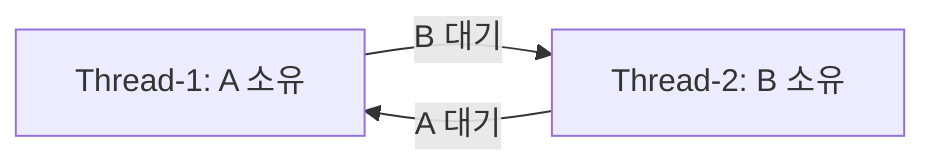

# 미션 4-2 평가문항 답변

평가표의 질문 20개와 보너스 항목에 대한 답변이다. 각 문항은 **핵심 답변 → 관측한 근거 → 판단 이유** 순서로 읽으면 된다. 중요한 로그·수치·코드는 본문에 실었고, 링크는 원문을 더 확인할 때 사용하도록 남겼다.

수치는 **2026-09-18 WSL 실측** 기준이며 Docker 재현 수치와 섞지 않았다. 아래 로그는 이날의 기록이다. 앱 로그는 KST, 관측 CSV·결과 파일은 UTC이므로 비교할 때 9시간 차이를 맞췄다. 표에서 시각만 적은 경우도 같은 날짜다.

‘생존 시간’은 실험 실행기가 앱을 실행하기 시작한 시점부터 종료를 관측할 때까지의 시간이다. 앱 내부 워커의 생성·종료 순간을 직접 잰 값은 아니다. `launcher_returncode` 역시 실행기가 직접 실행한 프로세스의 종료 상태이므로, 실제 워커의 상태와 종료 원인은 앱 로그·PID 기록을 함께 보고 판단했다.

답변에서 Heap은 앱이 보고한 동적 메모리이고, RSS는 OS가 관측한 실제 상주 메모리 규모다. 두 값은 측정 범위가 달라 정확히 일치하지 않는다. 또한 앱의 `Current Load`, OS가 계산한 프로세스 CPU 사용률, 호스트 전체 CPU 사용률도 서로 다른 지표다.

## 1. 실측 결과와 보고서

### 1-1. OOM의 메모리 증가와 강제 종료가 기록되어 있는가?

> [OOM] 메모리 사용량이 선형적으로 증가하다가 프로세스가 강제 종료되는 패턴이 로그에 기록되어 있는가?

**그렇다. Heap이 약 3초마다 25MB씩 증가했고, 75MB에서 설정값 64MB를 넘자 MemoryGuard가 프로세스를 종료했다.**

`console.log` 원문 발췌:

```text
2026-09-18 18:06:16,803 [INFO] [MemoryWorker] Current Heap: 25MB
2026-09-18 18:06:19,834 [INFO] [MemoryWorker] Current Heap: 50MB
2026-09-18 18:06:22,866 [INFO] [MemoryWorker] Current Heap: 75MB
2026-09-18 18:06:22,867 [CRITICAL] [MemoryGuard] Memory limit exceeded (75MB >= 64MB) / (Recommend Over 256MB)
2026-09-18 18:06:22,868 [CRITICAL] [MemoryGuard] Self-terminating process 2440463 to prevent system instability.
```

OS가 관측한 같은 워커의 RSS도 증가했다. 다음 표는 `metrics.csv`에서 해당 PID의 첫 행과 마지막 행을 골라 MiB로 환산한 것이다.

| UTC 시각 | PID | RSS KiB | RSS MiB |
| --- | ---: | ---: | ---: |
| 09:06:15.066 | 2440463 | 17664 | 17.250 |
| 09:06:22.609 | 2440463 | 68864 | 67.250 |

`result.json`에는 `reason=app_exited`, `launcher_returncode=-9`(SIGKILL), `runner_events=[]`가 기록됐다. **자체 종료를 알리는 앱 로그, 실제 종료 상태, 수집기가 종료 신호를 보내지 않았다는 기록**이 일치하므로 앱 MemoryGuard의 보호 종료로 판단했다. 이 결과를 Linux 커널의 OOM Kill로 해석하지는 않는다.

Heap은 약 3초마다 25MB씩 계단형으로 늘어 전체적으로 선형 증가 추세를 보였다. 마지막 RSS 측정은 75MB 할당 로그보다 약 0.26초 앞서므로 종료 직전 할당까지 포착한 값은 아니다.

원문: [OOM Before 로그](evidence/runs/20260918T090614Z-oom-before-402105430/console.log).

### 1-2. MEMORY_LIMIT 조정 뒤 생존 시간이 늘었는가?

> [OOM] 환경변수(MEMORY_LIMIT) 조정 후 프로세스 생존 시간이 늘어난 Before & After 비교 결과가 있는가?

**`MEMORY_LIMIT`를 64에서 128로 높이자 생존 시간이 8.418초에서 17.536초로 약 2.08배 늘었다.**

| 항목 | Before | After |
| --- | --- | --- |
| `MEMORY_LIMIT` | 64 | 128 |
| `CPU_MAX_OCCUPY` / `MULTI_THREAD_ENABLE` | 100 / false | 100 / false |
| 관찰 상한 / 수집 간격 | 90초 / 0.5초 | 90초 / 0.5초 |
| 생존 시간 | 8.418초 | 17.536초 |
| 종료 원인 | MemoryGuard | MemoryGuard |

설정·관찰 조건은 각 실행의 `metadata.json`, 시간·종료 상태는 `result.json`에서 가져왔다. 메모리 설정만 바꾼 비교이며, After에서도 다음 종료 로그가 남았다.

```text
2026-09-18 18:07:00,533 [INFO] [MemoryWorker] Current Heap: 150MB
2026-09-18 18:07:00,534 [CRITICAL] [MemoryGuard] Memory limit exceeded (150MB >= 128MB) / (Recommend Over 256MB)
```

`17.536 ÷ 8.418 ≈ 2.08`이므로 이번 실행에서는 생존 시간이 약 2.08배 늘었다. 하지만 메모리가 계속 쌓여 새 한도도 넘었으므로, 한도 상향은 종료를 늦춘 임시 완화다. 한 번씩 측정한 결과이므로 모든 환경에서 정확히 같은 배수가 나온다는 뜻은 아니다.

원문: [OOM After 로그](evidence/runs/20260918T090643Z-oom-after-033262350/console.log).

### 1-3. CPU 임계 초과와 종료가 기록되어 있는가?

> [CPU] CPU 사용률이 임계치를 초과하여 프로세스가 강제 종료되는 패턴이 로그에 기록되어 있는가?

**그렇다. 앱 내부 부하가 52.69%에 이르자 임계값 위반 로그를 남기고 Watchdog가 SIGTERM으로 종료했다.**

```text
2026-09-18 18:11:45,871 [INFO] [CpuWorker] Current Load: 44.69%
2026-09-18 18:11:48,987 [INFO] [CpuWorker] Current Load: 52.69%
2026-09-18 18:11:49,088 [CRITICAL] [CpuWorker] CPU Threshold Violated! (52.69%).
>>> [SYSTEM] WATCHDOG: INITIATING EMERGENCY ABORT (SIGTERM) <<<
```

별도로 `metrics.csv`에서 확인한 워커 PID 2445628의 구간 CPU는 UTC 09:11:48.954에 0.00%, 09:11:49.057에 58.26%였다. 이는 약 0.1초 구간의 사용률이며, 앱의 `Current Load`나 호스트 전체 CPU 사용률과 같은 값이 아니다.

`result.json`의 `observed_s=27.302`, `reason=app_exited`, `launcher_returncode=-15`(SIGTERM), `runner_events=[]`를 확인했다. 종료를 예고한 앱 로그와 실제 종료 상태가 맞고, 수집기는 종료 신호를 보내지 않았다. 이를 근거로 Watchdog에 의한 종료로 판단했다.

확인한 것은 **52.69%에서 앱이 정책 위반을 선언했다는 사실**이다. 정확한 내부 임계값이나 계산식까지 분석한 것은 아니며, `CPU_MAX_OCCUPY=100`을 ‘100%에서 종료’라는 뜻으로 해석할 수 없다.

원문: [CPU Before 로그](evidence/runs/20260918T091121Z-cpu-before-748323350/console.log).

### 1-4. CPU_MAX_OCCUPY 조정 후 종료·생존이 달라졌는가?

> [CPU] 환경변수(CPU_MAX_OCCUPY) 조정 후 프로세스 종료 여부/생존 시간이 변화한 Before & After 비교 결과가 있는가?

**`CPU_MAX_OCCUPY`를 100에서 40으로 낮추자 27.302초 만의 Watchdog 종료가 사라지고 90초 관찰 상한까지 작업이 계속됐다.**

| 항목 | Before | After |
| --- | --- | --- |
| `CPU_MAX_OCCUPY` | 100 | 40 |
| `MEMORY_LIMIT` / `MULTI_THREAD_ENABLE` | 512 / false | 512 / false |
| 관찰 상한 / 수집 간격 | 90초 / 0.1초 | 90초 / 0.1초 |
| 결과 | 27.302초 후 종료 | 90초 이상 생존 |
| 로그 | 임계값 위반 | 고점 도달 후 냉각·재증가 |

CPU 설정만 바꾼 After 실행에서는 다음 로그가 이어졌다.

```text
2026-09-18 18:13:51,956 [INFO] [CpuWorker] Peak reached (40.00%). Starting cooldown...
2026-09-18 18:14:07,533 [INFO] [CpuWorker] Cooldown complete (5.00%). Resuming load increase...
2026-09-18 18:14:17,883 [INFO] [CpuWorker] Current Load: 19.12%
```

After의 `result.json` 주요 필드는 다음과 같다.

```json
{
  "reason": "observation_timeout",
  "observed_s": 90.02,
  "alive_before_cleanup": true,
  "launcher_returncode": -15,
  "runner_events": [
    {
      "timestamp": "2026-09-18T09:14:20.680+00:00",
      "actor": "runner",
      "signal": "SIGTERM"
    }
  ]
}
```

정리 직전까지 살아 있었고 실행기가 SIGTERM을 보냈으므로, After의 `-15`는 Watchdog 장애 재발이 아니라 관찰 종료를 위한 정리 결과다.

따라서 이번 설정 변경으로 **관찰 기간 동안 Watchdog 종료를 피하고 작업 진행을 유지했다**고 말할 수 있다. 다만 앱이 선택하는 작업 시나리오도 달라졌으므로 동일 작업의 성능 개선율이나 실제 요청 지연 개선으로 해석하지는 않는다.

원문: [CPU After 로그](evidence/runs/20260918T091250Z-cpu-after-355471748/console.log).

### 1-5. 살아 있지만 로그와 자원이 정체된 상태를 식별했는가?

> [Deadlock] 프로세스가 살아있으나(PID 존재) CPU/메모리 변화 없이 로그가 멈춘 상태를 식별했는가?

**그렇다. PID 2448740은 살아 있었지만 CPU 0%, RSS 17.250MiB, 로그 크기가 79.317초 동안 변하지 않았다.**

`log-sizes.jsonl`의 두 기록 사이에서 크기가 유지됐고, 그 구간의 `metrics.csv`에서도 워커의 CPU·RSS가 정체됐다.

| 확인 항목 | 관측 결과 |
| --- | --- |
| 로그 비교 시각(UTC) | 09:14:44.539 → 09:16:03.856, 차이 79.317초 |
| `console.log` 크기 | 두 시점 모두 2881 bytes, 중간 기록도 동일 |
| `app-logs/agent_app.log` 크기 | 두 시점 모두 1517 bytes, 중간 기록도 동일 |
| 워커 구간 CPU / RSS | 0.00% / 17664 KiB(17.250MiB) 유지 |
| 관찰 종료 직전 상태 | `alive_before_cleanup=true` |
| `ps -L`의 대기 지점 | TID 2448740·2448841·2448842 모두 `futex_wait_queue` |

`futex_wait_queue`는 동기화 대기 중임을 보여 주지만, 어떤 락을 기다리는지까지 알려 주지는 않는다. 마지막 앱 로그에 나온 ‘Thread-1은 B 대기, Thread-2는 A 대기’ 관계와 함께 해석했다. 실제 락 획득·대기 로그는 3-4에 실었다.

CPU가 낮고 로그가 없는 것만으로는 Deadlock이라고 단정할 수 없다. 정상적으로 입력을 기다리는 프로세스도 같은 모습일 수 있기 때문이다. 이번에는 양방향 락 대기 로그, 장시간 자원·로그 정체, PID 생존이 동시에 확인돼 교착상태로 판단했다.

원문: [Deadlock Before 관측 기록](evidence/runs/20260918T091433Z-deadlock-before-531338111/snapshots.txt).

### 1-6. MULTI_THREAD_ENABLE 조정 후 재현·회피를 비교했는가?

> [Deadlock] 환경변수(MULTI_THREAD_ENABLE) 조정 후 데드락 재현/회피 비교 결과가 있는가?

**`true`에서는 순환 대기와 정체가 발생했고, `false`에서는 같은 90초 동안 작업 완료와 로그 진행이 이어졌다.**

두 실험은 `MEMORY_LIMIT=512`, `CPU_MAX_OCCUPY=40`, 관찰 상한 90초, 수집 간격 0.5초를 고정했다. `MULTI_THREAD_ENABLE`만 바꿔 앱을 새로 실행했으며, After에는 다음 기록이 남았다.

```text
2026-09-18 18:17:16,593 [INFO] [Scheduler] All tasks completed.
2026-09-18 18:18:05,443 [INFO] [CpuWorker] Cooldown complete (5.00%). Resuming load increase...
2026-09-18 18:18:17,146 [INFO] [System] Memory Cache Flushed. Process Stabilized.
2026-09-18 18:18:22,173 [INFO] [MemoryWorker] Current Heap: 25MB
2026-09-18 18:18:43,359 [INFO] [MemoryWorker] Current Heap: 200MB
```

`result.json`에도 `observed_s=90.044`, `reason=observation_timeout`, `alive_before_cleanup=true`가 남았다. PID 존재뿐 아니라 관찰 마지막까지 로그가 갱신됐으므로 작업 진행을 확인할 수 있다. 이미 교착된 프로세스의 락을 푼 것이 아니라, 설정을 바꾼 새 실행에서 교착을 회피한 결과다.

`false`는 문제가 있는 동시 처리 경로를 피한 것이며, 앱 전체가 단일 스레드가 됐다는 뜻은 아니다. 락 순서 자체를 수정한 근본 해결이라고도 볼 수 없다.

원문: [Deadlock After 로그](evidence/runs/20260918T091713Z-deadlock-after-166295630/console.log).

### 1-7. 세 보고서가 GitHub Issue 구조를 갖췄는가?

> [Format] 3건의 리포트 모두 GitHub Issue 구조(현상 → 증거 → 원인 → 조치)를 갖추고 있는가?

**그렇다. OOM·CPU·Deadlock 보고서 모두 현상, 증거, 원인, 조치 및 검증 순서로 작성했다.**

`reports/01-oom.md`, `02-cpu.md`, `03-deadlock.md`에 공통으로 들어 있는 실제 제목이다.

```text
1. Description (현상 설명)
2. Evidence & Logs (증거 자료)
3. Root Cause Analysis (원인 분석)
4. Workaround & Verification (조치 및 검증)
```

예를 들어 OOM 보고서는 ‘메모리 증가 후 종료 → Heap·RSS·종료 로그 → 앱 한도 초과 판단 → 64에서 128로 변경하고 생존 시간 비교’로 이어진다. GitHub Issue에 사용할 수 있는 문서 형식을 갖췄다는 뜻이며, 실제 Issue 등록 여부와는 구분한다.

### 1-8. PID·타임스탬프·핵심 로그가 증거로 첨부됐는가?

> [Evidence] 리포트에 PID, 로그 타임스탬프, 핵심 로그 메시지가 포함된 증거(스크린샷 또는 로그 발췌)가 첨부되어 있는가?

**그렇다. 스크린샷 대신 검색 가능한 원문 로그와 CSV를 보존하고 보고서에 PID·시각·핵심 문장을 인용했다.**

- OOM: PID 2440463, 18:06:22.868, 자체 종료 메시지
- CPU: PID 2445628, 18:11:49.088 임계값 위반 로그와 이어지는 Watchdog SIGTERM 문구
- Deadlock: PID 2448740, 18:14:42.871과 18:14:42.880, 양방향 자원 대기

일부 앱 로그 줄에는 PID가 직접 들어 있지 않다. 이 경우 같은 실행 폴더의 `ss`·`ps` 스냅샷과 CSV를 대조해 포트 소유 워커와 로그를 연결했다. 앱 로그 KST와 CSV UTC도 9시간 차이를 맞춰 비교했다.

핵심 원문은 이 문서의 1-1(OOM), 1-3(CPU), 3-4(Deadlock)에도 실었다. 따라서 링크를 열지 않아도 PID·시각·종료 또는 대기 원인을 따라갈 수 있다.

## 2. 수집 도구와 진단 과정

### 2-1. monitor.sh는 메모리 증가를 어떻게 추적했는가?

> monitor.sh에서 메모리 증가 패턴을 추적하기 위해 사용한 명령어와 데이터 추출 방법을 구체적으로 답변할 수 있는가?

**`monitor.sh`가 Python 수집기를 실행하고, 수집기는 `/proc/PID/stat`의 RSS 페이지 수를 일정 간격으로 읽어 `metrics.csv`에 저장한다.**

`bin/monitor.sh`의 실제 실행 문장은 다음과 같다.

```bash
exec python3 "$script_dir/../lib/monitor.py" "$@"
```

`lib/monitor.py`의 RSS 계산 과정을 필요한 부분만 남겨 정리하면 다음과 같다.

```python
PAGE_KIB = os.sysconf("SC_PAGE_SIZE") // 1024
raw = Path(f"/proc/{pid}/stat").read_text()
fields = raw[raw.rfind(")") + 2:].split()
rss_kib = int(fields[21]) * PAGE_KIB
```

프로세스 이름에는 공백이 들어갈 수 있어 이름을 둘러싼 마지막 `)` 뒤부터 나눈다. 이 배열의 `fields[21]`은 원래 `/proc/PID/stat`의 24번째 필드인 RSS 페이지 수다. 페이지 크기를 곱해 KiB로 바꾼 뒤 시각·PID와 함께 CSV에 기록한다. 예를 들어 1-1의 `17664 KiB ÷ 1024 = 17.250 MiB`다.

앱 실행기와 실제 워커의 PID가 달라 `--pgid`로 프로세스 그룹을 추적하고, `ss`로 15034 포트 소유 워커를 골랐다. OOM은 0.5초 간격으로 수집한 같은 워커의 `timestamp`·`rss_kib`를 비교했다. PID가 재사용돼 다른 프로세스의 값이 섞이지 않도록 시작 틱도 함께 식별자로 사용한다.

### 2-2. CPU 사용률을 확인한 도구와 옵션은 무엇인가?

> 프로세스의 CPU 사용률을 확인하기 위해 선택한 도구와 적용한 옵션의 의미를 구분하여 서술할 수 있는가?

**CPU 수치는 `/proc`의 user+system CPU 틱 차이로 계산했고, `ps`·`top`·`ss`는 프로세스와 스레드를 확인하는 보조 자료로 사용했다.**

| 도구·명령 형태 | 옵션과 사용 목적 |
| --- | --- |
| 수집기 `--pgid <PGID> --interval 0.1` | `--pgid`: 관측할 그룹, `--interval`: 0.1초 수집 간격 |
| `ps -p <PID목록> -o pid,ppid,pgid,stat,pcpu,rss` | `-p`: PID 선택, `-o`: PID·부모·그룹·상태·CPU·RSS 열 지정 |
| `ps -L -p <PID목록> -o pid,tid,stat,wchan` | `-L`: 스레드별 표시. `tid`는 스레드 ID, `wchan`은 커널 대기 지점 |
| `top -b -H -n 1 -p <PID목록>` | `-b`: 배치 출력, `-H`: 스레드 표시, `-n 1`: 한 화면 후 종료, `-p`: PID 선택 |
| `ss -ltnp 'sport = :15034'` | `-l`: LISTEN, `-t`: TCP, `-n`: 숫자 표시, `-p`: 소유 프로세스 확인 |

수집기의 계산식은 다음과 같다.

```text
CPU 시간(초) = user+system 누적 틱의 증가량 / 초당 틱 수(SC_CLK_TCK)
CPU % = CPU 시간(초) / 두 샘플 사이 실제 경과 시간(초) × 100
```

수집기에서 100%는 논리 CPU 하나를 전부 사용한 수준이며 멀티스레드 프로세스는 100%를 넘을 수도 있다. `ps %CPU`는 프로세스 수명 평균이므로 0.1초 구간값과 다르고, 앱 내부 `Current Load`도 별도 지표다. 그래서 CPU 장애 판정에는 수집값과 앱의 Watchdog 로그를 함께 사용했다.

예를 들어 0.1초 동안 CPU를 0.06초 사용했다면 60%다(계산을 설명하기 위한 예시). `top`의 첫 화면도 같은 0.1초 구간 측정값으로 취급하지 않았고, 시계열 수치는 위 수집기 계산값을 사용했다.

### 2-3. 살아 있지만 멈춘 프로세스를 어떤 순서로 진단했는가?

> 프로세스가 “살아있지만 멈춰있는 상태”를 진단하기 위해 어떤 도구를 어떤 순서로 사용했는지, 본인의 판단 흐름을 논리적으로 제시할 수 있는가?

**포트 소유 PID를 찾고, 생존 여부를 확인한 다음, CPU·RSS·로그 진행과 스레드의 락 대기를 차례로 확인했다.**

1. `ss`와 `ps`로 실제 워커 PID를 식별한다.
2. `/proc`와 반복 스냅샷으로 같은 프로세스가 살아 있는지 확인한다.
3. `metrics.csv`와 로그 크기로 작업 진행 여부를 판단한다.
4. `ps -L`·`top -H`로 스레드 상태를 보고, 앱의 락 로그로 소유·대기 관계를 연결한다.
5. 설정을 바꿔 새로 실행한 앱에서 작업이 진행되는지 비교한다.

이 순서대로 보면 ‘프로세스가 존재한다’에서 ‘정상이다’로 건너뛰지 않게 된다. 실제로 1-5에서는 PID가 살아 있어도 로그가 79.317초 멈췄고, 3-4의 락 로그로 원인을 좁혔다. 1-6의 새 실행에서 작업이 계속된 결과도 판단을 보강한다.

## 3. 장애가 발생하고 보호하는 원리

### 3-1. 메모리 보호 정책은 왜 프로세스를 종료하는가?

> 메모리 누수가 발생했을 때 애플리케이션의 메모리 보호 정책이 해당 프로세스를 강제 종료하는 이유를 설명할 수 있는가?

**추가 메모리 소비를 즉시 멈추고 다른 프로세스로 피해가 확산되는 것을 막기 위해서다.**

메모리는 여러 프로세스가 함께 사용하는 한정 자원이다. 한 프로세스의 누적이 계속되면 다른 프로세스의 할당 실패와 응답 지연으로 번질 수 있다. 해당 프로세스를 종료하면 추가 누적이 멈추고 그 프로세스가 점유한 메모리를 OS가 회수할 수 있다.

다만 종료는 피해를 제한하는 보호 조치일 뿐이며, 불필요한 객체·캐시·큐가 계속 쌓이는 원인은 소스에서 고쳐야 한다. 이번 실험은 커널이 희생 프로세스를 선택한 OOM Kill이 아니라 앱 MemoryGuard의 자체 종료였다.

이번 근거는 1-1의 `75MB >= 64MB`와 `Self-terminating process 2440463` 로그다. 실제로 호스트 전체의 메모리가 고갈된 상황을 재현한 것은 아니므로, 피해 확산 방지는 보호 정책의 목적에 대한 설명이다.

### 3-2. CPU 과점유 시 왜 ‘단일 프로세스’를 종료하는가?

> CPU 과점유 시 단일 프로세스를 종료하는 것이 시스템 보호에 왜 필요한지 근거를 제시할 수 있는가?

**원인 프로세스 하나의 CPU 소비를 멈춰 다른 정상 작업이 사용할 실행 시간을 확보하고, 조치 범위를 최소화하기 위해서다.**

문항의 ‘단일’은 **문제를 일으킨 특정 프로세스 하나를 식별해 조치한다**는 의미로 이해했다. 같은 CPU를 사용하려는 작업이 많아지면 실행 시간을 두고 경쟁한다. 문제 프로세스를 종료하면 그 안의 스레드들이 CPU를 더 소비하지 않으므로 다른 작업의 대기를 줄일 수 있다. 정상 프로세스까지 종료하지 않아 조치의 영향 범위도 좁힐 수 있다.

높은 CPU가 항상 장애인 것은 아니므로 PID, 지속 시간, 작업 진행, 응답 지연을 함께 확인해야 한다. 운영에서는 먼저 유입 제한, 워커 수 조절, CPU 쿼터 같은 완화책도 검토한다. 이번 앱에서는 Watchdog가 자체 정책 위반을 감지해 해당 프로세스에 SIGTERM을 보냈다.

실측 근거는 1-3의 `CPU Threshold Violated!`와 `WATCHDOG ... SIGTERM` 로그다. 이번 실험에서는 해당 앱의 보호 종료를 확인했으며, 다른 서비스의 응답시간이 얼마나 개선됐는지까지 측정하지는 않았다.

### 3-3. 상호 배제와 순환 대기로 교착상태를 설명할 수 있는가?

> “교착 상태(Deadlock)가 발생하는 원리”를 “상호 배제”와 “순환 대기” 개념으로 설명할 수 있는가?

**하나씩만 소유할 수 있는 자원을 각 스레드가 하나씩 가진 채 상대 자원을 기다리면 순환이 생겨 누구도 진행하지 못한다.**

- 상호 배제: 락 A와 B는 한 번에 한 스레드만 소유한다.
- 점유와 대기: Thread-1은 A를, Thread-2는 B를 가진 채 기다린다.
- 비선점: 기다리는 동안 상대가 보유한 락을 강제로 빼앗지 못한다.
- 순환 대기: Thread-1은 B를 기다리고 Thread-2는 A를 기다린다.



이 모델에서는 두 스레드 모두 다음 락을 얻어야 작업을 끝내고 현재 락을 놓을 수 있다. 상대도 같은 상태이므로 시간 제한이나 락 해제 같은 별도 조치가 없으면 어느 쪽도 진행하지 못한다. 락 대기 중에는 스레드가 잠들 수 있어 CPU 사용률이 낮아도 교착상태일 수 있다. 다음 문항의 로그가 이 앱의 소유·대기 관계를 보여 준다.

### 3-4. 로그에서 A→B, B→A 관계를 어떻게 찾았는가?

> 로그에서 스레드 간 순환 의존 관계(A→B, B→A)를 어떻게 파악했는지 추적 과정을 설명할 수 있는가?

**시간순으로 각 스레드가 획득한 락과 다음에 기다린 락을 연결했다.**

| 스레드 | 보유 | 대기 | 관계 |
| --- | --- | --- | --- |
| Thread-1 | Shared_Memory_A | Socket_Pool_B | A→B |
| Thread-2 | Socket_Pool_B | Shared_Memory_A | B→A |

위 표의 근거가 되는 `console.log` 원문이다.

```text
2026-09-18 18:14:40,866 [INFO] [AgentWorker][Worker-Thread-1] LOCK ACQUIRED: [Shared_Memory_A]. (Holding...)
2026-09-18 18:14:40,866 [INFO] [AgentWorker][Worker-Thread-2] LOCK ACQUIRED: [Socket_Pool_B]. (Holding...)
2026-09-18 18:14:42,871 [INFO] [AgentWorker][Worker-Thread-1] WAITING for [Socket_Pool_B]... (Status: BLOCKED)
2026-09-18 18:14:42,880 [INFO] [AgentWorker][Worker-Thread-2] WAITING for [Shared_Memory_A]... (Status: BLOCKED)
```

먼저 `LOCK ACQUIRED`로 A와 B의 소유자를 정했다. 다음으로 같은 스레드의 `WAITING` 대상을 연결하니 Thread-1이 기다리는 B는 Thread-2가, Thread-2가 기다리는 A는 Thread-1이 소유하고 있었다. 이후 완료·해제 로그 없이 1-5의 정체가 이어져 순환 대기로 판단했다.

앱의 스레드 이름을 OS의 TID와 일대일로 매핑한 것은 아니다. 소유·대기 관계는 앱 로그로, 프로세스 생존과 작업 정체는 OS 관측으로 확인해 결합했다.

원문: [Deadlock Before 락 로그](evidence/runs/20260918T091433Z-deadlock-before-531338111/console.log).

## 4. 운영 환경에 적용하기

이 절은 실측 결과를 바탕으로 한 운영 개선 제안이다. 제공 앱의 내부 소스는 분석하지 않았으며, 아래 기능을 이번 실습에 구현한 것은 아니다.

### 4-1. 장애 전에 메모리 누수를 탐지하도록 monitor.sh를 어떻게 개선할 것인가?

> 만약 이번 미션의 agent-leak-app이 실제 운영 서버에서 동작하고 있었다면, 메모리 누수를 장애 발생 전에 탐지하기 위해 현재의 monitor.sh를 어떻게 개선하겠는가?

**RSS 현재값뿐 아니라 최근 증가율과 회수 후 기준선을 계산하고, 한도 도달 전에 경보하도록 개선하겠다.**

1-1처럼 짧은 구간의 증가만 보면 정상 캐시와 누수를 구분하기 어렵다. 실제로 1-6의 정상 실행에서는 `Memory Cache Flushed` 뒤 Heap이 다시 25MB부터 증가했다. 따라서 단순히 ‘사용량이 늘었다’보다 **회수 후에도 기준선이 계속 높아지는가**를 감시하겠다.

현재 `monitor.sh`는 Python을 실행하는 진입점이므로 실제 추세 계산은 `lib/monitor.py`나 별도 분석기에 추가한다. PID·시작 틱별 RSS 증가율, 컨테이너 사용량·한도, 마지막 작업 완료 시각을 함께 기록하고, 여러 구간 연속 증가할 때 PID·추세·설정·핵심 로그를 포함해 경보한다.

남은 시간을 추정한다면 같은 범위의 지표를 사용한다. 예를 들어 컨테이너 사용량이 800MiB, 한도가 1000MiB, 증가율이 10MiB/s이면 `(1000−800)÷10=20초`다. 이는 **회수 없이 같은 속도로 증가한다는 가정의 예시**다. 프로세스 RSS와 앱의 Heap 한도를 섞어 계산해서는 안 되며, 누수 위치는 추가 힙·객체 분석으로 확인한다.

### 4-2. 세 장애 중 무엇이 가장 치명적이며 어떻게 예방할 것인가?

> 이번 미션에서 겪은 3가지 장애(OOM, CPU Spike, Deadlock) 중 실제 서비스 환경에서 가장 치명적인 것은 무엇이라고 생각하는가? 그 이유와 함께, 해당 장애를 근본적으로 예방하는 방법을 제안할 수 있는가?

**공유 서버에서 격리가 부족한 상황이라면 다른 프로세스까지 영향을 줄 수 있는 OOM이 가장 치명적이라고 판단한다.**

이 선택의 기준은 피해 범위다. 공유 서버의 메모리가 고갈되면 문제 앱뿐 아니라 다른 서비스의 메모리 할당과 진단 도구 실행도 어려워질 수 있다. 이번 앱의 자체 종료 실험에서 호스트 전체 장애가 발생했다는 뜻은 아니다.

근본 예방은 무제한 캐시·큐나 불필요한 참조가 남는 원인을 찾아 크기와 보관 시간을 제한하는 것이다. 입력이 처리량을 계속 넘으면 유입을 제한하고, 장시간 같은 부하에서 회수 후 메모리 기준선이 안정되는지 확인한다. 1-2처럼 한도를 늘려도 다시 종료된다면 누적 원인을 해결한 것으로 볼 수 없다.

다만 메모리 문제가 한 컨테이너에 격리되고 Deadlock이 핵심 요청 전체를 막는 환경이라면 Deadlock이 더 치명적일 수 있다. 장애 이름만으로 순위를 정하지 않고 서비스 영향과 격리 범위를 함께 보겠다.

### 4-3. OOM과 Deadlock이 동시에 발생하면 어떤 순서로 대응할 것인가?

> 만약 동일한 서버에서 OOM과 Deadlock이 동시에 발생했다면, 어떤 순서로 트러블슈팅을 진행하겠는가? 우선순위 판단의 근거를 설명할 수 있는가?

**메모리 고갈이 임박했다면 복구를 지연시키지 않는 범위에서 최소 증거를 확보하고, 메모리 피해를 제한한 뒤 Deadlock 원인을 분석하겠다.**

1. 메모리 여유, OOM 이벤트, 영향받은 PID와 서비스 범위를 확인한다.
2. 메모리 추세와 마지막 락 로그 등 최소 증거를 보존한다.
3. 유입을 제한하거나 정상 인스턴스로 전환한다. 문제 프로세스는 정상 종료를 시도하고, 교착으로 반응하지 않으면 유예 시간 뒤 강제 종료·교체를 검토한다.
4. 락 소유·대기 관계를 분석하고 재현한다.
5. 메모리와 작업 진행이 모두 정상화됐는지 확인한다.

메모리를 먼저 확보하는 이유는 다른 서비스로 피해가 번지는 것을 막고 진단·복구 도구가 실행될 여유를 남기기 위해서다. 교착으로 소비가 멈춰 큐가 쌓이고 메모리가 늘어난 것처럼 두 증상에 공통 원인이 있는지도 조사한다. 메모리 문제가 이미 격리됐고 Deadlock이 전체 요청을 막는다면 Deadlock 복구를 먼저 할 수 있다.

### 4-4. 소스를 수정할 수 있다면 각 장애를 어떻게 개선할 것인가?

> 이번 미션의 환경변수 조정은 임시 조치였다. 만약 소스 코드를 직접 수정할 수 있다면, 각 장애 유형별로 어떤 코드 레벨의 개선을 하겠는가?

**메모리는 보관 수명과 상한, CPU는 비효율 연산과 동시 작업량, Deadlock은 락 획득 순서를 고치겠다.**

| 장애 | 코드 수준 개선 | 이 조치가 필요한 이유 |
| --- | --- | --- |
| 메모리 | 캐시·큐에 상한과 만료 적용, 필요 없는 참조·자원 정리 | 끝난 작업의 데이터를 계속 보관하면 사용량이 누적되므로 보관량과 수명을 제한 |
| CPU | 프로파일링으로 연산이 집중된 위치를 찾고, busy wait를 이벤트 대기로 변경. 중복 연산·재시도·워커 수 제한 | 할 일이 없어도 반복 확인하거나 같은 계산을 되풀이하는 CPU 소비를 줄임 |
| Deadlock | 모든 경로의 락 획득 순서를 A→B로 통일하고 실패·예외 시 획득한 락 해제 | B를 가진 채 A를 기다리는 경로를 없애 3-4의 순환 대기를 끊음 |

두 스레드가 모두 A부터 얻도록 하면, A를 얻지 못한 스레드는 B를 잡기 전에 기다리므로 이번 A↔B 순환이 생기지 않는다. 단, 타임아웃만 추가하고 이미 얻은 락을 계속 쥐면 문제가 남으므로 실패 시 해제 경로도 필요하다.

내부 코드를 본 뒤 실제 원인에 맞는 수정을 선택하겠다. 검증은 같은 부하에서 메모리 회수 후 기준선, CPU 대비 처리량, 지연·오류를 비교하고 동시 요청·예외 상황에서도 작업이 완료되는지 확인하는 방식으로 하겠다.

### 4-5. 다시 수행한다면 무엇을 다르게 할 것인가?

> 다시 이 미션을 처음부터 수행한다면, 트러블슈팅 과정에서 어떤 점을 다르게 접근하겠는가?

**실험 전에 대상 PID, 수집 간격, 종료 판정 기준을 정하고 Before와 After를 같은 조건으로 반복 측정하겠다.**

이번 기록에는 다음처럼 측정 조건을 먼저 정해야 할 이유가 남아 있다.

| 확인한 사실 | 다음 실습에서 할 일 |
| --- | --- |
| OOM Before의 실행기 PID는 2440456, 실제 워커는 2440463 | `ss`의 포트 소유자를 먼저 확인해 다른 프로세스를 관측하는 오류 방지 |
| CPU Before와 After 모두 최종 종료 상태는 `-15`지만, Before의 `runner_events`는 비어 있고 After에는 실행기의 SIGTERM이 있음 | 종료 코드와 함께 신호 기록·정리 전 생존·앱 로그를 수집 |
| CPU 상승은 1-3의 약 0.1초 구간에서 포착됨 | 예비 관찰로 간격을 정하고 Before/After에 동일 적용 |

여기에 시간대 통일과 반복 실행을 추가하겠다. 실행 순서도 바꿔 보면 일시적인 호스트 부하가 결과에 미친 영향을 판단하는 데 도움이 된다.

또한 실험 전에 장애별 판정 기준을 적는다. OOM은 RSS 증가와 보호 종료, CPU는 정책 위반과 변경 후 작업 진행, Deadlock은 PID 생존·정체·순환 대기를 기준으로 삼는다. 이렇게 해야 실행 후 눈에 띄는 숫자만 골라 원인을 설명하는 오류를 줄일 수 있다.

## 5. 보너스: 스케줄링 분석

> 보너스 문제 해결에 따른 크레딧 부여

**A→B→C→A 순환과 `Preempted`·`Resumed` 로그를 근거로 앱 수준의 Round-Robin 방식으로 추론했다.**

CPU After의 `console.log`에서 작업 순서와 진행률을 추린 결과다.

| 순회 | KST 시각과 작업 진행 | 다음 동작 |
| --- | --- | --- |
| 첫 번째 | A 18:12:52.682 → B 18:12:52.837 → C 18:12:52.990에 20%부터 시작 | 각 작업이 40%에서 `Preempted`, 진행률 저장 |
| 두 번째 | A 18:12:53.144 → B 18:12:53.298 → C 18:12:53.451에 60%로 재개 | 각 작업이 80%에서 `Preempted`, 다시 진행률 저장 |
| 세 번째 | A 18:12:53.605 → B 18:12:53.656 → C 18:12:53.707에 100% 도달 | 18:12:53.758에 전체 완료 |

핵심 문구도 원문에서 확인할 수 있다.

```text
2026-09-18 18:12:52,785 [INFO] [Thread-A] Preempted. Progress saved at (40%)
2026-09-18 18:12:53,144 [INFO] [Thread-A] Resumed. Calculating... (60%)
2026-09-18 18:12:53,605 [INFO] [Thread-A] Resumed. Calculating... (100%)
2026-09-18 18:12:53,758 [INFO] [Scheduler] All tasks completed.
```

A가 끝나기 전에 B·C가 실행되고, 저장한 진행률에서 A가 다시 실행되는 순환이므로 앱 수준의 Round-Robin 패턴과 맞는다. 각 작업에 실행 기회를 번갈아 주면 다른 작업의 긴 대기를 줄일 수 있지만 전환 비용이 생긴다. 이 문구는 앱이 출력한 기록이므로 Linux 커널의 실제 `SCHED_RR` 정책까지 입증하지는 않는다.

## 부록 A. Docker에서 프로그램이 실행되는 과정

이 저장소의 Docker 구성은 제공 앱을 격리된 Linux 컨테이너에서 실행하고, 별도 모니터로 CPU·메모리·스레드 상태를 수집한다.

```text
docker compose 명령
  → 일회용 Linux 컨테이너 생성
  → vendor/agent-app-leak.zip을 /input에 읽기 전용 연결
  → 컨테이너 아키텍처에 맞는 바이너리를 /tmp에 추출
  → experiment.py가 환경변수를 구성해 앱 실행
  → monitor.sh가 앱 프로세스 그룹을 관찰
  → 실행 로그와 측정값을 /data Docker 볼륨에 보존
```

### A-1. Docker에서는 어떤 파일을 실행하는가?

현재 Docker 구성은 호스트의 `vendor/`를 컨테이너의 `/input`에 읽기 전용으로 연결한다. `docker/entrypoint.py`에서 ZIP과 실행 파일을 선택하는 실제 코드는 다음과 같다.

```python
ARCHIVE = Path("/input/agent-app-leak.zip")
ARCHITECTURES = {"x86_64": ("agent-leak-app-x86", 62),
                 "aarch64": ("agent-leak-app-arm64", 183)}
```

| 컨테이너 아키텍처 | ZIP에서 선택하는 파일 |
| --- | --- |
| x86_64 | `agent-leak-app-x86` |
| aarch64/ARM64 | `agent-leak-app-arm64` |

컨테이너의 아키텍처를 확인한 뒤 해당 파일을 `/tmp/mission4-app-.../agent-leak-app`으로 추출해 실행한다. 따라서 현재 Docker 경로에서는 호스트에 미리 추출해 둔 `vendor/agent-leak-app-x86` 대신 ZIP 안의 파일을 사용한다. Docker 없이 Linux에서 실행할 때는 추출한 바이너리를 직접 지정한다.

### A-2. 환경변수는 누가 만들고 읽는가?

`entrypoint.py`가 케이스 이름과 옵션을 받아 `experiment.py`에 넘기면, `experiment.py`는 프리셋에서 기본값을 고르고 명령행에 지정된 값이 있으면 우선 적용한다. 아래는 실제 코드에서 설정 선택 부분을 발췌한 것이다.

```python
memory, cpu, multi = PRESETS[case]
memory = args.memory_limit if args.memory_limit is not None else memory
cpu = args.cpu_max_occupy if args.cpu_max_occupy is not None else cpu
multi = args.multi_thread if args.multi_thread is not None else multi
```

그 값을 `env` 딕셔너리의 `MEMORY_LIMIT`, `CPU_MAX_OCCUPY`, `MULTI_THREAD_ENABLE`에 넣는다. 같은 딕셔너리에는 앱의 홈·업로드·키·로그 경로와 포트도 들어간다. 앱 실행 부분은 다음과 같다.

```python
app = subprocess.Popen([str(args.app)], cwd=home,
                       env={**os.environ, **env, "PYTHONUNBUFFERED": "1"},
                       stdin=subprocess.DEVNULL, stdout=slave_fd, stderr=slave_fd,
                       start_new_session=True)
```

`env=`는 자식 프로세스에 전달할 환경변수 묶음이다. 위 코드에서는 부모의 환경변수 위에 실험 설정을 덮어쓴다. 따라서 이 실험 도구를 사용할 때 설정을 바꾸려면 `--memory-limit` 같은 실행 옵션을 사용한다. 부모 환경에 같은 이름의 변수를 지정하는 것만으로는 프리셋을 바꿀 수 없다.

값을 실제로 읽고 동작에 사용하는 주체는 **제공 앱 `agent-leak-app`**이다. CPU After 부팅 로그에 다음 확인 결과가 있다.

```text
[2/6] Verifying Environment Variables     [OK]
   ... All required Envs correct
[6/6] Verifying Mission Environment       [OK]
   ... MEMORY_LIMIT=512MB, CPU_MAX_OCCUPY=40%, MULTI_THREAD_ENABLE=False
```

즉 실행 도구가 값을 선택·전달하고, 앱이 이를 읽어 부팅 검사와 작업 시나리오에 사용한다. 앱 내부에서 어떤 함수로 읽는지까지 분석한 것은 아니며, Docker Compose가 이 앱 전용 변수의 의미를 해석하는 구조도 아니다.

### A-3. 앱 설정과 Docker 자원 제한의 차이

| 설정 | 읽고 적용하는 주체 | 의미 |
| --- | --- | --- |
| `MEMORY_LIMIT` | 제공 앱 | 메모리 관련 시나리오와 보호 동작 설정 |
| `CPU_MAX_OCCUPY` | 제공 앱 | CpuWorker 로그에서 확인한 부하 동작 설정 |
| `MULTI_THREAD_ENABLE` | 제공 앱 | 동시 트랜잭션 시나리오 사용 여부 |
| `mem_limit: 1536m` | Docker Engine·Linux cgroup | 컨테이너 전체의 실제 메모리 상한 |
| `pids_limit: 256` | Docker Engine·Linux cgroup | 컨테이너의 프로세스·스레드 수 상한 |

`compose.yaml`의 실제 자원 제한은 다음과 같다.

```yaml
mem_limit: 1536m
memswap_limit: 1536m
pids_limit: 256
```

`MEMORY_LIMIT=64`일 때는 1-1처럼 앱이 `75MB >= 64MB`를 판단하고 자체 종료했다. 반면 512 설정의 정상 시나리오에서는 1-6처럼 캐시 회수 로그가 나타났다. 따라서 이 변수는 앱의 내부 동작 설정이며, OS가 프로세스 메모리를 해당 값 이하로 강제 제한한다는 뜻은 아니다. Docker의 1.5GiB 한도는 앱·실행기·모니터 등을 포함한 컨테이너 전체에 별도로 적용된다. `memswap_limit`는 메모리와 스왑의 합산 한도이며, 여기서는 메모리 한도와 같게 두어 추가 스왑을 허용하지 않는다.

`CPU_MAX_OCCUPY=40`도 워커 개수나 OS CPU 사용률의 강제 상한이 아니다. 1-4의 `Peak reached (40.00%). Starting cooldown...`처럼 앱의 부하 동작과 연결된 값으로 관측됐다. 현재 Compose 파일에는 별도 CPU 쿼터가 없다. `MULTI_THREAD_ENABLE=false` 역시 앱의 문제 시나리오를 피하는 설정이며 OS 스레드를 하나로 제한하지 않는다.

### A-4. 실행기와 모니터의 역할

| 구성 요소 | 역할 |
| --- | --- |
| Docker Compose | Linux 환경, 네트워크 격리, 컨테이너 자원 한도와 볼륨 제공 |
| `docker/entrypoint.py` | ZIP 검사, 아키텍처별 바이너리 선택, 명령 처리 |
| `lib/experiment.py` | 실험값 선택, 환경변수 구성, 앱과 모니터 실행, 종료 결과 기록 |
| `agent-leak-app` | 설정을 읽고 OOM·CPU·Deadlock 또는 정상 시나리오 수행 |
| `bin/monitor.sh` / `lib/monitor.py` | PID별 CPU·RSS·스레드 상태 수집 |
| `/data` 볼륨 | 컨테이너가 삭제된 뒤에도 실험 증거 보존 |

예를 들어 다음 명령은 일회용 컨테이너에서 `MEMORY_LIMIT=512`, `CPU_MAX_OCCUPY=40`, `MULTI_THREAD_ENABLE=false`로 앱을 실행하고 최대 90초 동안 관찰한다.

```bash
docker compose run --rm lab run cpu-after --duration 90
```

`--duration`은 앱 환경변수가 아니라 **실험 실행기가 읽는 최대 관찰 시간**이다. 앱이 먼저 종료되면 실험도 먼저 끝나고, 살아 있으면 관찰 종료 후 실행기가 해당 실험의 프로세스 그룹을 정리한다.

추가 원문 확인: [실행 목록과 재현 명령](evidence/manifest.json), [CPU·RSS 수집 코드](lib/monitor.py), [앱 실행·증거 수집 코드](lib/experiment.py), [Docker 진입 코드](docker/entrypoint.py), [컨테이너 설정](compose.yaml).
