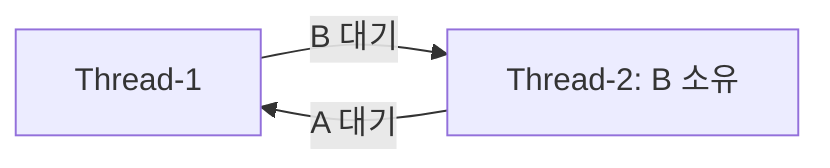

# 미션 4-2 평가문항 답변

평가표의 질문 20개와 보너스 항목에 대한 답변이다. 각 문항의 **굵은 문장**은 면접에서 먼저 말할 핵심 답변이다. 이어지는 설명은 `무엇을 관측했는가 → 왜 그렇게 판단했는가 → 어디까지 말할 수 있는가` 순서로 구성했다.

수치는 **2026-09-18 WSL 실측** 기준이다. 앱 로그는 KST, 관측 CSV는 UTC이므로 9시간 차이가 난다. Docker 재현 수치는 [별도 검증 기록](docs/DOCKER-VERIFICATION.md)과 구분한다.

답변에서 Heap은 앱이 보고한 동적 메모리이고, RSS는 OS가 관측한 실제 상주 메모리 규모다. 두 값은 측정 범위가 달라 정확히 일치하지 않는다. 또한 앱의 `Current Load`, OS가 계산한 프로세스 CPU 사용률, 호스트 전체 CPU 사용률도 서로 다른 지표다.

## 1. 실측 결과와 보고서

### 1-1. OOM의 메모리 증가와 강제 종료가 기록되어 있는가?

> [OOM] 메모리 사용량이 선형적으로 증가하다가 프로세스가 강제 종료되는 패턴이 로그에 기록되어 있는가?

**그렇다. Heap이 약 3초마다 25MB씩 증가했고, 75MB에서 설정값 64MB를 넘자 MemoryGuard가 프로세스를 종료했다.**

```text
Current Heap: 25MB → 50MB → 75MB
Memory limit exceeded (75MB >= 64MB)
Self-terminating process 2440463
```

같은 구간의 워커 RSS도 17.250MiB에서 67.250MiB로 증가했다. 이는 Linux 커널 OOM이 아니라 **앱 자체 보호 정책에 의한 종료**다.

종료 결과도 `app_exited`, `launcher_returncode=-9`, `runner_events=[]`였다. 수집기가 종료 신호를 보낸 기록이 없으므로 관찰 종료가 아니라 앱의 MemoryGuard가 먼저 종료시킨 것으로 판단했다. 로그 값은 계단형이지만 일정한 시간 간격으로 같은 양이 누적돼 전체 추세는 선형 증가에 가깝다.

근거: [앱 로그](evidence/runs/20260918T090614Z-oom-before-402105430/console.log), [RSS 시계열](evidence/runs/20260918T090614Z-oom-before-402105430/metrics.csv), [종료 결과](evidence/runs/20260918T090614Z-oom-before-402105430/result.json).

### 1-2. MEMORY_LIMIT 조정 뒤 생존 시간이 늘었는가?

> [OOM] 환경변수(MEMORY_LIMIT) 조정 후 프로세스 생존 시간이 늘어난 Before & After 비교 결과가 있는가?

**`MEMORY_LIMIT`를 64에서 128로 높이자 생존 시간이 8.418초에서 17.536초로 약 2.08배 늘었다.**

| 항목 | Before | After |
| --- | --- | --- |
| `MEMORY_LIMIT` | 64 | 128 |
| 생존 시간 | 8.418초 | 17.536초 |
| 종료 원인 | MemoryGuard | MemoryGuard |

두 실행은 `CPU_MAX_OCCUPY=100`, `MULTI_THREAD_ENABLE=false`, 관찰 조건을 같게 두고 메모리 설정만 바꿨다. 따라서 생존 시간 차이를 `MEMORY_LIMIT` 변경의 영향으로 비교할 수 있다. 한도를 높여 종료만 늦췄고 메모리 증가는 계속됐으므로 임시 완화다.

근거: [OOM 보고서](reports/01-oom.md), [After 로그](evidence/runs/20260918T090643Z-oom-after-033262350/console.log).

### 1-3. CPU 임계 초과와 종료가 기록되어 있는가?

> [CPU] CPU 사용률이 임계치를 초과하여 프로세스가 강제 종료되는 패턴이 로그에 기록되어 있는가?

**그렇다. 앱 내부 부하가 52.69%에 이르자 임계값 위반 로그를 남기고 Watchdog가 SIGTERM으로 종료했다.**

```text
[CpuWorker] Current Load: 52.69%
[CpuWorker] CPU Threshold Violated! (52.69%).
WATCHDOG: INITIATING EMERGENCY ABORT (SIGTERM)
```

OS가 `/proc`에서 측정한 0.1초 구간 최대 CPU는 58.26%였고 앱은 27.302초에 종료됐다. 앱의 `Current Load`와 OS CPU 사용률은 서로 다른 지표다.

종료 결과의 `launcher_returncode=-15`는 SIGTERM이고 `runner_events=[]`이므로 수집기가 보낸 종료 신호가 아니다. `CPU_MAX_OCCUPY=100`이 곧 Watchdog의 종료 임계값 100%라는 뜻도 아니다. 이 앱의 실제 정책 판단은 위 임계값 위반 로그를 기준으로 확인했다.

근거: [앱 로그](evidence/runs/20260918T091121Z-cpu-before-748323350/console.log), [CPU 시계열](evidence/runs/20260918T091121Z-cpu-before-748323350/metrics.csv).

### 1-4. CPU_MAX_OCCUPY 조정 후 종료·생존이 달라졌는가?

> [CPU] 환경변수(CPU_MAX_OCCUPY) 조정 후 프로세스 종료 여부/생존 시간이 변화한 Before & After 비교 결과가 있는가?

**`CPU_MAX_OCCUPY`를 100에서 40으로 낮추자 27.302초 만의 Watchdog 종료가 사라지고 90초 관찰 상한까지 작업이 계속됐다.**

| 항목 | Before | After |
| --- | --- | --- |
| `CPU_MAX_OCCUPY` | 100 | 40 |
| 결과 | 27.302초 후 종료 | 90초 이상 생존 |
| 로그 | 임계값 위반 | 고점 도달 후 냉각·재증가 |

두 실행은 `MEMORY_LIMIT=512`, `MULTI_THREAD_ENABLE=false`, 0.1초 수집 간격을 같게 하고 CPU 설정만 바꿨다. After 결과는 `observation_timeout`, `alive_before_cleanup=true`였으므로 장애 종료가 아니라 관찰 시간이 끝나 수집기가 정리한 것이다.

따라서 설정 변경 뒤 **Watchdog 종료를 피하면서 작업과 냉각 로그가 계속됐다**고 말할 수 있다. 90초 이후의 영구적인 안정성이나 실제 요청 지연 개선까지 증명한 것은 아니다.

근거: [CPU 보고서](reports/02-cpu.md), [After 결과](evidence/runs/20260918T091250Z-cpu-after-355471748/result.json).

### 1-5. 살아 있지만 로그와 자원이 정체된 상태를 식별했는가?

> [Deadlock] 프로세스가 살아있으나(PID 존재) CPU/메모리 변화 없이 로그가 멈춘 상태를 식별했는가?

**그렇다. PID 2448740은 살아 있었지만 CPU 0%, RSS 17.250MiB, 로그 크기가 79.317초 동안 변하지 않았다.**

마지막 로그에는 두 스레드가 상대 자원을 기다리는 `WAITING/BLOCKED` 상태가 있었고, `ps -L`에서는 `futex_wait_queue` 대기가 관측됐다. PID 생존만 보지 않고 **작업 정체와 락 대기**를 함께 확인했다.

CPU가 낮고 로그가 없는 것만으로는 Deadlock이라고 단정할 수 없다. 정상적으로 입력을 기다리는 프로세스도 같은 모습일 수 있기 때문이다. 이번에는 양방향 락 대기 로그, 장시간 자원·로그 정체, PID 생존이 동시에 확인돼 교착상태로 판단했다.

근거: [스레드 스냅샷](evidence/runs/20260918T091433Z-deadlock-before-531338111/snapshots.txt), [로그 크기](evidence/runs/20260918T091433Z-deadlock-before-531338111/log-sizes.jsonl).

### 1-6. MULTI_THREAD_ENABLE 조정 후 재현·회피를 비교했는가?

> [Deadlock] 환경변수(MULTI_THREAD_ENABLE) 조정 후 데드락 재현/회피 비교 결과가 있는가?

**`true`에서는 순환 대기와 정체가 발생했고, `false`에서는 같은 90초 동안 작업 완료와 로그 진행이 이어졌다.**

메모리 512와 CPU 40은 고정하고 멀티스레드 설정만 변경했다. Before에서는 마지막 기록이 양쪽의 `WAITING`이었고, After에서는 `All tasks completed`, 메모리 회수, CPU 냉각 로그가 이어졌다. 따라서 설정 변경과 작업 진행 회복을 연결할 수 있다.

`false`는 문제가 있는 동시 처리 경로를 피한 것이며, 앱 전체가 단일 스레드가 됐다는 뜻은 아니다. 락 순서 자체를 수정한 근본 해결이라고도 볼 수 없다.

근거: [Deadlock 보고서](reports/03-deadlock.md), [After 로그](evidence/runs/20260918T091713Z-deadlock-after-166295630/console.log).

### 1-7. 세 보고서가 GitHub Issue 구조를 갖췄는가?

> [Format] 3건의 리포트 모두 GitHub Issue 구조(현상 → 증거 → 원인 → 조치)를 갖추고 있는가?

**그렇다. OOM·CPU·Deadlock 보고서 모두 현상, 증거, 원인, 조치 및 검증 순서로 작성했다.**

현상에는 재현 조건을, 증거에는 PID·시각·수치를, 원인에는 증거의 해석을, 조치에는 변경값과 Before/After 결과를 넣었다. 이 순서를 지키면 현상만 보고 원인을 단정하거나 설정 변경 후 검증을 빠뜨리는 일을 줄일 수 있다.

근거: [OOM](reports/01-oom.md), [CPU](reports/02-cpu.md), [Deadlock](reports/03-deadlock.md), [공통 템플릿](templates/issue-report.md).

### 1-8. PID·타임스탬프·핵심 로그가 증거로 첨부됐는가?

> [Evidence] 리포트에 PID, 로그 타임스탬프, 핵심 로그 메시지가 포함된 증거(스크린샷 또는 로그 발췌)가 첨부되어 있는가?

**그렇다. 스크린샷 대신 검색 가능한 원문 로그와 CSV를 보존하고 보고서에 PID·시각·핵심 문장을 인용했다.**

- OOM: PID 2440463, 18:06:22.868, 자체 종료 메시지
- CPU: PID 2445628, 18:11:49.088, Watchdog SIGTERM
- Deadlock: PID 2448740, 18:14:42.871/880, 양방향 자원 대기

일부 앱 로그 줄에는 PID가 직접 들어 있지 않다. 이 경우 같은 실행 폴더의 `ss`·`ps` 스냅샷과 CSV를 대조해 포트 소유 워커와 로그를 연결했다. 앱 로그 KST와 CSV UTC도 9시간 차이를 맞춰 비교했다.

근거: [실행 목록](evidence/manifest.json), [증거 검사 결과](evidence/verification.txt).

## 2. 수집 도구와 진단 과정

### 2-1. monitor.sh는 메모리 증가를 어떻게 추적했는가?

> monitor.sh에서 메모리 증가 패턴을 추적하기 위해 사용한 명령어와 데이터 추출 방법을 구체적으로 답변할 수 있는가?

**`monitor.sh`가 Python 수집기를 실행하고, 수집기는 `/proc/PID/stat`의 RSS 페이지 수를 일정 간격으로 읽어 `metrics.csv`에 저장한다.**

```text
RSS KiB = RSS 페이지 수 × OS 페이지 크기 / 1024
```

패키징 실행기와 실제 워커 PID가 달라질 수 있어 `--pgid`로 그룹을 추적하고, `ss`로 15034 포트 소유 워커를 확인했다. OOM 실험은 0.5초 간격으로 수집했다.

수집기는 `/proc/PID/stat`의 24번째 값인 RSS 페이지 수에 OS 페이지 크기를 곱한다. PID 재사용으로 다른 프로세스의 값을 이어 붙이지 않도록 PID와 프로세스 시작 틱을 함께 식별자로 사용한다. CSV에서 같은 워커의 `timestamp`와 `rss_kib` 행을 시간순으로 비교해 증가 추세를 구했다.

근거: [Bash 진입점](bin/monitor.sh), [수집 코드](lib/monitor.py), [추출 예제](README.md#메모리-추적-구현).

### 2-2. CPU 사용률을 확인한 도구와 옵션은 무엇인가?

> 프로세스의 CPU 사용률을 확인하기 위해 선택한 도구와 적용한 옵션의 의미를 구분하여 서술할 수 있는가?

**CPU 수치는 `/proc`의 user+system CPU 틱 차이로 계산했고, `ps`·`top`·`ss`는 프로세스와 스레드를 확인하는 보조 자료로 사용했다.**

| 도구 | 사용 목적 |
| --- | --- |
| 수집기 `--pgid --interval 0.1` | 앱 그룹의 짧은 CPU 변화를 기록 |
| `ps -p ... -o ...` | PID·부모·그룹·상태·CPU·RSS 확인 |
| `ps -L` | 스레드별 TID·상태·대기 지점 확인 |
| `top -b -H -n 1 -p` | 대상 스레드의 한 시점 상태 저장 |
| `ss -ltnp` | 15034 포트 소유 프로세스 확인 |

수집기의 계산식은 다음과 같다.

```text
CPU % = 두 샘플 사이 증가한 user+system CPU 시간
        / 두 샘플 사이 실제 경과 시간 × 100
```

수집기에서 100%는 논리 CPU 하나를 전부 사용한 수준이며 멀티스레드 프로세스는 100%를 넘을 수도 있다. `ps %CPU`는 프로세스 수명 평균이므로 0.1초 구간값과 다르고, 앱 내부 `Current Load`도 별도 지표다. 그래서 CPU 장애 판정에는 수집값과 앱의 Watchdog 로그를 함께 사용했다.

근거: [수집 코드](lib/monitor.py), [스냅샷 코드](lib/experiment.py).

### 2-3. 살아 있지만 멈춘 프로세스를 어떤 순서로 진단했는가?

> 프로세스가 “살아있지만 멈춰있는 상태”를 진단하기 위해 어떤 도구를 어떤 순서로 사용했는지, 본인의 판단 흐름을 논리적으로 제시할 수 있는가?

**포트 소유 PID를 찾고, 생존 여부를 확인한 다음, CPU·RSS·로그 진행과 스레드의 락 대기를 차례로 확인했다.**

1. `ss`와 `ps`로 실제 워커 PID를 식별한다.
2. `/proc`와 반복 스냅샷으로 같은 프로세스가 살아 있는지 확인한다.
3. `metrics.csv`와 로그 크기로 작업 진행 여부를 판단한다.
4. `ps -L`, `top -H`, 락 로그로 순환 대기를 확인한다.
5. 설정 변경 후 작업이 다시 진행되는지 비교한다.

이 순서는 `존재하는가`, `진행하는가`, `왜 멈췄는가`를 분리한다. 최종 판단 기준은 **PID 생존 + CPU·RSS·로그 정체 + 양방향 락 대기**였으며, 설정 변경 뒤 작업이 재개되는 것까지 확인해 판단을 보강했다.

근거: [Deadlock 보고서](reports/03-deadlock.md), [Before 스냅샷](evidence/runs/20260918T091433Z-deadlock-before-531338111/snapshots.txt).

## 3. 장애가 발생하고 보호하는 원리

### 3-1. 메모리 보호 정책은 왜 프로세스를 종료하는가?

> 메모리 누수가 발생했을 때 애플리케이션의 메모리 보호 정책이 해당 프로세스를 강제 종료하는 이유를 설명할 수 있는가?

**추가 메모리 소비를 즉시 멈추고 다른 프로세스로 피해가 확산되는 것을 막기 위해서다.**

메모리는 여러 프로세스가 함께 사용하는 한정 자원이다. 한 프로세스의 누적이 계속되면 다른 프로세스의 할당 실패와 응답 지연으로 번질 수 있다. 해당 프로세스를 종료하면 추가 누적이 멈추고 그 프로세스가 점유한 메모리를 OS가 회수할 수 있다.

다만 종료는 피해를 제한하는 보호 조치일 뿐이며, 불필요한 객체·캐시·큐가 계속 쌓이는 원인은 소스에서 고쳐야 한다. 이번 실험은 커널이 희생 프로세스를 선택한 OOM Kill이 아니라 앱 MemoryGuard의 자체 종료였다.

근거: [MemoryGuard 로그](evidence/runs/20260918T090614Z-oom-before-402105430/console.log).

### 3-2. CPU 과점유 시 왜 ‘단일 프로세스’를 종료하는가?

> CPU 과점유 시 단일 프로세스를 종료하는 것이 시스템 보호에 왜 필요한지 근거를 제시할 수 있는가?

**원인 프로세스 하나의 CPU 소비를 멈춰 다른 정상 작업이 사용할 실행 시간을 확보하고, 조치 범위를 최소화하기 위해서다.**

여기서 ‘단일’은 단일 스레드나 CPU 코어 하나가 아니라 **문제를 일으킨 특정 프로세스 하나**를 뜻한다. 그 프로세스를 멈추면 그 안의 모든 스레드가 CPU 경쟁에서 빠져 다른 서비스가 실행될 여지가 생긴다. 서버 전체를 재부팅하는 것보다 정상 프로세스에 미치는 영향도 작다.

높은 CPU가 항상 장애인 것은 아니므로 PID, 지속 시간, 작업 진행, 응답 지연을 함께 확인해야 한다. 운영에서는 먼저 유입 제한, 워커 수 조절, CPU 쿼터 같은 완화책도 검토한다. 이번 앱에서는 Watchdog가 자체 정책 위반을 감지해 해당 프로세스에 SIGTERM을 보냈다.

근거: [CPU 종료 로그](evidence/runs/20260918T091121Z-cpu-before-748323350/console.log).

### 3-3. 상호 배제와 순환 대기로 교착상태를 설명할 수 있는가?

> “교착 상태(Deadlock)가 발생하는 원리”를 “상호 배제”와 “순환 대기” 개념으로 설명할 수 있는가?

**하나씩만 소유할 수 있는 자원을 각 스레드가 하나씩 가진 채 상대 자원을 기다리면 순환이 생겨 누구도 진행하지 못한다.**

- 상호 배제: 락 A와 B는 한 번에 한 스레드만 소유한다.
- 점유와 대기: Thread-1은 A를, Thread-2는 B를 가진 채 기다린다.
- 비선점: 기다리는 동안 상대가 보유한 락을 강제로 빼앗지 못한다.
- 순환 대기: Thread-1은 B를 기다리고 Thread-2는 A를 기다린다.



각 스레드는 다음 락을 얻어야 기존 작업을 끝내고 현재 락을 놓을 수 있다. 그러나 상대도 같은 상태이므로 어느 쪽도 해제 단계에 도달하지 못한다. 락 대기 중에는 스레드가 잠들 수 있어 Deadlock의 CPU 사용률은 오히려 낮게 나타날 수 있다.

근거: [Deadlock 원인 분석](reports/03-deadlock.md).

### 3-4. 로그에서 A→B, B→A 관계를 어떻게 찾았는가?

> 로그에서 스레드 간 순환 의존 관계(A→B, B→A)를 어떻게 파악했는지 추적 과정을 설명할 수 있는가?

**시간순으로 각 스레드가 획득한 락과 다음에 기다린 락을 연결했다.**

| 스레드 | 보유 | 대기 | 관계 |
| --- | --- | --- | --- |
| Thread-1 | Shared_Memory_A | Socket_Pool_B | A→B |
| Thread-2 | Socket_Pool_B | Shared_Memory_A | B→A |

이후 해제·완료 로그 없이 PID와 자원이 정체된 것을 확인해 지속적인 순환 대기로 판단했다.

즉 로그를 단순히 A 다음 B가 등장한 순서로 읽은 것이 아니다. 먼저 `LOCK ACQUIRED`로 소유자를 정하고, 같은 스레드의 `WAITING` 대상을 화살표로 연결했다. 두 화살표가 서로에게 돌아오는 폐회로를 만드는지 확인한 것이다.

근거: [락 로그](evidence/runs/20260918T091433Z-deadlock-before-531338111/console.log), [스레드 관측](evidence/runs/20260918T091433Z-deadlock-before-531338111/snapshots.txt).

## 4. 운영 환경에 적용하기

이 절은 실습 결과를 바탕으로 한 운영 개선 제안이며, 모두 구현했다는 뜻은 아니다.

### 4-1. 장애 전에 메모리 누수를 탐지하도록 monitor.sh를 어떻게 개선할 것인가?

> 만약 이번 미션의 agent-leak-app이 실제 운영 서버에서 동작하고 있었다면, 메모리 누수를 장애 발생 전에 탐지하기 위해 현재의 monitor.sh를 어떻게 개선하겠는가?

**RSS 현재값뿐 아니라 최근 증가율과 회수 후 기준선을 계산하고, 한도 도달 전에 경보하도록 개선하겠다.**

PID·시작 틱별 RSS 추세, 컨테이너 메모리 사용량과 한도, 마지막 작업 완료 시각을 함께 수집한다. 여러 구간 연속 증가하고 회수가 없을 때 경보하면 순간적인 캐시 증가와 누수를 구분하기 쉽다. 실제 구현은 Bash 진입점보다 [Python 수집기](lib/monitor.py)에 추가하는 것이 적절하다.

경보에는 현재값만 넣지 않고 최근 증가량, 예상 한도 도달 시간, PID, 설정값, 마지막 진행 시각을 함께 보낸다. 한 번의 급증이 아니라 일정 횟수 연속 증가했을 때 경보하고 사용량이 충분히 내려갔을 때 해제하도록 해 반복 오경보를 줄인다. RSS만으로 내부 누수 위치는 알 수 없으므로 경보 후에는 힙·객체 프로파일링으로 원인을 좁힌다.

### 4-2. 세 장애 중 무엇이 가장 치명적이며 어떻게 예방할 것인가?

> 이번 미션에서 겪은 3가지 장애(OOM, CPU Spike, Deadlock) 중 실제 서비스 환경에서 가장 치명적인 것은 무엇이라고 생각하는가? 그 이유와 함께, 해당 장애를 근본적으로 예방하는 방법을 제안할 수 있는가?

**공유 서버에서 격리가 부족한 상황이라면 다른 프로세스까지 영향을 줄 수 있는 OOM이 가장 치명적이라고 판단한다.**

무제한 캐시·큐·참조를 찾아 크기와 수명을 제한하고, 작업 종료 후 자원을 해제하며, 유입량이 처리량을 넘으면 제한한다. 컨테이너 한도와 사전 경보도 적용하되, 메모리 한도 상향만으로 누수 원인이 해결되지는 않는다.

이 선택은 피해 범위를 기준으로 한다. 공유 서버의 메모리가 고갈되면 같은 서버의 여러 서비스와 진단 도구까지 영향을 받을 수 있기 때문이다. 반대로 메모리가 컨테이너에 잘 격리되어 있고 Deadlock이 핵심 요청 전체를 막는 환경이라면 Deadlock이 더 치명적일 수 있으므로 서비스 구조와 격리 수준을 함께 확인한다.

### 4-3. OOM과 Deadlock이 동시에 발생하면 어떤 순서로 대응할 것인가?

> 만약 동일한 서버에서 OOM과 Deadlock이 동시에 발생했다면, 어떤 순서로 트러블슈팅을 진행하겠는가? 우선순위 판단의 근거를 설명할 수 있는가?

**메모리 고갈이 임박했다면 피해 확산을 먼저 막고, 최소 증거를 확보한 뒤 Deadlock 원인을 분석하겠다.**

1. 메모리 여유, OOM 이벤트, 영향받은 PID와 서비스 범위를 확인한다.
2. 메모리 추세와 마지막 락 로그 등 최소 증거를 보존한다.
3. 유입 제한·인스턴스 전환·문제 프로세스 종료로 메모리 피해를 제한한다.
4. 락 소유·대기 관계를 분석하고 재현한다.
5. 메모리와 작업 진행이 모두 정상화됐는지 확인한다.

우선순위는 고정 규칙이 아니라 피해 범위에 따른다. 메모리 문제가 격리됐고 Deadlock이 전체 요청을 막는다면 Deadlock 복구를 먼저 할 수 있다.

### 4-4. 소스를 수정할 수 있다면 각 장애를 어떻게 개선할 것인가?

> 이번 미션의 환경변수 조정은 임시 조치였다. 만약 소스 코드를 직접 수정할 수 있다면, 각 장애 유형별로 어떤 코드 레벨의 개선을 하겠는가?

**메모리는 보관 수명과 상한, CPU는 비효율 연산과 동시 작업량, Deadlock은 락 획득 순서를 고치겠다.**

| 장애 | 코드 수준 개선 |
| --- | --- |
| 메모리 | 무제한 캐시·큐에 상한과 만료 적용, 불필요한 참조·파일·소켓 해제 |
| CPU | 프로파일링 후 busy wait·중복 연산·무제한 재시도 제거, 워커 수 제한 |
| Deadlock | 모든 경로의 락 획득 순서를 A→B로 통일하고 예외 시 반드시 해제 |

수정 후에는 CPU·메모리뿐 아니라 처리량, 지연, 오류, 작업 완료 여부까지 비교한다.

환경변수 조정은 장애 발생 조건을 늦추거나 문제 경로를 피하는 조치다. 근본 수정은 같은 부하를 장시간 주었을 때 메모리 기준선이 안정되고, CPU 대비 처리량이 좋아지며, 동시 요청과 예외가 겹쳐도 락이 제한 시간 안에 해제되는지 확인해야 한다.

### 4-5. 다시 수행한다면 무엇을 다르게 할 것인가?

> 다시 이 미션을 처음부터 수행한다면, 트러블슈팅 과정에서 어떤 점을 다르게 접근하겠는가?

**실험 전에 대상 PID, 수집 간격, 종료 판정 기준을 정하고 Before와 After를 같은 조건으로 반복 측정하겠다.**

먼저 포트 소유 워커 PID를 찾고, CPU는 짧은 상승을 놓치지 않는 간격으로 수집한다. 시간대를 통일하고 앱 자체 종료와 수집기 정리를 구분해 기록한다. 가능하면 실행 순서를 바꿔 여러 번 반복해 우연한 호스트 부하 영향을 줄이겠다.

또한 실험 전에 장애별 판정 기준을 적는다. OOM은 RSS 증가와 보호 종료, CPU는 정책 위반과 변경 후 작업 진행, Deadlock은 PID 생존·정체·순환 대기를 기준으로 삼는다. 이렇게 해야 실행 후 눈에 띄는 숫자만 골라 원인을 설명하는 오류를 줄일 수 있다.

근거: [실행 목록과 탐색 기록](evidence/manifest.json), [검증 범위](docs/VERIFICATION.md).

## 5. 보너스: 스케줄링 분석

> 보너스 문제 해결에 따른 크레딧 부여

**A→B→C→A 순환과 `Preempted`·`Resumed` 로그를 근거로 앱 수준의 Round-Robin 방식으로 추론했다.**

각 작업이 일부 진행한 뒤 상태를 저장하고 다음 작업으로 넘어갔으며, 두 번째 순회에서 다시 실행돼 완료됐다. 이는 앱이 출력한 작업 배분 로그이므로 Linux 커널이 실제 `SCHED_RR` 정책을 사용했다고 단정하지 않는다.

Round-Robin은 각 작업에 실행 기회를 번갈아 주어 한 작업이 끝날 때까지 나머지가 오래 기다리는 상황을 줄인다. 대신 전환이 너무 잦으면 상태 저장·복원 비용이 커진다. 이번 결론은 앱 수준의 로그 패턴에 대한 해석이며 커널 스케줄링 정책 확인 결과는 아니다.

근거: [스케줄링 분석](reports/04-scheduling.md), [실행 로그](evidence/runs/20260918T091250Z-cpu-after-355471748/console.log).

## 부록 A. Docker에서 프로그램이 실행되는 과정

이 저장소의 Docker 구성은 제공 앱을 격리된 Linux 컨테이너에서 실행하고, 별도 모니터로 CPU·메모리·스레드 상태를 수집한다.

```text
docker compose 명령
  → 일회용 Linux 컨테이너 생성
  → vendor/agent-app-leak.zip을 /input에 읽기 전용 연결
  → 컨테이너 아키텍처에 맞는 바이너리를 /tmp에 추출
  → experiment.py가 환경변수를 구성해 앱 실행
  → monitor.sh가 앱 프로세스 그룹을 관찰
  → 실행 로그와 측정값을 /data Docker 볼륨에 보존
```

### A-1. Docker에서는 어떤 파일을 실행하는가?

Docker에서는 호스트의 `vendor/agent-leak-app-x86`을 직접 실행하지 않는다. [compose.yaml](compose.yaml)은 `vendor/`를 컨테이너의 `/input`에 읽기 전용으로 연결하고, [entrypoint.py](docker/entrypoint.py)가 `/input/agent-app-leak.zip`에서 다음 파일을 선택한다.

| 컨테이너 아키텍처 | ZIP에서 선택하는 파일 |
| --- | --- |
| x86_64 | `agent-leak-app-x86` |
| aarch64/ARM64 | `agent-leak-app-arm64` |

선택한 파일을 `/tmp/mission4-app-.../agent-leak-app`으로 추출해 실행한다. Linux에서 Docker 없이 실험할 때만 저장소에 추출한 `vendor/agent-leak-app-x86`을 직접 지정한다.

### A-2. 환경변수는 누가 만들고 읽는가?

[entrypoint.py](docker/entrypoint.py)는 `oom-before` 같은 실행 케이스와 명령행 옵션을 받는다. [experiment.py](lib/experiment.py)는 선택된 프리셋으로 다음 환경변수를 만들고 `subprocess.Popen(..., env=...)`을 통해 자식 프로세스에 전달한다.

```text
AGENT_HOME, AGENT_PORT, AGENT_UPLOAD_DIR, AGENT_KEY_PATH, AGENT_LOG_DIR
MEMORY_LIMIT, CPU_MAX_OCCUPY, MULTI_THREAD_ENABLE
```

운영체제는 환경변수를 프로세스에 전달하고, 실제 값을 읽어 동작을 바꾸는 주체는 **제공 앱 `agent-leak-app`**이다. 앱의 부팅 로그에 `Verifying Environment Variables`와 최종 설정값이 출력되어 이를 확인할 수 있다. Docker Compose는 이 세 앱 환경변수의 의미를 해석하지 않는다.

### A-3. 앱 설정과 Docker 자원 제한의 차이

| 설정 | 읽고 적용하는 주체 | 의미 |
| --- | --- | --- |
| `MEMORY_LIMIT` | 제공 앱의 MemoryGuard | 앱 내부 메모리 보호 기준 |
| `CPU_MAX_OCCUPY` | 제공 앱의 CpuWorker·Watchdog | 실습용 CPU 부하 동작 설정 |
| `MULTI_THREAD_ENABLE` | 제공 앱 | 동시 트랜잭션 시나리오 사용 여부 |
| `mem_limit: 1536m` | Docker Engine·Linux cgroup | 컨테이너 전체의 실제 메모리 상한 |
| `pids_limit: 256` | Docker Engine·Linux cgroup | 컨테이너의 프로세스·스레드 수 상한 |

`MEMORY_LIMIT=64`는 OS가 프로세스 메모리를 64MB로 강제 제한한다는 뜻이 아니다. 앱이 내부 상태를 기준과 비교해 스스로 종료한다. 반면 Docker의 1.5GiB 제한은 앱·실행기·모니터를 포함한 컨테이너 전체에 적용된다.

`CPU_MAX_OCCUPY=40`도 워커 개수나 OS CPU 사용률의 강제 상한이 아니다. 앱이 자신의 실습용 부하 패턴을 조절하는 값이다. 현재 [compose.yaml](compose.yaml)에는 별도 CPU 쿼터가 없다. `MULTI_THREAD_ENABLE=false` 역시 앱의 문제 시나리오를 피하는 설정이며 OS 스레드를 하나로 제한하지 않는다.

### A-4. 실행기와 모니터의 역할

| 구성 요소 | 역할 |
| --- | --- |
| Docker Compose | Linux 환경, 네트워크 격리, 컨테이너 자원 한도와 볼륨 제공 |
| `docker/entrypoint.py` | ZIP 검사, 아키텍처별 바이너리 선택, 명령 처리 |
| `lib/experiment.py` | 실험값 선택, 환경변수 구성, 앱과 모니터 실행, 종료 결과 기록 |
| `agent-leak-app` | 설정을 읽고 OOM·CPU·Deadlock 또는 정상 시나리오 수행 |
| `bin/monitor.sh` / `lib/monitor.py` | PID별 CPU·RSS·스레드 상태 수집 |
| `/data` 볼륨 | 컨테이너가 삭제된 뒤에도 실험 증거 보존 |

예를 들어 다음 명령은 일회용 컨테이너에서 `MEMORY_LIMIT=512`, `CPU_MAX_OCCUPY=40`, `MULTI_THREAD_ENABLE=false`로 앱을 실행하고 최대 90초 동안 관찰한다.

```bash
docker compose run --rm lab run cpu-after --duration 90
```

`--duration`은 앱 환경변수가 아니라 **실험 실행기가 읽는 최대 관찰 시간**이다. 앱이 먼저 종료되면 실험도 먼저 끝나고, 살아 있으면 관찰 종료 후 실행기가 해당 실험의 프로세스 그룹을 정리한다.
