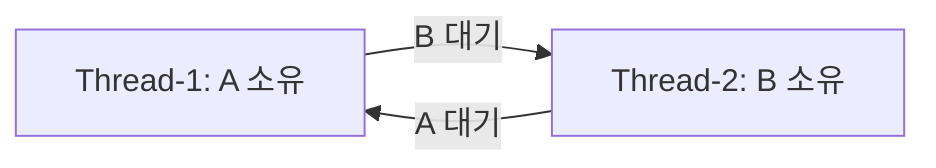

# 미션 4-2 평가문항 답변

2026-09-18 WSL에서 측정한 결과를 바탕으로 평가 문항 20개와 보너스 문항에 답했다. 먼저 아래 결과를 보고, 각 문항에서 판단 근거를 확인하면 된다. 실험 방법과 전체 로그는 [README](README.md), [실행 기록](evidence/), [장애별 보고서](reports/)에 있다.

각 문항 제목은 원본 평가표의 질문을 그대로 옮겼다.

| 장애 | 변경한 설정 | 변경 전 | 변경 후 |
| --- | --- | --- | --- |
| 메모리 누적 | `MEMORY_LIMIT=64 → 128` | 8.418초 후 MemoryGuard 종료 | 17.536초 후 같은 이유로 종료 |
| CPU 부하 | `CPU_MAX_OCCUPY=100 → 40` | 27.302초 후 Watchdog 종료 | 90초 관찰 동안 작업 진행 |
| 교착상태 | `MULTI_THREAD_ENABLE=true → false` | 락 순환 대기, 로그 79.317초 정체 | 90초 관찰 동안 작업·로그 진행 |

이 수치는 **WSL에서 각 조건을 한 번씩 실행한 결과**다. Docker 재현 수치와 섞지 않았다. 앱 로그는 KST, 수집 CSV와 결과 파일은 UTC다. '생존 시간'은 실행을 시작한 때부터 종료를 관측할 때까지이며, 90초에 살아 있던 실행은 **90초 이상 생존**으로 표시했다.

앱이 출력한 Heap과 OS가 측정한 RSS는 범위가 다른 메모리 값이다. 앱의 `Current Load`도 OS가 계산한 프로세스 CPU 사용률과 다르다. 종료 주체는 종료 코드만으로 판단하지 않고 앱 로그, `result.json`의 종료 이유와 수집기의 신호 기록을 함께 확인했다.

## 1. 실측 결과와 보고서

### 1-1. [OOM] 메모리 사용량이 선형적으로 증가하다가 프로세스가 강제 종료되는 패턴이 로그에 기록되어 있는가?

**그렇다.** `MEMORY_LIMIT=64` 실행에서 앱 Heap은 약 3초마다 25MB씩 늘었고, 75MB가 되자 MemoryGuard가 종료를 알렸다. 아래는 실제 앱 로그의 연속된 구간이다.

```text
2026-09-18 18:06:16,803 [INFO] [MemoryWorker] Current Heap: 25MB
2026-09-18 18:06:19,834 [INFO] [MemoryWorker] Current Heap: 50MB
2026-09-18 18:06:22,866 [INFO] [MemoryWorker] Current Heap: 75MB
2026-09-18 18:06:22,867 [CRITICAL] [MemoryGuard] Memory limit exceeded (75MB >= 64MB) / (Recommend Over 256MB)
2026-09-18 18:06:22,868 [CRITICAL] [MemoryGuard] Self-terminating process 2440463 to prevent system instability.
```

같은 워커(PID 2440463)의 RSS도 **17.250 → 67.250MiB**로 증가했다. 앱의 자체 종료 로그와 수집기의 신호 기록을 함께 보면 **앱 MemoryGuard의 보호 종료**로 판단할 수 있다. Linux 커널의 OOM Kill을 확인한 결과는 아니다.

Heap은 앱이 보고한 할당량이고 RSS는 OS가 실제 메모리에 올라와 있다고 본 양이다. 따라서 두 수치가 정확히 같을 필요는 없다. 여기서는 **서로 다른 측정값이 같은 증가 방향을 보인다**는 점이 중요하다.

[원문 로그](evidence/runs/20260918T090614Z-oom-before-402105430/console.log) · [측정 CSV](evidence/runs/20260918T090614Z-oom-before-402105430/metrics.csv)

### 1-2. [OOM] 환경변수( `MEMORY_LIMIT` ) 조정 후 프로세스 생존 시간이 늘어난 Before & After 비교 결과가 있는가?

**그렇다.** 메모리 설정만 64에서 128로 높이자 생존 시간이 **8.418초 → 17.536초**, 약 **2.08배**가 됐다. 두 실행 모두 `CPU_MAX_OCCUPY=100`, `MULTI_THREAD_ENABLE=false`, 최대 관찰 90초, 수집 간격 0.5초였다.

| 비교 항목 | Before | After |
| --- | ---: | ---: |
| 앱 메모리 한도 | 64MB | 128MB |
| 종료 직전 앱 Heap 로그 | 75MB | 150MB |
| 관측한 생존 시간 | 8.418초 | 17.536초 |
| 종료 원인 | MemoryGuard | MemoryGuard |

After에서도 Heap이 150MB에 이르자 `150MB >= 128MB` 보호 로그를 남기고 종료했다. 따라서 한도 상향은 **종료를 늦춘 임시 조치**다.

설정 변경 후에도 약 3초마다 25MB씩 증가하는 모습은 그대로다.

```text
2026-09-18 18:06:45,379 [INFO] [MemoryWorker] Current Heap: 25MB
2026-09-18 18:06:48,408 [INFO] [MemoryWorker] Current Heap: 50MB
2026-09-18 18:06:51,441 [INFO] [MemoryWorker] Current Heap: 75MB
2026-09-18 18:06:54,475 [INFO] [MemoryWorker] Current Heap: 100MB
2026-09-18 18:06:57,505 [INFO] [MemoryWorker] Current Heap: 125MB
2026-09-18 18:07:00,533 [INFO] [MemoryWorker] Current Heap: 150MB
2026-09-18 18:07:00,534 [CRITICAL] [MemoryGuard] Memory limit exceeded (150MB >= 128MB) / (Recommend Over 256MB)
2026-09-18 18:07:00,535 [CRITICAL] [MemoryGuard] Self-terminating process 2440969 to prevent system instability.
```

[After 로그](evidence/runs/20260918T090643Z-oom-after-033262350/console.log) · [두 실행 결과](evidence/manifest.json)

### 1-3. [CPU] CPU 사용률이 임계치를 초과하여 프로세스가 종료되는 패턴이 로그에 기록되어 있는가?

**그렇다.** 앱의 `Current Load`가 5.00%에서 52.69%로 계속 오른 직후 임계값 위반과 Watchdog의 SIGTERM이 기록됐다. 아래는 실제 앱 로그에서 `CpuWorker`의 연속된 구간이다.

```text
2026-09-18 18:11:24,056 [INFO] [CpuWorker] Current Load: 5.00%
2026-09-18 18:11:27,172 [INFO] [CpuWorker] Current Load: 13.56%
2026-09-18 18:11:30,289 [INFO] [CpuWorker] Current Load: 16.83%
2026-09-18 18:11:33,406 [INFO] [CpuWorker] Current Load: 21.75%
2026-09-18 18:11:36,522 [INFO] [CpuWorker] Current Load: 30.94%
2026-09-18 18:11:39,638 [INFO] [CpuWorker] Current Load: 32.60%
2026-09-18 18:11:42,755 [INFO] [CpuWorker] Current Load: 41.77%
2026-09-18 18:11:45,871 [INFO] [CpuWorker] Current Load: 44.69%
2026-09-18 18:11:48,987 [INFO] [CpuWorker] Current Load: 52.69%
2026-09-18 18:11:49,088 [CRITICAL] [CpuWorker] CPU Threshold Violated! (52.69%).
>>> [SYSTEM] WATCHDOG: INITIATING EMERGENCY ABORT (SIGTERM) <<<
```

워커 PID 2445628의 OS 측정 CPU는 종료 직전 약 0.1초 구간에서 **58.26%**였다. 두 수치는 계산 방식이 다르므로 같은 임계값으로 비교하지 않는다. 수집기가 보낸 종료 신호는 없었으나, 앱의 정확한 내부 임계값이나 계산식까지 확인한 것은 아니다.

`CPU_MAX_OCCUPY=100`이라는 설정만 보고 CPU가 정확히 100%일 때 종료한다고 해석할 수 없다. 실제로 확인한 것은 **앱이 52.69%에서 정책 위반을 선언하고 종료했다**는 사실이다.

`Current Load` 로그는 약 3초 간격이고, OS의 CPU 측정은 0.1초 간격이다. 위 로그는 앱 내부 부하의 상승을, [측정 CSV](evidence/runs/20260918T091121Z-cpu-before-748323350/metrics.csv)는 워커의 구간 CPU 사용률을 보여 준다. [원문 로그](evidence/runs/20260918T091121Z-cpu-before-748323350/console.log)

### 1-4. [CPU] 환경변수( `CPU_MAX_OCCUPY` ) 조정 후 프로세스 종료 여부/생존 시간이 변화한 Before & After 비교 결과가 있는가?

**그렇다.** `CPU_MAX_OCCUPY=100`에서는 **27.302초 후 Watchdog 종료**, `40`에서는 **90초 이상 생존**하며 냉각과 작업 재개 로그가 이어졌다. 두 실행의 `MEMORY_LIMIT=512`, `MULTI_THREAD_ENABLE=false`, 관찰 상한 90초, 수집 간격 0.1초는 같았다.

| 비교 항목 | Before | After |
| --- | --- | --- |
| 변경한 설정 | `CPU_MAX_OCCUPY=100` | `CPU_MAX_OCCUPY=40` |
| 관찰 결과 | 27.302초 후 앱 종료 | 90초 관찰 때까지 생존 |
| 종료를 알리는 근거 | Watchdog 위반 로그 | 관찰 상한 후 수집기의 정리 신호 |

After의 앱 로그에서는 부하가 5.00%에서 40.00%까지 오른 뒤 냉각되고, 다시 증가한다. 아래는 `CpuWorker` 행만 시간순으로 뽑은 원문이다.

```text
2026-09-18 18:12:53,775 [INFO] [CpuWorker] Current Load: 5.00%
2026-09-18 18:12:56,891 [INFO] [CpuWorker] Current Load: 14.00%
2026-09-18 18:13:00,005 [INFO] [CpuWorker] Current Load: 18.17%
2026-09-18 18:13:03,121 [INFO] [CpuWorker] Current Load: 26.96%
2026-09-18 18:13:06,237 [INFO] [CpuWorker] Current Load: 33.44%
2026-09-18 18:13:08,348 [INFO] [CpuWorker] Peak reached (40.00%). Starting cooldown...
2026-09-18 18:13:09,355 [INFO] [CpuWorker] Current Load: 40.00%
2026-09-18 18:13:12,471 [INFO] [CpuWorker] Current Load: 38.77%
2026-09-18 18:13:15,587 [INFO] [CpuWorker] Current Load: 35.26%
2026-09-18 18:13:18,704 [INFO] [CpuWorker] Current Load: 33.39%
2026-09-18 18:13:21,813 [INFO] [CpuWorker] Current Load: 27.29%
2026-09-18 18:13:24,929 [INFO] [CpuWorker] Current Load: 18.17%
2026-09-18 18:13:28,042 [INFO] [CpuWorker] Current Load: 9.20%
2026-09-18 18:13:30,153 [INFO] [CpuWorker] Cooldown complete (5.00%). Resuming load increase...
2026-09-18 18:13:31,159 [INFO] [CpuWorker] Current Load: 5.00%
2026-09-18 18:13:34,273 [INFO] [CpuWorker] Current Load: 10.17%
2026-09-18 18:13:37,389 [INFO] [CpuWorker] Current Load: 12.11%
2026-09-18 18:13:40,506 [INFO] [CpuWorker] Current Load: 12.48%
2026-09-18 18:13:43,622 [INFO] [CpuWorker] Current Load: 22.00%
2026-09-18 18:13:46,733 [INFO] [CpuWorker] Current Load: 26.98%
2026-09-18 18:13:49,845 [INFO] [CpuWorker] Current Load: 34.93%
2026-09-18 18:13:51,956 [INFO] [CpuWorker] Peak reached (40.00%). Starting cooldown...
2026-09-18 18:13:52,963 [INFO] [CpuWorker] Current Load: 40.00%
```

After의 `result.json`에는 `reason=observation_timeout`, `alive_before_cleanup=true`, 수집기가 보낸 `SIGTERM`이 기록됐다. 따라서 After의 최종 종료 코드 `-15`는 장애 재발이 아니라 **90초 관찰을 마친 뒤 정리한 결과**다. [After 로그](evidence/runs/20260918T091250Z-cpu-after-355471748/console.log) · [종료 결과](evidence/runs/20260918T091250Z-cpu-after-355471748/result.json)

### 1-5. [Deadlock] 프로세스가 살아있으나(PID 존재) CPU/메모리 변화 없이 로그가 멈춘 상태를 식별했는가?

**그렇다.** 워커 PID 2448740은 관찰 종료 직전까지 살아 있었지만, **79.317초** 동안 로그 크기가 그대로였고 CPU는 0%, RSS는 17.250MiB였다.

| 근거 | 관측값 |
| --- | --- |
| 로그 크기 | `console.log` 2881 bytes, 앱 로그 1517 bytes로 유지 |
| 관측 시각 | UTC 09:14:44.539 → 09:16:03.856 |
| 워커 상태 | 동일 PID·시작 틱 유지, `alive_before_cleanup=true` |
| 스레드 대기 | `ps -L`에서 워커 스레드들이 `futex_wait_queue` 대기 |

정상적으로 다음 입력을 기다리는 앱도 CPU가 0%이고 로그가 멈출 수 있다. 그래서 **살아 있음과 작업 진행은 별도로 확인**했다. 아래 3-4의 **서로 상대 락을 기다리는 로그**까지 합쳐 교착으로 판단했다. [관측 스냅샷](evidence/runs/20260918T091433Z-deadlock-before-531338111/snapshots.txt) · [로그 크기 기록](evidence/runs/20260918T091433Z-deadlock-before-531338111/log-sizes.jsonl)

### 1-6. [Deadlock] 환경변수( `MULTI_THREAD_ENABLE` ) 조정 후 데드락 재현/회피 비교 결과가 있는가?

**그렇다.** `true`에서는 A와 B를 가진 두 스레드가 서로를 기다린 뒤 작업 로그가 멈췄다. `false`로 바꾼 새 실행에서는 `All tasks completed`, `Memory Cache Flushed`와 이후 Heap 로그가 이어졌다.

두 실행은 `MEMORY_LIMIT=512`, `CPU_MAX_OCCUPY=40`, 관찰 상한 90초, 수집 간격 0.5초를 같게 했다. 둘 다 관찰 종료 때 살아 있었지만, **락 대기 시점 이후의 작업 진행은 After에서만 확인**됐다. `false`는 문제의 동시 처리 경로를 피한 설정이며, 이미 걸린 락을 풀거나 락 설계를 고친 결과는 아니다.

After 로그에는 18:17:16의 `All tasks completed` 이후에도 메모리 회수와 새 Heap 기록이 이어진다. 

After의 긴 로그에서 작업 완료와 메모리 회수 전후의 행을 발췌했다. 회수 뒤에도 Heap 로그가 다시 쌓여 작업이 이어졌음을 볼 수 있다.

```text
2026-09-18 18:17:16,593 [INFO] [Scheduler] All tasks completed.
2026-09-18 18:18:14,098 [INFO] [MemoryWorker] Current Heap: 500MB
2026-09-18 18:18:17,131 [INFO] [MemoryWorker] Current Heap: 525MB
2026-09-18 18:18:17,146 [INFO] [System] Memory Cache Flushed. Process Stabilized.
2026-09-18 18:18:22,173 [INFO] [MemoryWorker] Current Heap: 25MB
2026-09-18 18:18:25,204 [INFO] [MemoryWorker] Current Heap: 50MB
2026-09-18 18:18:28,228 [INFO] [MemoryWorker] Current Heap: 75MB
2026-09-18 18:18:31,259 [INFO] [MemoryWorker] Current Heap: 100MB
```

[Before 락 로그](evidence/runs/20260918T091433Z-deadlock-before-531338111/console.log) · [After 진행 로그](evidence/runs/20260918T091713Z-deadlock-after-166295630/console.log)

### 1-7. [Format] 3건의 리포트 모두 GitHub Issue 구조(현상 → 증거 → 원인 → 조치)를 갖추고 있는가?

**그렇다.** [OOM](reports/01-oom.md), [CPU](reports/02-cpu.md), [Deadlock](reports/03-deadlock.md) 보고서 모두 **현상 → 증거 → 원인 → 조치 및 검증** 순서로 작성했다. GitHub Issue에 옮길 수 있는 형식이라는 뜻이며, 실제 Issue 등록 여부와는 별개다.

예를 들어 OOM 보고서는 **메모리 누적과 종료 → Heap·RSS·종료 로그 → 앱 한도 초과 판단 → 한도 변경 후 생존 시간 비교**로 이어진다. 나머지 두 보고서도 같은 순서로 증거와 판단을 연결했다.

### 1-8. [Evidence] 리포트에 `PID` , 로그 타임스탬프, 핵심 로그 메시지가 포함된 증거(스크린샷 또는 로그 발췌)가 첨부되어 있는가?

**그렇다.** 세 보고서에 원문 로그와 CSV 링크, 워커 PID, 시각과 핵심 문장을 넣었다.

| 장애 | 워커 PID | 핵심 시각(KST)과 메시지 |
| --- | ---: | --- |
| OOM | 2440463 | 18:06:22.868 자체 종료 |
| CPU | 2445628 | 18:11:49.088 임계값 위반 및 Watchdog |
| Deadlock | 2448740 | 18:14:42.871 / 42.880 서로 다른 락 대기 |

앱 로그에 PID가 없는 줄은 같은 실행의 `ss`·`ps` 스냅샷과 CSV로 포트 소유 워커에 연결했다. 앱 로그(KST)와 수집 기록(UTC)은 9시간 차이를 맞춰 비교했다.

예를 들어 Deadlock 로그의 **18:14:42 KST**는 측정 파일의 **09:14:42 UTC**와 같은 때다. 시간대가 다르다는 점을 놓치면 서로 다른 실행의 로그처럼 보일 수 있다.

## 2. 수집 도구와 진단 과정

### 2-1. `monitor.sh` 에서 메모리 증가 패턴을 추적하기 위해 사용한 명령어와 데이터 추출 방법을 구체적으로 답변할 수 있는가?

`bin/monitor.sh`는 [Python 수집기](lib/monitor.py)를 실행한다. `/proc/PID/stat`은 Linux가 프로세스마다 제공하는 가상 파일로, 실행 상태·부모 PID·프로세스 그룹·CPU 사용 시간·시작 시점·메모리 사용량 등을 담고 있다. 예를 들어 이번 실험에서 PID 2440463의 부모는 2440456이고 상태는 `S`(대기)였으며, 그 프로세스의 RSS도 이 파일에서 읽었다.

수집기는 `/proc/PID/stat`의 **24번째 필드인 RSS 페이지 수**에 시스템 페이지 크기를 곱해 KiB로 바꾸고, 시각·PID·시작 틱과 함께 `metrics.csv`에 기록한다. 예를 들어 첫 측정값 `17664KiB ÷ 1024 = 17.250MiB`다. 프로세스 이름에 공백이 있어도 필드를 잘못 읽지 않도록 이름을 감싼 마지막 `)` 뒤부터 나눠 해석한다.

앱을 실행할 때 먼저 나타난 PID 2440456은 약 2MiB만 쓰는 **실행기**였고, 실제로 메모리가 늘어난 자식 **워커**의 PID는 2440463이었다. 시작할 때는 자식 PID를 모르므로 `--pgid`로 같은 프로세스 그룹의 실행기와 워커를 함께 수집했다. 그런 다음 앱이 사용하는 15034 포트를 `ss`로 확인해 소켓 소유자 2440463을 워커로 구분했다. 실행기만 측정하면 OOM의 메모리 증가를 놓치므로, 비교에는 이 워커의 RSS를 **0.5초 간격**으로 사용했다.

PID는 프로세스가 종료된 뒤 다른 프로세스에 다시 배정될 수 있다. 그래서 수집기는 PID와 **시작 틱**(프로세스가 시작된 시점)을 함께 확인한다. 나중에 같은 PID가 보여도 시작 틱이 다르면 새 프로세스로 보고, 앞선 워커의 측정값과 이어 붙이지 않는다.

### 2-2. 프로세스의 CPU 사용률을 확인하기 위해 선택한 도구와 적용한 옵션의 의미를 구분하여 서술할 수 있는가?

주요 시계열 값은 [수집기](lib/monitor.py)가 `/proc`의 사용자·시스템 CPU 누적 틱 차이를 실제 경과 시간으로 나눠 계산했다. **100%는 논리 CPU 하나를 계속 사용한 수준**이다. CPU 실험은 짧은 상승을 보기 위해 0.1초 간격으로 수집했다.

수집기의 계산식은 다음과 같다. `SC_CLK_TCK`는 CPU 시간 1초에 해당하는 틱 수다.

```text
CPU 시간(초) = user+system 누적 틱의 증가량 / 초당 틱 수(SC_CLK_TCK)
CPU % = CPU 시간(초) / 두 샘플 사이 실제 경과 시간(초) × 100
```

예를 들어 0.1초 사이에 CPU를 0.06초 썼다면 `0.06 ÷ 0.1 × 100 = 60%`다. 여러 CPU 코어를 동시에 쓰는 프로세스는 이 방식에서 100%를 넘을 수도 있다.

| 도구 | 주요 옵션과 용도 |
| --- | --- |
| 수집기 `--pgid ... --interval 0.1` | 프로세스 그룹을 0.1초마다 관찰 |
| `ps -p ... -o pid,ppid,pgid,stat,pcpu,rss` | PID 선택 및 프로세스 관계·상태·자원 열 표시 |
| `ps -L -p ... -o pid,tid,stat,wchan` | 스레드별 상태와 커널 대기 지점 확인 |
| `top -b -H -n 1 -p ...` | 한 번의 배치 스냅샷에서 스레드 확인 |
| `ss -ltnp 'sport = :15034'` | LISTEN TCP 포트의 소유 PID 확인 |

`ps %CPU`는 프로세스 수명 기준 평균이므로 수집기의 0.1초 구간 값과 바로 비교하지 않았다. 앱의 `Current Load`도 별도 지표다.

### 2-3. 프로세스가 "살아있지만 멈춰있는 상태"를 진단하기 위해 어떤 도구를 어떤 순서로 사용했는지, 본인의 판단 흐름을 논리적으로 제시할 수 있는가?

자동 수집된 자료를 다음 순서로 해석했다. 처음 네 단계는 같은 Before 실행, 마지막 단계는 설정을 바꾼 별도 After 실행이다.

1. **대상 식별:** `ss -ltnp 'sport = :15034'`로 포트 소유 워커 PID **2448740**을 찾고 `ps`의 부모·그룹 정보를 확인했다. 실행기 PID **2448732**과 구분했다.
2. **생존 확인:** `metrics.csv`의 첫·마지막 기록에서 PID와 `start_ticks=21797426`이 같고 상태가 `S`(대기)임을 확인했다. PID가 한 번 보였다는 사실만으로 생존을 판단하지 않았다.
3. **진행 확인:** 같은 워커의 CPU **0.00%**, RSS **17664KiB**가 유지되고 로그 크기도 **79.317초** 동안 변하지 않았다.
4. **대기 원인 확인:** `ps -L`의 `futex_wait_queue`는 동기화 대기를 보여 준다. 앱 로그의 A 소유·B 대기와 B 소유·A 대기를 결합해 순환 관계를 찾았다. `futex`만으로 어느 락을 기다리는지는 알 수 없다.
5. **조치 검증:** `MULTI_THREAD_ENABLE=false`로 새로 실행하자 90초 관찰 동안 작업 완료와 로그 갱신이 이어졌다. `result.json`의 `alive_before_cleanup=true`로 관찰 종료 시점의 생존도 확인했다.

핵심 판정은 **같은 PID의 생존 + 작업 정체 + 양방향 락 대기**다. [Before 스냅샷](evidence/runs/20260918T091433Z-deadlock-before-531338111/snapshots.txt) · [Before 측정 CSV](evidence/runs/20260918T091433Z-deadlock-before-531338111/metrics.csv) · [After 결과](evidence/runs/20260918T091713Z-deadlock-after-166295630/result.json)

`start_ticks`는 프로세스가 시작된 시점에 커널이 부여한 값이다. PID 번호만 같으면 종료 후 재사용된 다른 프로세스를 같은 워커로 착각할 수 있어 두 값을 함께 비교했다. `futex_wait_queue`는 동기화 대기 지점이지만 어떤 앱 락인지 알려 주지는 않으므로, 마지막 단계에서 앱의 락 로그가 필요했다.

## 3. 장애가 발생하고 보호하는 원리

### 3-1. 메모리 누수가 발생했을 때 애플리케이션의 메모리 보호 정책이 해당 프로세스를 강제 종료하는 이유를 설명할 수 있는가?

**메모리 누적을 멈춰 다른 프로세스로 피해가 번지는 것을 막기 위해서다.** 이번 앱은 Heap이 75MB에 이르러 자체 설정인 `MEMORY_LIMIT=64`를 넘자 MemoryGuard가 종료했다. OS는 종료된 프로세스가 쓰던 메모리를 회수한다. 이는 커널 OOM Kill이 아니며, 한도만 높이면 종료 시점이 늦춰질 뿐 누적 원인은 남는다.

### 3-2. CPU 과점유 시 단일 프로세스를 종료하는 것이 시스템 보호에 왜 필요한지 근거를 제시할 수 있는가?

**원인 프로세스의 CPU 소비를 멈춰 다른 작업이 실행할 시간을 확보하기 위해서다.** 이번 앱은 Watchdog가 정책 위반을 기록하고 해당 프로세스에 SIGTERM을 보냈다. 운영에서는 CPU가 높다는 이유만으로 종료하지 않고, PID별 사용률·작업 진행·응답 지연을 살펴 폭주인지 판단한다. 필요하면 유입 제한이나 워커 수 조절로 먼저 완화한다. 이번 실험에서 다른 서비스의 지연 변화는 측정하지 않았다.

### 3-3. 교착 상태(Deadlock)가 발생하는 원리를 "상호 배제"와 "순환 대기" 개념으로 설명할 수 있는가?

**Thread-1은 A를 가진 채 B를 기다리고, Thread-2는 B를 가진 채 A를 기다린다.** 둘 다 상대가 락을 놓아야 다음 작업을 할 수 있으므로 진행이 멈춘다. 이 상황을 교착상태의 네 조건에 대입하면 다음과 같다.

1. **상호 배제:** 락 A와 B는 각각 한 번에 한 스레드만 소유한다.
2. **점유와 대기:** 두 스레드가 락을 하나씩 가진 채 다음 락을 기다린다.
3. **비선점:** 기다리는 동안 상대가 가진 락을 강제로 빼앗지 못한다.
4. **순환 대기:** Thread-1은 Thread-2의 B를, Thread-2는 Thread-1의 A를 기다린다.


```mermaid
flowchart LR
    T1["Thread-1: A 소유"] -->|B 대기| T2["Thread-2: B 소유"]
    T2 -->|A 대기| T1
```

서로 기다리는 동안 스레드는 잠들 수 있어 CPU 사용률이 낮아도 교착상태일 수 있다. 다음 문항의 락 로그와 작업 정체 기록이 이 관계를 뒷받침한다.

### 3-4. 로그에서 스레드 간 순환 의존 관계(A→B, B→A)를 어떻게 파악했는지 추적 과정을 설명할 수 있는가?

시간순으로 각 스레드의 `LOCK ACQUIRED`와 `WAITING` 대상을 연결했다. 아래는 시각과 핵심 메시지만 추린 로그다.

```text
18:14:40.866 Thread-1 LOCK ACQUIRED: Shared_Memory_A
18:14:40.866 Thread-2 LOCK ACQUIRED: Socket_Pool_B
18:14:42.871 Thread-1 WAITING for Socket_Pool_B
18:14:42.880 Thread-2 WAITING for Shared_Memory_A
```

로그의 `LOCK ACQUIRED`는 이미 쥔 자원, `WAITING`은 추가로 필요한 자원이다. Thread-1의 B는 Thread-2가, Thread-2의 A는 Thread-1이 쥐고 있다. 따라서 Thread-1은 **A→B**, Thread-2는 **B→A** 순서로 락이 필요하다. 이후 해제·완료 로그가 없고 OS 관측도 정체돼 순환 대기로 판단했다. 앱의 스레드 이름을 OS의 TID와 일대일로 연결한 것은 아니다. [락 로그 원문](evidence/runs/20260918T091433Z-deadlock-before-531338111/console.log)

## 4. 운영 환경에 적용하기

이 절은 실측 결과에서 출발한 **개선 제안**이다. 제공 바이너리의 내부 코드를 확인하거나 아래 변경을 구현한 것은 아니다.

### 4-1. 만약 이번 미션의 `agent-leak-app` 이 실제 운영 서버에서 동작하고 있었다면, 메모리 누수를 장애 발생 전에 탐지하기 위해 현재의 `monitor.sh` 를 어떻게 개선하겠는가?

**RSS의 현재값에 증가 속도와 메모리 회수 후 최저값을 더해 보겠다.** 캐시는 늘었다가 줄 수 있지만, 회수 후 최저값까지 계속 높아지면 누적을 의심할 수 있다. Python 수집기에 PID별 추세와 컨테이너 사용량·한도를 기록하고, 증가가 여러 구간 이어지면 설정과 최근 로그를 함께 경보하겠다. 프로세스 RSS와 컨테이너 사용량은 측정 범위가 달라 각각 추적한다.

### 4-2. 이번 미션에서 겪은 3가지 장애(OOM, CPU Spike, Deadlock) 중 실제 서비스 환경에서 가장 치명적인 것은 무엇이라고 생각하는가? 그 이유와 함께, 해당 장애를 근본적으로 예방하는 방법을 제안할 수 있는가?

**격리가 부족한 공유 서버에서는 메모리 고갈을 가장 심각하게 본다.** 한 앱의 누적이 다른 서비스와 복구 도구까지 방해할 수 있기 때문이다. 예방하려면 불필요한 참조를 정리하고 캐시·큐에 상한을 둔 뒤, 장시간 부하에서 메모리가 회수되는지 확인한다. 이번 실험에서 관측한 것은 앱 MemoryGuard의 종료이며 호스트 메모리 고갈은 아니다.

### 4-3. 만약 동일한 서버에서 OOM과 Deadlock이 동시에 발생했다면, 어떤 순서로 트러블슈팅을 진행하겠는가? 우선순위 판단의 근거를 설명할 수 있는가?

**남은 메모리와 실제 서비스 영향을 먼저 보고 우선순위를 정한다.** 호스트 메모리 고갈이 임박했다면 피해 확산을 막는 일이 먼저다.

1. 메모리 여유·영향받은 서비스·문제 PID를 확인한다.
2. 메모리 추세와 마지막 락 로그를 짧게 보존한다.
3. 유입을 제한하고 문제 인스턴스를 정상 종료·교체한다. 교착으로 응답하지 않으면 유예 후 강제 종료한다.
4. 락 대기 관계를 분석하고, 작업 완료와 메모리 회복을 확인한다.

메모리가 격리돼 여유가 충분하고 교착이 모든 요청을 막는다면 교착 복구를 먼저 한다.

### 4-4. 이번 미션의 환경변수 조정은 임시 조치였다. 만약 소스 코드를 직접 수정할 수 있다면, 각 장애 유형별로 어떤 코드 레벨의 개선을 하겠는가?

| 장애 | 소스 수정 후보 | 확인할 결과 |
| --- | --- | --- |
| 메모리 | 불필요한 참조 정리, 캐시·큐에 상한과 만료 적용 | 회수 후 메모리 기준선 안정 |
| CPU | 프로파일링 후 반복 연산·busy wait·무제한 재시도 수정 | 같은 요청량에서 CPU·처리량·지연 비교 |
| Deadlock | 락 획득 순서를 A→B로 통일하고 실패 시 보유 락 해제 | 동시 요청·예외 상황에서도 작업 완료 |

제공 바이너리의 소스는 확인하지 않았으므로 실제 수정 지점은 코드와 프로파일을 본 뒤 정한다.

### 4-5. 다시 이 미션을 처음부터 수행한다면, 트러블슈팅 과정에서 어떤 점을 다르게 접근하겠는가?

**실험 전에 실제 워커 PID, 수집 간격, 시간대와 종료 판정 기준을 정하겠다.** 이번에는 실행기와 워커 PID가 달랐고, CPU After의 `-15`도 장애가 아니라 수집기의 정리 신호였다. 다음에는 포트 소유 워커와 종료 신호의 주체를 처음부터 함께 기록하겠다.

Before/After를 같은 조건에서 여러 번 실행해 생존 시간의 범위를 비교하겠다. 90초에 살아 있으면 **90초 이상 생존**으로 적고, 응답 지연 개선을 주장하려면 실제 요청 지연을 따로 측정하겠다.

## 5. 보너스 문제 해결에 따른 크레딧 부여

**앱 로그의 A→B→C 순환과 `Preempted`·`Resumed`를 근거로 앱 수준의 Round-Robin 패턴을 추론했다.** CPU After 로그에서 A·B·C는 차례로 40%까지 진행한 뒤 상태를 저장했고, 다음 순회에서는 60~80%, 마지막 순회에서는 100%까지 이어서 실행됐다. 18:12:53.758에 `All tasks completed`가 기록됐다.

예를 들어 A가 `Preempted. Progress saved at (40%)`를 남긴 뒤 B와 C가 실행되고, 다음 차례의 A는 `Resumed`로 저장한 진행률에서 이어간다. 한 작업을 끝까지 실행하는 방식과 달리 **각 작업에 차례를 돌린다**는 점이 판단 근거다.

한 작업이 끝날 때까지 기다리지 않고 실행 기회를 번갈아 주는 방식은 다른 작업의 긴 대기를 줄일 수 있지만 전환 비용이 든다. 이 기록은 **앱이 출력한 작업 순서**를 보여 주며 Linux 커널의 실제 `SCHED_RR` 정책을 입증하지는 않는다. [CPU After 로그](evidence/runs/20260918T091250Z-cpu-after-355471748/console.log)
