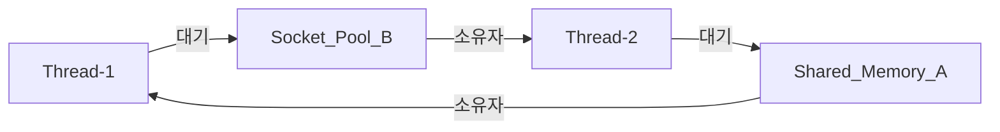

# 미션 4-2 평가문항 답변

이 문서는 [평가표 원본](rawdata/evaluation-criteria.webp)의 질문 20개와 보너스 항목을 순서대로 설명한다. 각 문항의 **굵은 문장은 먼저 말할 답변**, 뒤의 설명과 링크는 이해와 근거 확인을 위한 자료다.

수치는 Git에 보존된 **2026-09-18 WSL 실측**을 기준으로 한다. 앱 로그는 KST, 관제 CSV·종료 결과는 UTC이며 KST가 9시간 빠르다. Docker 재현은 [별도 검증 기록](docs/DOCKER-VERIFICATION.md)에 있으므로 서로 다른 실행의 수치나 PID를 섞지 않는다. 항목 4는 실제로 적용한 조치가 아닌 운영 상황에 대한 개선 제안이다.

읽기 순서: [실측 결과](#1-실측-결과와-보고서) → [도구와 진단](#2-수집-도구와-진단-과정) → [원리](#3-장애가-발생하고-보호하는-원리) → [운영 적용](#4-운영-환경에-적용하기) → [보너스](#5-보너스-스케줄링-분석).

## 먼저 알아둘 용어

| 용어 | 쉽게 말하면 |
| --- | --- |
| 프로세스 / PID | 실행 중인 프로그램 / 그 실행을 식별하는 번호 |
| 스레드 | 프로세스 안에서 작업을 수행하는 실행 흐름 |
| 워커 | 이 앱에서 실제 작업과 15034 포트 사용을 담당하는 프로세스. 패키징 실행기와 PID가 다를 수 있음 |
| RSS | 현재 RAM에 올라와 있는 프로세스 메모리의 크기. 가상 주소 공간 전체 크기인 VMS와 구분 |
| Heap | 앱이 동적으로 데이터를 보관하는 메모리 영역. 로그의 Heap 값과 OS의 RSS는 같은 측정값이 아님 |
| MemoryGuard / Watchdog | 앱이 메모리·CPU 관련 상태를 감시하고 자체 보호 동작을 수행하는 구성 요소 |
| 락(lock) | 공유 자원을 동시에 사용하지 못하도록 소유권을 관리하는 장치 |
| cgroup | Linux가 프로세스 묶음의 자원 사용을 계측하고 제한하는 기능. Docker의 메모리 한도도 이를 이용 |
| Before / After | 관심 설정을 바꾸기 전 / 바꾼 후. 다른 조건은 같게 맞춰 비교 |

**종료 코드는 로그와 함께 읽는다.** 이번 `result.json`의 `-9`는 SIGKILL, `-15`는 SIGTERM 종료를 뜻한다. 같은 `-15`라도 앱 Watchdog가 보냈는지, 관찰을 끝낸 수집기가 보냈는지는 `runner_events`와 앱 로그로 구분한다.

## 1. 실측 결과와 보고서

### 1-1. OOM의 메모리 증가와 강제 종료가 기록되어 있는가?

> [OOM] 메모리 사용량이 선형적으로 증가하다가 프로세스가 강제 종료되는 패턴이 로그에 기록되어 있는가?

**그렇다. 메모리가 일정한 양씩 누적된 뒤 앱의 MemoryGuard가 해당 프로세스를 종료했다.**

Before에서 실제 워커 PID는 **2440463**이었다. Heap은 약 3초마다 25MB씩 증가했다. 아래는 같은 실행의 원문 발췌다.

```text
2026-09-18 18:06:16,803 [INFO] [MemoryWorker] Current Heap: 25MB
2026-09-18 18:06:19,834 [INFO] [MemoryWorker] Current Heap: 50MB
2026-09-18 18:06:22,866 [INFO] [MemoryWorker] Current Heap: 75MB
2026-09-18 18:06:22,867 [CRITICAL] [MemoryGuard] Memory limit exceeded (75MB >= 64MB) / (Recommend Over 256MB)
2026-09-18 18:06:22,868 [CRITICAL] [MemoryGuard] Self-terminating process 2440463 to prevent system instability.
```

OS에서 관측한 워커 RSS도 **17.250→67.250MiB**로 증가했다. 결과는 `app_exited`, `launcher_returncode=-9`, `runner_events=[]`였다. 수집기가 정리 신호를 보내기 전에 앱이 종료된 것이다.

여기서 선형 증가는 매 순간 매끄러운 직선을 그린다는 뜻보다, 일정 시간마다 비슷한 양이 쌓인다는 추세로 이해하면 된다. 실제 샘플은 계단형이다. Heap과 RSS의 범위·단위·측정 시점이 다르므로 마지막 Heap 75MB와 RSS 67.250MiB가 같아야 하는 것은 아니다. 이번에 확인한 것은 **앱의 자체 보호 종료**이며 커널 OOM으로 판정한 결과는 아니다.

근거: [앱 로그](evidence/runs/20260918T090614Z-oom-before-402105430/console.log), [RSS 시계열](evidence/runs/20260918T090614Z-oom-before-402105430/metrics.csv), [종료 결과](evidence/runs/20260918T090614Z-oom-before-402105430/result.json).

### 1-2. MEMORY_LIMIT 조정 뒤 생존 시간이 늘었는가?

> [OOM] 환경변수(MEMORY_LIMIT) 조정 후 프로세스 생존 시간이 늘어난 Before & After 비교 결과가 있는가?

**64에서 128로 높이자 생존 시간이 8.418초에서 17.536초로 늘었다. 약 2.08배지만 메모리 누적 자체가 해결된 것은 아니다.**

| 비교 조건·결과 | Before | After |
| --- | --- | --- |
| `MEMORY_LIMIT` | 64 | 128 |
| `CPU_MAX_OCCUPY` / `MULTI_THREAD_ENABLE` | 100 / false | 동일 |
| 관찰 상한 / 샘플 간격 | 90초 / 0.5초 | 동일 |
| 실제 생존 시간 | 8.418초 | 17.536초 |
| 마지막 Heap 로그 | 75MB | 150MB |
| 종료 원인 | MemoryGuard | MemoryGuard |

물이 계속 들어오는 통의 크기를 키우면 넘치는 시점은 늦어진다. 이 실험도 한도를 늘려 종료가 늦어졌지만 두 경우 모두 다시 종료됐다. 따라서 **한도 상향은 임시 완화**라고 설명한다.

근거: [OOM 보고서](reports/01-oom.md), [After 앱 로그](evidence/runs/20260918T090643Z-oom-after-033262350/console.log), [After 종료 결과](evidence/runs/20260918T090643Z-oom-after-033262350/result.json).

### 1-3. CPU 임계 초과와 종료가 기록되어 있는가?

> [CPU] CPU 사용률이 임계치를 초과하여 프로세스가 강제 종료되는 패턴이 로그에 기록되어 있는가?

**앱이 내부 부하 52.69%를 정책 위반으로 판단하고 Watchdog가 SIGTERM으로 종료한 로그가 있다. OS에서 측정한 CPU 사용률은 별도로 확인했다.**

Before의 워커 PID는 **2445628**이다.

```text
2026-09-18 18:11:48,987 [INFO] [CpuWorker] Current Load: 52.69%
2026-09-18 18:11:49,088 [CRITICAL] [CpuWorker] CPU Threshold Violated! (52.69%).

>>> [SYSTEM] WATCHDOG: INITIATING EMERGENCY ABORT (SIGTERM) <<<
```

같은 실행의 OS 관측에서는 **0.1초 구간 CPU가 최대 58.26%**였고, 앱은 **27.302초**에 종료됐다. 결과의 `-15`와 빈 `runner_events`는 수집기 정리 전에 종료됐음을 보여 준다.

52.69%는 앱의 `Current Load`, 58.26%는 `/proc` 기반 구간 측정값이다. 서로 다른 지표다. 또한 `CPU_MAX_OCCUPY=100`이라고 해서 종료 임계값이 반드시 100%라는 뜻은 아니다. 실제 로그에서 앱의 정책 위반과 종료를 확인해야 한다.

근거: [앱 로그](evidence/runs/20260918T091121Z-cpu-before-748323350/console.log), [CPU 시계열](evidence/runs/20260918T091121Z-cpu-before-748323350/metrics.csv), [종료 결과](evidence/runs/20260918T091121Z-cpu-before-748323350/result.json).

### 1-4. CPU_MAX_OCCUPY 조정 후 종료·생존이 달라졌는가?

> [CPU] 환경변수(CPU_MAX_OCCUPY) 조정 후 프로세스 종료 여부/생존 시간이 변화한 Before & After 비교 결과가 있는가?

**설정값을 100에서 40으로 낮추자 27.302초 만의 Watchdog 종료가 사라지고 90초 관찰 상한까지 작업이 이어졌다.**

| 비교 조건·결과 | Before | After |
| --- | --- | --- |
| `CPU_MAX_OCCUPY` | 100 | 40 |
| `MEMORY_LIMIT` / `MULTI_THREAD_ENABLE` | 512 / false | 동일 |
| 관찰 상한 / 샘플 간격 | 90초 / 0.1초 | 동일 |
| 생존 | 27.302초 후 앱 종료 | 90초 이상 생존 |
| 주요 로그 | Watchdog 정책 위반 | 고점 도달→냉각→부하 재증가 |
| 마지막 SIGTERM의 주체 | 앱 Watchdog | 관찰을 마친 수집기 |

After의 `result.json`은 `observation_timeout`, `alive_before_cleanup=true`, `observed_s=90.020`이다. 즉 90초에 다시 장애가 난 것이 아니라, 관찰할 만큼 본 뒤 수집기가 실험을 끝냈다.

이 결과로 말할 수 있는 것은 **관찰 기간 내 보호 종료 회피와 작업 진행**이다. 영구적인 안정성이나 실제 HTTP 응답시간 개선까지 확인한 것은 아니다.

근거: [CPU 보고서](reports/02-cpu.md), [After 로그](evidence/runs/20260918T091250Z-cpu-after-355471748/console.log), [After 종료 결과](evidence/runs/20260918T091250Z-cpu-after-355471748/result.json).

### 1-5. 살아 있지만 로그와 자원이 정체된 상태를 식별했는가?

> [Deadlock] 프로세스가 살아있으나(PID 존재) CPU/메모리 변화 없이 로그가 멈춘 상태를 식별했는가?

**PID가 존재한다는 사실에 더해, 같은 프로세스의 CPU·RSS·로그 진행이 함께 멈췄는지 확인했다.**

| 관측 항목 | Deadlock Before의 증거 |
| --- | --- |
| 실제 워커 | PID **2448740**, 관찰 종료 직전에도 생존 |
| 구간 CPU | 0.00%로 유지 |
| RSS | 17.250MiB로 유지 |
| 로그 크기 | `console.log` 2881 bytes, 앱 로그 1517 bytes로 **79.317초** 정체 |
| 마지막 작업 로그 | 두 워커가 상대 자원을 `WAITING` / `BLOCKED` |
| 스레드 상태 | `ps -L`에서 세 스레드의 `futex_wait_queue` 대기 관측 |

사람이 사무실에 있다고 일이 진행되는 것은 아닌 것처럼, PID 존재만으로 정상이라고 할 수 없다. 다만 CPU가 낮고 로그가 조용한 정상 대기도 가능하다. 이번에는 **서로의 락을 기다린다는 로그**까지 있어 교착상태라는 판단을 뒷받침한다.

근거: [스레드 스냅샷](evidence/runs/20260918T091433Z-deadlock-before-531338111/snapshots.txt), [로그 크기 기록](evidence/runs/20260918T091433Z-deadlock-before-531338111/log-sizes.jsonl), [앱 로그](evidence/runs/20260918T091433Z-deadlock-before-531338111/console.log).

### 1-6. MULTI_THREAD_ENABLE 조정 후 재현·회피를 비교했는가?

> [Deadlock] 환경변수(MULTI_THREAD_ENABLE) 조정 후 데드락 재현/회피 비교 결과가 있는가?

**true일 때 순환 대기와 작업 정체가 나타났고, false일 때 같은 90초 동안 작업 완료와 로그 진행을 확인했다.**

메모리 설정 512와 CPU 설정 40은 고정했다. Before의 마지막 로그는 양쪽 `WAITING`이었지만, After에서는 `All tasks completed`, 메모리 캐시 회수, CPU 냉각 로그가 이어졌다. After의 실제 관찰 시간은 **90.044초**이고 관찰 종료 후 수집기가 정리했다.

따라서 결과는 **문제가 발생한 동시 처리 경로를 피했다**는 뜻이다. `false`여도 앱의 다른 워커 스레드들은 존재할 수 있다. 앱 전체가 단일 스레드가 됐다거나 락 설계 자체를 고쳤다고 설명하지 않는다.

근거: [Deadlock 비교 보고서](reports/03-deadlock.md), [After 로그](evidence/runs/20260918T091713Z-deadlock-after-166295630/console.log), [After 결과](evidence/runs/20260918T091713Z-deadlock-after-166295630/result.json).

### 1-7. 세 보고서가 GitHub Issue 구조를 갖췄는가?

> [Format] 3건의 리포트 모두 GitHub Issue 구조(현상 → 증거 → 원인 → 조치)를 갖추고 있는가?

**세 장애 보고서를 모두 같은 네 항목으로 작성했다.**

| 보고서 항목 | 이 항목에서 답하는 질문 |
| --- | --- |
| Description / 현상 | 어떤 조건에서 무엇이 일어났는가? |
| Evidence & Logs / 증거 | 어떤 PID·시각·로그·수치로 확인했는가? |
| Root Cause Analysis / 원인 | 그 증거를 어떻게 해석했는가? |
| Workaround & Verification / 조치 | 무엇을 바꿨고 전후 결과와 한계는 무엇인가? |

같은 구조를 사용하면 현상만 보고 원인을 단정하거나, 설정을 바꾼 뒤 검증을 빠뜨리는 일을 줄일 수 있다. GitHub Issue에 옮겨 사용할 수 있는 Markdown 형식이다. 실제 Issue 등록 여부와 문서 구조는 별개다.

근거: [OOM](reports/01-oom.md), [CPU](reports/02-cpu.md), [Deadlock](reports/03-deadlock.md), [공통 템플릿](templates/issue-report.md).

### 1-8. PID·타임스탬프·핵심 로그가 증거로 첨부됐는가?

> [Evidence] 리포트에 PID, 로그 타임스탬프, 핵심 로그 메시지가 포함된 증거(스크린샷 또는 로그 발췌)가 첨부되어 있는가?

**스크린샷 대신 검색·대조가 가능한 로그 발췌와 원문 링크를 첨부했다.**

- OOM: PID **2440463**, KST **18:06:22.868**, `Self-terminating process 2440463`.
- CPU: PID **2445628**의 CSV와 소켓 소유 기록, KST **18:11:49.088**의 임계 초과 로그, 이어지는 Watchdog SIGTERM.
- Deadlock: PID **2448740**의 반복 스냅샷, KST **18:14:42.871 / 18:14:42.880**의 서로 반대 자원 대기 로그.

CPU·Deadlock의 모든 앱 로그 줄에 PID가 들어 있는 것은 아니다. **같은 실행 폴더**의 `ss`·`ps` 출력과 CSV를 대조해 어느 프로세스의 로그인지 연결했다. 앱 로그 KST와 CSV UTC는 9시간 차이를 맞춰 읽었다.

근거: [실행 목록·명령](evidence/manifest.json), [세 보고서](reports/), [실측 증거 검사 결과](evidence/verification.txt).

## 2. 수집 도구와 진단 과정

### 2-1. monitor.sh는 메모리 증가를 어떻게 추적했는가?

> monitor.sh에서 메모리 증가 패턴을 추적하기 위해 사용한 명령어와 데이터 추출 방법을 구체적으로 답변할 수 있는가?

**Bash 스크립트가 Python 수집기를 실행하고, Python이 `/proc/PID/stat`을 일정 간격으로 읽어 RSS를 CSV로 저장한다.**

```text
bin/monitor.sh
  → python3 lib/monitor.py에 실행 옵션 전달
  → --pid 또는 --pgid로 대상 선택
  → /proc/PID/stat에서 메모리·CPU·상태 읽기
  → metrics.csv와 monitor.log에 시각과 함께 기록
```

`monitor.sh`의 실제 실행 문장은 `exec python3 "$script_dir/../lib/monitor.py" "$@"`다. 따라서 `ps` 출력에서 숫자를 잘라 저장했다고 설명하는 것은 이 코드와 맞지 않는다.

수집기는 stat의 **24번째 필드인 RSS 페이지 수**를 읽고 OS 페이지 크기를 곱한다. 프로세스 이름에 공백·괄호가 있을 수 있어 마지막 `)` 뒤부터 분리한다. 이 분리 배열에서는 RSS가 `fields[21]`이다.

```text
RSS KiB = RSS 페이지 수 × 페이지 크기(bytes) / 1024
RSS MiB = RSS KiB / 1024
예: 17664 KiB / 1024 = 17.250 MiB
```

OOM은 0.5초 간격으로 기록했다. 패키징 실행기와 실제 워커가 다른 PID이므로 `--pgid`로 그룹을 관측하고, `ss`에서 15034 포트 소유자를 찾아 그 워커의 행을 비교했다. 동일 PID가 나중에 다른 프로세스에 재사용될 수 있어 시작 틱도 함께 식별자로 사용한다.

CSV는 `csv.DictReader`로 읽어 `pid`가 해당 워커인 행의 `timestamp`, `rss_kib`를 추출한다. [README의 실행 가능한 추출 예제](README.md#메모리-추적-구현)로 17.250→67.250MiB 증가를 직접 확인할 수 있다. RSS는 근사 계측값이며 공유 페이지 중복이나 내부 객체의 누수 위치까지 판별해 주지는 않는다.

근거: [Bash 진입점](bin/monitor.sh), [read_stat·sample·CSV 기록 코드](lib/monitor.py), [Linux /proc 설명](https://www.kernel.org/doc/html/latest/filesystems/proc.html).

### 2-2. CPU 사용률을 확인한 도구와 옵션은 무엇인가?

> 프로세스의 CPU 사용률을 확인하기 위해 선택한 도구와 적용한 옵션의 의미를 구분하여 서술할 수 있는가?

**CPU 변화의 수치는 `/proc` 기반 수집기로 계산했고, `ps`·`top`은 프로세스와 스레드 상태를 확인하는 보조 증거로 사용했다.**

CPU 계산은 두 시점 사이에 실제로 사용한 CPU 시간을 비교한다.

```text
CPU % = CPU를 사용한 시간 / 두 샘플 사이 실제 경과 시간 × 100
CPU를 사용한 시간 = (user+system 누적 틱의 증가량) / SC_CLK_TCK

설명용 예: 0.1초 동안 CPU를 0.06초 사용 → 60%
```

이 방식에서 100%는 논리 CPU 하나를 전부 사용한 수준이다. 컴퓨터 전체 CPU 사용률과 같은 기준이 아니며 CPU 개수로 나누지 않는다. 최초 샘플은 비교할 이전 값이 없어 CPU 값을 비워 둔다.

| 도구·옵션 | 확인하는 것 |
| --- | --- |
| 수집기의 `--pgid`, `--interval 0.1` | 앱 그룹을 추적하면서 짧은 CPU 상승을 0.1초 간격으로 기록 |
| `ps -p PID목록 -o ...` | `-p`로 대상 PID 선택, `-o`로 `pid,ppid,pgid,stat,pcpu,rss` 등의 출력 열 지정 |
| `ps -L -p PID목록 -o pid,tid,stat,pcpu,rss,wchan:32,comm` | `-L`로 스레드별 TID·상태·대기 지점 표시. `:32`는 대기 지점 열의 너비 |
| `top -b -H -n 1 -p PID목록` | `-b`: 파일로 남길 배치 출력, `-H`: 스레드 표시, `-n 1`: 한 화면 후 종료, `-p`: 대상 선택 |
| `ss -ltnp 'sport = :15034'` | LISTEN 중인 TCP 소켓을 숫자로 표시하고 소유 프로세스를 확인 |

`ps %CPU`는 프로세스 수명 평균이다. `top`의 첫 화면도 수집기의 0.1초 차분과 같은 값으로 보지 않았다. 초기 0.5초 관측에서는 짧은 상승이 희석되어, 최종 CPU 비교는 양쪽 모두 0.1초로 맞췄다.

근거: [수집 계산 코드](lib/monitor.py), [스냅샷 명령](lib/experiment.py), [ps 매뉴얼](https://man7.org/linux/man-pages/man1/ps.1.html), [top 매뉴얼](https://man7.org/linux/man-pages/man1/top.1.html), [ss 매뉴얼](https://man7.org/linux/man-pages/man8/ss.8.html).

### 2-3. 살아 있지만 멈춘 프로세스를 어떤 순서로 진단했는가?

> 프로세스가 “살아있지만 멈춰있는 상태”를 진단하기 위해 어떤 도구를 어떤 순서로 사용했는지, 본인의 판단 흐름을 논리적으로 제시할 수 있는가?

**대상을 정확히 찾고, 생존과 작업 진행을 구분한 뒤, 멈춘 이유를 락 로그로 좁혔다.**

1. **누구를 볼지 정한다.** `ss -ltnp`로 포트 소유 PID를 찾고 `ps`의 부모·그룹 정보를 대조했다. 실행기만 보고 있지 않은지 먼저 확인했다.
2. **정말 살아 있는지 본다.** 반복 스냅샷과 `/proc`에서 같은 PID·시작 틱·상태를 확인했다. 종료된 프로세스나 좀비와 구분했다.
3. **일이 진행되는지 본다.** CSV의 CPU·RSS, `log-sizes.jsonl`, 작업 완료 로그를 비교했다. Deadlock Before는 PID가 살아도 79.317초 동안 로그 크기가 그대로였다.
4. **왜 기다리는지 본다.** `ps -L`·`top -H`와 마지막 락 로그를 대조해 A를 가진 스레드가 B를, B를 가진 스레드가 A를 기다린다는 관계를 확인했다.
5. **설정 변경 뒤 다시 검증한다.** 같은 관찰 조건에서 `MULTI_THREAD_ENABLE=false`로 바꿨을 때 작업·로그가 계속 진행하는지 확인했다.

판단의 핵심은 **PID 생존 + 실제 작업 정체 + 순환 대기 증거**다. CPU가 낮다는 사실이나 `futex` 대기 하나만으로 Deadlock이라고 단정하면 정상 대기를 오진할 수 있다.

근거: [Deadlock 보고서](reports/03-deadlock.md), [Before 스냅샷](evidence/runs/20260918T091433Z-deadlock-before-531338111/snapshots.txt), [로그 크기 기록](evidence/runs/20260918T091433Z-deadlock-before-531338111/log-sizes.jsonl).

## 3. 장애가 발생하고 보호하는 원리

### 3-1. 메모리 보호 정책은 왜 프로세스를 종료하는가?

> 메모리 누수가 발생했을 때 애플리케이션의 메모리 보호 정책이 해당 프로세스를 강제 종료하는 이유를 설명할 수 있는가?

**메모리 누적을 멈추고 문제가 다른 작업으로 번지는 것을 줄이기 위한 보호 조치다.**

메모리는 여러 작업이 공유하는 한정된 자원이다. 한 프로세스가 필요 없어진 데이터를 계속 보관하면 다른 작업이 사용할 여유가 줄고 메모리 회수·할당 지연이 커질 수 있다. 해당 프로세스를 종료하면 추가 누적이 멈추고 그 프로세스가 독점하던 메모리를 회수할 수 있다. 다른 프로세스가 함께 보유한 공유 자원까지 모두 사라진다는 뜻은 아니다.

이번 앱은 Heap이 **75MB ≥ 설정 64MB**가 되자 MemoryGuard가 자체 종료했다. 이것은 앱의 정책이며, Linux 커널이 시스템 메모리 부족을 판단해 프로세스를 고르는 OOM 동작과 구분해야 한다.

비유하면 안전장치가 과열된 기계를 멈추는 것이다. 멈추면 피해를 줄일 수 있지만 과열 원인이 수리된 것은 아니다. 강제 종료는 처리 중 작업을 잃을 수 있으므로 운영에서는 사전 경고·유입 제한·정상 종료와 누적 원인 제거를 함께 검토한다.

근거: [MemoryGuard 원문](evidence/runs/20260918T090614Z-oom-before-402105430/console.log), [OOM 원인 분석](reports/01-oom.md).

### 3-2. CPU 과점유 시 왜 ‘단일 프로세스’를 종료하는가?

> CPU 과점유 시 단일 프로세스를 종료하는 것이 시스템 보호에 왜 필요한지 근거를 제시할 수 있는가?

**문제를 일으키는 특정 프로세스 하나의 CPU 소비를 멈춰, 정상 작업이 사용할 실행 시간을 확보하고 조치 범위를 제한하기 위해서다.**

여기서 ‘단일’은 **특정 프로세스 하나를 골라 조치한다**는 뜻으로 이해한다. ‘단일 스레드 프로그램’이나 ‘CPU 코어 하나’라는 뜻이 아니다. 문항의 의도는 전체 사용률만 보고 끝내지 않고 원인 PID를 식별할 수 있는지 확인하는 것으로 해석할 수 있다.

CPU에서 실행하려는 작업이 많아지면 같은 CPU를 쓰려는 작업끼리 경쟁한다. 문제 프로세스를 종료하면 그 프로세스의 스레드들이 더 이상 CPU 실행 시간을 소비하지 않으므로 다른 작업이 사용할 여지가 생긴다. Linux가 스케줄링하더라도 자원이 충분하지 않으면 대기·응답 지연은 커질 수 있다.

다만 **높은 CPU 사용률 자체가 반드시 장애는 아니다.** 영상 인코딩이나 정상 계산도 CPU를 많이 쓸 수 있다. 작업 진행·지연·오류·과점유 지속 시간을 보고 판단해야 한다. 실제 서비스에서는 작업량·동시성·자원 제한으로 완화할 수 있는지도 검토한다.

이번 실측에서 확실한 사실은 **앱 Watchdog가 자체 정책 위반을 감지해 SIGTERM으로 종료했다**는 것이다. 호스트 전체가 장시간 포화됐거나 실제 서비스 지연이 줄었다고 측정한 것은 아니다.

근거: [CPU 정책 위반과 종료 로그](evidence/runs/20260918T091121Z-cpu-before-748323350/console.log), [CPU 보고서](reports/02-cpu.md).

### 3-3. 상호 배제와 순환 대기로 교착상태를 설명할 수 있는가?

> “교착 상태(Deadlock)가 발생하는 원리”를 “상호 배제”와 “순환 대기” 개념으로 설명할 수 있는가?

**서로 나눠 쓸 수 없는 자원을 하나씩 가진 채 상대 자원을 기다리면, 누구도 다음 단계로 갈 수 없는 순환이 생긴다.**

두 사람이 도구 A와 B를 모두 써야 일을 끝낼 수 있다고 생각해 보자. 한 사람은 A를 쥐고 B를 기다리고, 다른 사람은 B를 쥐고 A를 기다린다. 둘 다 가진 도구를 놓지 않으면 일이 멈춘다.

| 조건 | 이 앱에 연결하면 |
| --- | --- |
| 상호 배제 | 하나의 락을 동시에 여러 스레드가 소유할 수 없음 |
| 점유와 대기 | A 또는 B를 가진 상태로 다른 락을 기다림 |
| 비선점 | 관찰 중 상대 락을 강제로 회수하지 못하고 계속 기다림 |
| 순환 대기 | Thread-1은 Thread-2의 B를, Thread-2는 Thread-1의 A를 기다림 |



스레드가 락을 기다리며 잠들면 CPU 사용은 낮을 수 있다. 그래서 ‘CPU가 높지 않으니 정상’이라는 판단은 맞지 않는다. 이 설명은 로그에 나온 두 락의 소유·대기 모델이며, 단일 자원을 서로 독점하는 조건에 근거한다.

근거: [Deadlock의 네 조건과 원문 로그](reports/03-deadlock.md).

### 3-4. 로그에서 A→B, B→A 관계를 어떻게 찾았는가?

> 로그에서 스레드 간 순환 의존 관계(A→B, B→A)를 어떻게 파악했는지 추적 과정을 설명할 수 있는가?

**먼저 누가 자원을 가졌는지 표시하고, 그 스레드가 다음에 무엇을 기다리는지 시간순으로 연결했다.**

| KST 시각 | 로그가 말하는 사실 | 판단 |
| --- | --- | --- |
| 18:14:40.866 | Thread-1: `LOCK ACQUIRED: [Shared_Memory_A]` | Thread-1이 A 소유 |
| 18:14:40.866 | Thread-2: `LOCK ACQUIRED: [Socket_Pool_B]` | Thread-2가 B 소유 |
| 18:14:42.871 | Thread-1: `WAITING for [Socket_Pool_B]` | A를 가진 채 B 요청: A→B |
| 18:14:42.880 | Thread-2: `WAITING for [Shared_Memory_A]` | B를 가진 채 A 요청: B→A |

이 두 요청을 합치면 **Thread-1이 기다리는 B의 소유자는 Thread-2이고, Thread-2가 기다리는 A의 소유자는 Thread-1**이다. 이후 완료·해제 로그 없이 PID와 자원이 유지되는 것을 확인해 지속적인 순환 대기로 해석했다.

락 로그의 이름을 OS TID와 일대일 대응한 것은 아니다. 소유·대기 관계는 앱 로그로, 생존·정체는 OS 관측으로 확인해 서로 보완했다.

근거: [락 획득·대기 원문](evidence/runs/20260918T091433Z-deadlock-before-531338111/console.log), [스레드 관측](evidence/runs/20260918T091433Z-deadlock-before-531338111/snapshots.txt).

## 4. 운영 환경에 적용하기

이 절은 관측 결과를 바탕으로 한 **운영 판단과 개선 제안**이다. 아래 경보·자동 복구·앱 내부 수정 기능을 이번 실습에서 모두 구현한 것으로 읽지 않는다.

### 4-1. 장애 전에 메모리 누수를 탐지하도록 monitor.sh를 어떻게 개선할 것인가?

> 만약 이번 미션의 agent-leak-app이 실제 운영 서버에서 동작하고 있었다면, 메모리 누수를 장애 발생 전에 탐지하기 위해 현재의 monitor.sh를 어떻게 개선하겠는가?

**사용량을 기록하는 것에서 나아가, 메모리 증가 추세와 남은 여유를 감시하고 작업 진행 지표와 함께 경보하도록 개선하겠다.**

| 개선 | 이유 |
| --- | --- |
| PID·시작 틱별 RSS의 최근 증가율 기록 | 한 번의 큰 값보다 지속 증가를 먼저 발견 |
| 캐시 회수 뒤의 최저 사용량 비교 | 정상적인 증가·회수와 기준선까지 계속 올라가는 패턴 구분 |
| 앱 Heap, 컨테이너 전체 사용량·한도, 호스트 여유 메모리 구분 | 문제가 앱·컨테이너·호스트 중 어디에 영향을 주는지 판단 |
| 여러 관측 구간에 걸친 경보 조건과 회복 조건 설정 | 순간 변화나 정상 캐시 때문에 반복 경보가 생기는 것을 줄임 |
| 완료 건수·마지막 진행 시각·큐 길이 수집 | 메모리 증가와 실제 업무 적체의 관계 확인 |
| 로그 회전·보존 기간과 수집 간격 조절 | 모니터 자체가 디스크·CPU를 과도하게 쓰지 않도록 관리 |

예를 들어 **같은 컨테이너의 전체 메모리**가 800MiB이고 한도가 1000MiB, 증가율이 10MiB/s라면 단순 추정 여유는 `(1000−800)/10=20초`다. 이 수치는 설명용이며 실제 실측값이 아니다. 증가율이 유지되고 회수가 없다는 가정이므로 정확한 종료 시각 예측으로 쓰지 않는다.

경보에는 PID·시각·최근 추세·설정·핵심 로그를 묶는다. RSS 증가만으로 누수를 확정하지 않고, 필요할 때 객체·힙 프로파일로 원인을 더 조사한다. 기존 `monitor.sh`는 Python을 실행하는 진입점이므로 추세 계산의 실제 구현은 `lib/monitor.py` 또는 별도 분석기에 추가하는 것이 자연스럽다.

근거: [현재 수집기](lib/monitor.py), [현재 cgroup 기록](lib/runtime_context.py), [cgroup 메모리 계측 정의](https://docs.kernel.org/admin-guide/cgroup-v2.html#memory-interface-files).

### 4-2. 세 장애 중 무엇이 가장 치명적이며 어떻게 예방할 것인가?

> 이번 미션에서 겪은 3가지 장애(OOM, CPU Spike, Deadlock) 중 실제 서비스 환경에서 가장 치명적인 것은 무엇이라고 생각하는가? 그 이유와 함께, 해당 장애를 근본적으로 예방하는 방법을 제안할 수 있는가?

**공유 서버에서 격리와 여유 메모리가 부족하다는 조건이라면, 호스트 전체로 번질 수 있는 OOM을 가장 치명적으로 보겠다.**

한 앱의 메모리 문제가 다른 프로세스의 할당·응답·생존까지 영향을 줄 수 있고, 장애를 조사할 도구마저 실행하기 어려워질 수 있기 때문이다. 이 판단은 ‘피해가 어디까지 번지는가’를 우선한 것이다. 이번 실험에서 호스트 OOM이 발생했다는 뜻은 아니다.

근본 예방은 **불필요한 메모리가 계속 쌓이는 원인을 제거하는 것**이다. 객체를 오래 붙잡는 참조, 무제한 캐시·큐, 소비 속도보다 빠른 유입을 조사한다. 캐시·큐의 크기와 수명을 제한하고, 작업이 끝나면 관련 자원을 정리한다. 이후 같은 부하를 오래 가해 회수 뒤 기준선이 계속 올라가지 않는지 확인한다. 메모리 한도는 피해를 줄이는 경계이며 누수 원인의 수정은 아니다.

다른 조건에서는 판단이 달라질 수 있다. OOM이 한 컨테이너에 잘 격리되지만 Deadlock이 모든 요청의 공통 경로를 막는다면 Deadlock 복구가 우선이다. CPU 장애도 응답시간 보장이 중요한 서비스에서는 가장 큰 문제가 될 수 있다. 따라서 **서비스 영향·격리 범위·복구 가능성을 함께 말하는 것**이 선택 자체보다 중요하다.

### 4-3. OOM과 Deadlock이 동시에 발생하면 어떤 순서로 대응할 것인가?

> 만약 동일한 서버에서 OOM과 Deadlock이 동시에 발생했다면, 어떤 순서로 트러블슈팅을 진행하겠는가? 우선순위 판단의 근거를 설명할 수 있는가?

**호스트 메모리 고갈이 임박했다면 피해 확산을 먼저 막고, 최소 증거를 확보한 뒤 교착 원인을 조사하겠다. 순서는 서비스 영향에 따라 조정한다.**

1. **영향 범위를 빠르게 확인한다.** 호스트 여유 메모리, 컨테이너 사용량·OOM 이벤트, 응답·큐 상태를 본다. 같은 프로세스에 두 증상이 있는지도 PID·시작 틱·시각으로 구분한다.
2. **최소 증거와 복구 여유를 확보한다.** 설정·메모리 추세·마지막 락 로그·가능한 스레드 상태를 보존하고, 새 작업의 유입을 제한하거나 정상 인스턴스로 전환한다. 종료가 임박하면 무거운 덤프보다 복구를 우선한다.
3. **메모리 피해를 먼저 제한한다.** 고갈을 일으키는 인스턴스의 정상 종료를 시도한다. 교착 때문에 응답하지 않으면 정해진 유예 뒤 종료·교체를 검토한다. 진행 중 작업의 손실과 재시도 중복도 확인한다.
4. **교착의 소유·대기 관계를 분석한다.** 남긴 로그로 순환을 재현하고 동시 경로 회피 등 임시 조치를 적용한다. 메모리 문제가 이미 격리됐는데 교착이 모든 업무를 막는 상황이면 이 단계의 복구를 먼저 한다.
5. **정상화와 두 장애의 관계를 확인한다.** 메모리 추세뿐 아니라 작업 완료·로그 진행·지연·오류를 확인한다. 교착으로 소비가 멈춰 큐가 쌓이고 메모리가 증가한 것인지도 조사한다.

우선순위의 이유는 **더 넓은 피해를 막고 진단·복구할 자원을 확보하기 위해서**다. 같은 프로세스의 두 증상은 한 번의 교체로 함께 완화될 수도 있지만, 재시작만으로 원인을 해결했다고 판정하지 않는다.

### 4-4. 소스를 수정할 수 있다면 각 장애를 어떻게 개선할 것인가?

> 이번 미션의 환경변수 조정은 임시 조치였다. 만약 소스 코드를 직접 수정할 수 있다면, 각 장애 유형별로 어떤 코드 레벨의 개선을 하겠는가?

**메모리는 보관 수명을, CPU는 연산과 동시 작업량을, Deadlock은 락 획득 순서와 해제 경로를 우선 점검하겠다.**

제공 바이너리의 내부 코드를 확인하지 않았으므로 아래는 원인 후보에 따른 제안이다.

| 장애 | 코드에서 바꿀 부분 | 수정 뒤 확인할 것 |
| --- | --- | --- |
| 메모리 누적 | 무제한 리스트·캐시·큐의 상한과 만료를 정함. 작업 종료 후 필요 없는 참조·파일·소켓 정리. 처리 능력보다 입력이 빠르면 유입 제한 | 장시간 같은 부하에서 회수 후 기준선·객체 수가 안정되는지, 데이터 손실은 없는지 |
| CPU 과점유 | 프로파일로 비용이 큰 경로를 찾음. 상태를 계속 확인하는 busy wait를 이벤트 대기로 변경. 중복 연산·무제한 재시도·과도한 워커 수 제한 | 같은 요청량에서 CPU뿐 아니라 처리량·지연·오류·작업 진행을 함께 비교 |
| Deadlock | 모든 경로에서 A→B처럼 락 순서 통일. 락을 가진 채 수행하는 긴 I/O 축소. 실패·예외 시 이미 얻은 락을 반드시 해제 | 동시 요청·타임아웃·예외를 의도적으로 겹쳐도 제한 시간 내 완료하고 데이터가 일관적인지 |

Deadlock의 핵심 수정 예는 다음과 같다.

```text
기존: Thread-1은 A→B 순서, Thread-2는 B→A 순서로 획득
개선: 두 스레드 모두 A→B 순서로 획득
보완: B 획득 실패·예외 시 A 해제, 재시도 횟수·간격 제한
```

타임아웃만 추가하고 첫 번째 락을 계속 쥐고 있으면 문제가 남을 수 있다. 무한 재시도도 실제 진행을 막을 수 있다. 메모리도 GC를 호출하거나 재시작을 반복하는 것만으로 불필요한 참조를 보관하는 원인이 없어지지는 않는다.

근거: [장애별 원인 분석](README.md#결과-요약), [Python Lock 동작](https://docs.python.org/3/library/threading.html#lock-objects), [Python GC 설명](https://docs.python.org/3/library/gc.html).

### 4-5. 다시 수행한다면 무엇을 다르게 할 것인가?

> 다시 이 미션을 처음부터 수행한다면, 트러블슈팅 과정에서 어떤 점을 다르게 접근하겠는가?

**측정 대상·수집 조건·판정 기준을 먼저 정하고, 같은 조건의 비교와 종료 직전 증거 보존을 처음부터 일관되게 하겠다.**

| 이번 기록에서 얻은 교훈 | 다음 실습에서 바꿀 접근 |
| --- | --- |
| 실행기와 실제 워커의 PID가 달랐다 | 먼저 포트 소유 워커를 찾고 PID·시작 틱을 기록 |
| 초기 0.5초 관측에서 짧은 CPU 상승이 희석됐다 | 예비 관찰로 간격을 정한 뒤 Before/After를 같은 간격으로 수집 |
| 강제 종료 직전 stdout이 버퍼에 남을 수 있다 | PTY 수집을 처음부터 일관되게 적용하고 종료 문구 보존 확인 |
| 앱 KST와 CSV UTC가 달랐다 | 시간대를 통일하거나 문서에 변환 기준을 먼저 명시 |
| 같은 `-15`도 Watchdog와 수집기 정리로 원인이 달랐다 | 신호를 보낸 주체·시각과 정리 전 생존을 처음부터 기록 |
| 한 번의 CPU 최대값만으로는 조건 차이를 설명하기 어렵다 | 각 조건을 반복하고 비교 순서를 번갈아 실행. 호스트 부하·아키텍처도 함께 기록 |

먼저 ‘OOM은 메모리 증가와 보호 종료’, ‘CPU는 정책 위반과 냉각·생존’, ‘Deadlock은 생존과 작업 정체 및 순환 대기’처럼 판정 기준을 적겠다. 응답시간 개선을 말하려면 실제 요청 지연을 추가 측정하겠다. 관찰 상한까지 생존한 실행은 수명이 90초라고 쓰지 않고 **최소 90초 이상 생존**했다고 쓰겠다.

이는 저장소에 남은 실험 기록을 바탕으로 한 다음 실습의 개선 계획이다. 실제 답변할 때는 원문을 확인하고 설명할 수 있는 항목을 중심으로 말한다.

근거: [실행 목록의 exploratory_runs·capture_notes](evidence/manifest.json), [CPU 샘플 간격과 해석](reports/02-cpu.md), [실험 도구의 종료 처리](lib/experiment.py).

## 5. 보너스: 스케줄링 분석

> 보너스 문제 해결에 따른 크레딧 부여

평가표의 항목 5는 추가 서술 질문이 아니라 크레딧 표시란이다. 이 저장소에서는 다음 분석을 보너스 근거로 제출할 수 있다. 실제 크레딧 부여 여부는 평가자가 결정한다.

**A→B→C→A 순환과 중단·재개 로그를 근거로, 앱 수준의 Round-Robin 패턴과 가장 잘 맞는다고 추론했다.**

| KST 시각 | 작업 | 로그에서 확인한 사건 |
| --- | --- | --- |
| 18:12:52.682 | A | Started, 20% |
| 18:12:52.785 | A | Preempted, 40% 저장 |
| 18:12:52.837 | B | Started, 20% |
| 18:12:52.990 | C | Started, 20% |
| 18:12:53.144 | A | Resumed, 60% |
| 18:12:53.758 | 전체 | All tasks completed |

Round-Robin은 여러 작업이 돌아가며 실행 기회를 받는 방식이다. 하나의 긴 작업이 끝날 때까지 다음 작업이 계속 기다리는 상황을 줄이는 데 도움이 된다. 다만 작업 교체 비용이 있고, 할당 시간이 너무 짧으면 교체 부담이 커지고 너무 길면 다음 작업이 오래 기다린다.

이 로그는 앱이 출력한 작업 진행 기록이다. `Preempted`라는 문구나 약 153~155ms의 시작 간격만으로 **Linux 커널이 실제로 `SCHED_RR` 정책을 사용했다**고 확정할 수 없다. 커널 정책과 앱 내부 작업 배분을 구분했다.

근거: [상세 보너스 보고서](reports/04-scheduling.md), [작업 실행 원문](evidence/runs/20260918T091250Z-cpu-after-355471748/console.log).

## 답변 전 마지막 확인

- 메모리 한도 상향은 누적 원인을 제거한 것이 아니라 생존 시간을 늘린 조치다.
- CPU의 앱 내부 수치·OS 구간 사용률·시스템 전체 사용률을 구분한다.
- ‘단일 프로세스 종료’는 문제를 일으킨 특정 프로세스를 대상으로 조치한다는 뜻으로 설명한다.
- PID가 살아 있는지와 업무가 진행되는지를 따로 확인한다.
- After의 90초 생존과 수집기의 종료를 장애 재발로 오인하지 않는다.
- 실측한 사실, 로그로부터의 추론, 운영 환경의 개선 제안을 나눠 말한다.
