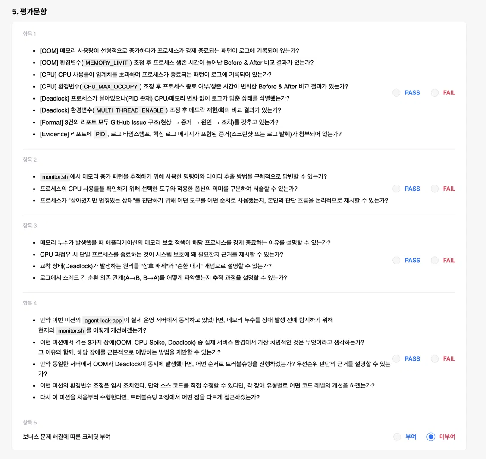

# Linux 장애 분석: OOM · CPU 과점유 · Deadlock

AI/SW Basic · 미션 4 Linux와 OS · 과제 2

## Docker로 실습 시작하기

Windows·macOS·Linux에서 따라 할 수 있는 [단계별 튜토리얼](TUTORIAL.md)을 먼저 읽는다. 교육기관 제공 원본 ZIP은 [vendor/agent-app-leak.zip](vendor/agent-app-leak.zip)에 포함되어 있어 저장소를 clone하면 함께 받는다. Docker Desktop 또는 Docker Engine + Compose를 준비하고 저장소 루트에서 실행한다.

```text
docker compose build lab
docker compose run --rm lab doctor
docker compose run --rm lab test
docker compose run --rm lab run oom-before
docker compose run --rm lab show oom-before
```

전체 비교는 `docker compose run --rm lab suite`로 실행한다. 케이스당 최대 90초, CPU 관측은 0.1초, 나머지는 0.5초 간격이다. 컨테이너는 UID 1000, 외부 네트워크 차단, 메모리 1.5GiB·스왑 0으로 실행한다. CPU 쿼터는 별도로 걸지 않는다. Intel/AMD와 ARM64에 맞는 제공 바이너리를 자동 선택하며 ZIP·바이너리를 이미지에 포함하지 않는다. 추가 `unshare`나 호스트 포트 공개는 필요 없다.

결과는 Docker 볼륨에 보존하고 다음 명령으로 내보낸다.

```text
docker compose create lab
docker compose cp lab:/data/. ./docker-evidence
```

새 실험의 설정·로그·CSV와 cgroup OOM 증가량을 확인한다. [Docker 검증 기록](docs/DOCKER-VERIFICATION.md)에 실제 테스트 범위를 적었다. 아래 보고서는 **2026-09-18 WSL 실측 원본**이며, Docker 실행 결과는 별도로 비교한다. 기존 제출 PDF·ZIP도 당시 자료로 유지한다.

---

**2026-09-18 교육기관 제공 앱으로 장애 3종과 설정 변경 전후 총 6회 비교를 완료했다.** 이 README에 발생 현상, 실측 로그·그래프, 원인 분석, 조치 및 검증 결과를 모았다. 스케줄링 보너스 분석과 재현 방법도 아래에서 확인할 수 있다.

수집 도구 테스트 **11개**, 실측 증거 검사 **50개**가 통과했다. 개별 Issue로 옮겨 쓸 보고서는 [reports/](reports/), 원문 증거는 [evidence/](evidence/)에 있다.

바로가기: [결과 요약](#결과-요약) · [실행 환경](#실행-환경) · [OOM 분석](#oom-분석) · [CPU 분석](#cpu-분석) · [Deadlock 분석](#deadlock-분석) · [스케줄링 분석](#스케줄링-분석) · [재현 방법](#재현-방법) · [검증](#검증) · [평가문항 대응](#평가문항-대응) · [수집 방법](#수집-방법과-도구-선택) · [운영 적용·회고](#운영-환경-적용과-회고) · [공통 템플릿](#이슈-리포트-템플릿)

## 결과 요약

| 장애 | Before | After | 보고서 |
| --- | --- | --- | --- |
| OOM | MEMORY_LIMIT=64, 8.418초 후 MemoryGuard 종료 | 128로 상향, 17.536초 후 종료: 생존 약 2.08배 | [OOM](#oom-분석) |
| CPU | CPU_MAX_OCCUPY=100, 27.302초 후 Watchdog 종료 | 40으로 하향, 90초 이상 생존·냉각 확인 | [CPU](#cpu-분석) |
| Deadlock | MULTI_THREAD_ENABLE=true, 순환 락 대기·79.317초 로그 정체 | false, 90초 동안 작업·로그 진행 | [Deadlock](#deadlock-분석) |
| 보너스 | A→B→C 순환과 Preempted/Resumed 로그 | 앱 수준 Round-Robin으로 추론 | [스케줄링](#스케줄링-분석) |

생존 연장·회피는 관측 범위의 결과다. 커널 OOM, 영구적인 누수 해결, 장기간 무장애, 응답 지연 개선까지 주장하지 않는다. 앱의 `Current Load`와 OS가 측정한 CPU 사용률은 구분했다.

## 실행 환경

| 항목 | 실측 환경 |
| --- | --- |
| 실행 일자 | 2026-09-18 |
| 운영체제 | WSL2 Linux 6.6.87.2, x86_64 |
| 논리 CPU | 12개 |
| 실행 계정 | kjw, UID 1000 — 일반 사용자 |
| 제공 앱 | agent-app-leak.zip의 agent-leak-app-x86 |
| 네트워크 | 독립 사용자·네트워크 네임스페이스에서 0.0.0.0:15034 바인딩 |
| 관찰 상한 | 각 실행 90초 |
| 관제 간격 | OOM·Deadlock 0.5초, CPU 0.1초 |
| 시각 기준 | 앱 로그 KST(UTC+9), 관제 CSV·수집기 로그 UTC |

기존 서비스와 포트가 충돌하지 않도록 `unshare --user --map-current-user --net`으로 실행했다. 앱의 부팅 검사 6단계가 모두 통과했으며 CPU·메모리는 호스트 자원을 공유했다. 각 비교 쌍에서는 관심 환경변수 하나만 변경했다.

바이너리를 수정하거나 역공학하지 않았다. 원본 실행 파일의 SHA256은 다음과 같으며, [ZIP·바이너리 정보](evidence/artifact.json)와 각 실행의 metadata로 확인할 수 있다.

```text
7e0a19cfa80ece6b547a5008273661f0d4d71e526e96b51e0d0f341dd1bb3e40
```

## OOM 분석

**[Bug] OOM Crash - 메모리 누적 후 MemoryGuard가 SIGKILL로 종료**

실측 완료 · 2026-09-18 · 교육기관 제공 `agent-leak-app-x86`

### 1. Description (현상 설명)

WSL2 Linux x86_64에서 일반 계정 `kjw`(UID 1000)로 실행했다. 부팅 검사 6개와 `Agent READY`를 통과한 뒤 MemoryWorker의 메모리가 약 3초마다 25 MB씩 증가했다. `MEMORY_LIMIT=64`에서 실행 후 **8.418초**에 MemoryGuard가 강제 종료했다. 한도를 `128`로 높인 실행은 **17.536초**까지 생존했지만 같은 원인으로 종료했다.

두 실행에서 `CPU_MAX_OCCUPY=100`, `MULTI_THREAD_ENABLE=false`를 고정했다. 독립된 사용자·네트워크 네임스페이스에서 UID 1000으로 `0.0.0.0:15034`에 정상 바인딩했다. 바이너리는 수정하지 않았다. [실험 목록](evidence/manifest.json), [원본 SHA256](evidence/artifact.json).

### 2. Evidence & Logs (증거 자료)

#### 재현 명령

관찰 상한은 90초, 모니터 간격은 0.5초다. 저장소 루트에서 일반 사용자로 실행한다.

```bash
unshare --user --map-current-user --net bash scripts/run-case.sh \
  --app vendor/agent-leak-app-x86 --case oom-before \
  --duration 90 --interval 0.5 --snapshot-interval 5
unshare --user --map-current-user --net bash scripts/run-case.sh \
  --app vendor/agent-leak-app-x86 --case oom-after \
  --duration 90 --interval 0.5 --snapshot-interval 5
```

소켓 소유 워커는 Before **2440463**, After **2440969**였다. 약 2 MiB인 패키징 실행기 PID와 구분했다.

| 실행 | 워커 RSS 첫 샘플 → 마지막/최대 | 앱 로그 Heap 진행 | 결과 |
| --- | --- | --- | --- |
| Before | 17.250 → 67.250 MiB | 25 → 50 → 75 MB | 75 ≥ 64, 보호 종료 |
| After | 17.484 → 142.359 MiB | 25 → 50 → … → 150 MB | 150 ≥ 128, 보호 종료 |


Before의 원문 발췌. 앱 시각은 KST(UTC+9)이며 관제 CSV와 수집기 시각은 UTC다.

```text
2026-09-18 18:06:16,803 [INFO] [MemoryWorker] Current Heap: 25MB
2026-09-18 18:06:19,834 [INFO] [MemoryWorker] Current Heap: 50MB
2026-09-18 18:06:22,866 [INFO] [MemoryWorker] Current Heap: 75MB
2026-09-18 18:06:22,867 [CRITICAL] [MemoryGuard] Memory limit exceeded (75MB >= 64MB) / (Recommend Over 256MB)
2026-09-18 18:06:22,868 [CRITICAL] [MemoryGuard] Self-terminating process 2440463 to prevent system instability.
```

After의 종료 직전 원문:

```text
2026-09-18 18:06:57,505 [INFO] [MemoryWorker] Current Heap: 125MB
2026-09-18 18:07:00,533 [INFO] [MemoryWorker] Current Heap: 150MB
2026-09-18 18:07:00,534 [CRITICAL] [MemoryGuard] Memory limit exceeded (150MB >= 128MB) / (Recommend Over 256MB)
2026-09-18 18:07:00,535 [CRITICAL] [MemoryGuard] Self-terminating process 2440969 to prevent system instability.
```

두 실행의 `result.json`은 `reason=app_exited`, `alive_before_cleanup=false`, `launcher_returncode=-9`, `runner_events=[]`다. 수집기가 종료 신호를 보내기 전에 앱 그룹이 종료됐고, 실행기는 SIGKILL 종료 상태를 반환했다. 종료 후 `monitor.log`에는 `EVENT:PROCESS_EXITED`가 기록됐다.

원문 자료:

- Before: [관제 로그](evidence/runs/20260918T090614Z-oom-before-402105430/monitor.log), [CSV](evidence/runs/20260918T090614Z-oom-before-402105430/metrics.csv), [실행 로그](evidence/runs/20260918T090614Z-oom-before-402105430/console.log), [ps·top·ss](evidence/runs/20260918T090614Z-oom-before-402105430/snapshots.txt), [종료 결과](evidence/runs/20260918T090614Z-oom-before-402105430/result.json)
- After: [관제 로그](evidence/runs/20260918T090643Z-oom-after-033262350/monitor.log), [CSV](evidence/runs/20260918T090643Z-oom-after-033262350/metrics.csv), [실행 로그](evidence/runs/20260918T090643Z-oom-after-033262350/console.log), [종료 결과](evidence/runs/20260918T090643Z-oom-after-033262350/result.json)

### 3. Root Cause Analysis (원인 분석)

관측된 직접 원인은 **메모리 누적과 앱의 MemoryGuard 임계치 초과**다. Heap 출력과 RSS가 함께 증가하고, Guard가 초과를 기록한 직후 종료됐다. 할당한 데이터를 종료 전까지 충분히 회수하지 않는 누수성 패턴과 일치한다. 다만 제공 바이너리를 분석하지 않았으므로 어떤 객체·참조가 원인인지, 의도된 실습용 누적과 실제 결함을 내부 구현 수준에서 구분할 수는 없다.

이 결과는 **커널 OOM killer의 시스템 메모리 고갈 판정이 아니다**. 앱이 자체 보호 종료를 명시했고 수집기 개입도 없었다. 커널 OOM 로그나 시스템 전체 메모리 고갈은 입증하지 않았다.

Guard의 Heap MB와 OS의 RSS MiB는 같은 지표가 아니다. RSS에는 런타임과 공유 라이브러리도 포함된다. 0.5초 샘플 사이에 마지막 할당과 종료가 연속해서 발생하므로 마지막 RSS 샘플은 종료 순간을 놓칠 수 있다. 따라서 로그의 75/150 MB와 RSS 최대 67.250/142.359 MiB를 같은 값으로 취급하지 않는다.

### 4. Workaround & Verification (조치 및 검증)

| 항목 | Before | After |
| --- | --- | --- |
| MEMORY_LIMIT | 64 MB | 128 MB |
| 고정 변수 | CPU=100%, 멀티스레드=false | 동일 |
| 관찰 상한 | 90초 | 90초 |
| 실제 생존 시간 | 8.418초 | 17.536초 |
| 종료 상태 | MemoryGuard / -9 | MemoryGuard / -9 |
| 최대 RSS | 67.250 MiB | 142.359 MiB |

한도 상향으로 생존 시간이 **9.118초 증가, 약 2.08배**가 됐다. 메모리 증가 자체는 계속됐으므로 임시 완화다. 이후 `MEMORY_LIMIT=512`, `CPU_MAX_OCCUPY=40`, `MULTI_THREAD_ENABLE=false`의 정상 관측에서는 앱의 캐시 정리와 계속되는 작업 로그를 확인했다. 이 추가 관측은 다른 변수도 바뀌었으므로 위 단일 변수 비교와 분리해 해석한다.

근본 개선 제안은 불필요한 참조 제거, 캐시·큐 크기 제한, 주기적인 회수, 장시간 부하 검증이다. 바이너리의 소스 수정은 수행하지 않았다.

## CPU 분석

**[Bug] CPU Latency - CPU 급상승과 Watchdog의 SIGTERM 보호 종료**

실측 완료 · 2026-09-18 · 교육기관 제공 `agent-leak-app-x86`

### 1. Description (현상 설명)

`MEMORY_LIMIT=512`, `MULTI_THREAD_ENABLE=false`를 고정하고 CPU 설정만 비교했다. `CPU_MAX_OCCUPY=100`에서 워커의 짧은 CPU 상승 구간을 관측했고, 앱 내부 부하 값이 52.69%가 되자 Watchdog가 종료했다. 실행부터 종료 관측까지 **27.302초**였다. `CPU_MAX_OCCUPY=40`으로 낮춘 실행은 **90초 이상 생존**하며 부하 증가·냉각과 작업 로그를 계속 남겼다.

공통 환경은 WSL2 Linux x86_64, 논리 CPU 12개, UID 1000이다. 독립 네트워크에서 앱이 `0.0.0.0:15034`에 정상 바인딩했다. 소켓 소유 워커 PID는 Before **2445628**, After **2447020**이다. HTTP 응답시간이나 실제 사용자 요청 지연은 측정하지 않았으므로 지연 감소를 실측 성과로 주장하지 않는다.

### 2. Evidence & Logs (증거 자료)

#### 재현 명령

짧은 CPU 상승을 포착하기 위해 양쪽 모두 **0.1초** 간격으로 관측했다.

```bash
unshare --user --map-current-user --net bash scripts/run-case.sh \
  --app vendor/agent-leak-app-x86 --case cpu-before \
  --duration 90 --interval 0.1 --snapshot-interval 5
unshare --user --map-current-user --net bash scripts/run-case.sh \
  --app vendor/agent-leak-app-x86 --case cpu-after \
  --duration 90 --interval 0.1 --snapshot-interval 5
```

#### CPU 상승과 종료 원문

Before의 `metrics.csv`에서 동일 워커의 CPU 구간 값이 다음과 같이 변했다. CPU 100%는 논리 CPU 한 개이며, 최초 샘플은 계산 구간이 없어 비워 둔다.

| UTC 시각 | 워커 PID | 구간 CPU | RSS KiB | 누적 CPU ticks |
| --- | --- | ---: | ---: | ---: |
| 09:11:48.850 | 2445628 | 0.00% | 17792 | 23 |
| 09:11:48.954 | 2445628 | 0.00% | 17792 | 23 |
| 09:11:49.057 | 2445628 | **58.26%** | 17792 | 29 |


앱 로그 원문은 KST(UTC+9)다. **앱의 Current Load는 OS 관제 CPU와 별도 지표**이며 동일 값으로 취급하지 않는다.

```text
2026-09-18 18:11:45,871 [INFO] [CpuWorker] Current Load: 44.69%
2026-09-18 18:11:48,987 [INFO] [CpuWorker] Current Load: 52.69%
2026-09-18 18:11:49,088 [CRITICAL] [CpuWorker] CPU Threshold Violated! (52.69%).

>>> [SYSTEM] WATCHDOG: INITIATING EMERGENCY ABORT (SIGTERM) <<<
```

Before 결과는 `app_exited`, `launcher_returncode=-15`, `runner_events=[]`다. 앱이 명시한 Watchdog 신호와 실제 SIGTERM 종료 상태가 일치하며, 수집기는 종료 신호를 보내지 않았다.

After에서는 다음과 같이 정상적인 냉각과 재증가가 이어졌다.

```text
2026-09-18 18:13:51,956 [INFO] [CpuWorker] Peak reached (40.00%). Starting cooldown...
2026-09-18 18:13:52,963 [INFO] [CpuWorker] Current Load: 40.00%
2026-09-18 18:14:07,533 [INFO] [CpuWorker] Cooldown complete (5.00%). Resuming load increase...
2026-09-18 18:14:08,539 [INFO] [CpuWorker] Current Load: 5.00%
2026-09-18 18:14:17,883 [INFO] [CpuWorker] Current Load: 19.12%
```

원문 자료:

- Before: [관제 로그](evidence/runs/20260918T091121Z-cpu-before-748323350/monitor.log), [CSV](evidence/runs/20260918T091121Z-cpu-before-748323350/metrics.csv), [실행 로그](evidence/runs/20260918T091121Z-cpu-before-748323350/console.log), [ps·top·ss](evidence/runs/20260918T091121Z-cpu-before-748323350/snapshots.txt), [종료 결과](evidence/runs/20260918T091121Z-cpu-before-748323350/result.json)
- After: [관제 로그](evidence/runs/20260918T091250Z-cpu-after-355471748/monitor.log), [CSV](evidence/runs/20260918T091250Z-cpu-after-355471748/metrics.csv), [실행 로그](evidence/runs/20260918T091250Z-cpu-after-355471748/console.log), [종료 결과](evidence/runs/20260918T091250Z-cpu-after-355471748/result.json)

### 3. Root Cause Analysis (원인 분석)

직접 원인은 **앱 내부 부하 증가와 Watchdog 정책 위반**이다. 본 바이너리는 CPU 설정 100%에서 부하를 높이다가 내부 값 52.69%에서 보호 종료했고, 40%에서는 고점 도달 후 냉각했다. 따라서 CPU_MAX_OCCUPY를 보호 임계값 그 자체로 해석해 높이는 조치는 이 앱에 맞지 않는다. 로그상 최대 부하 설정을 낮추는 방향으로 회피했다. 정확한 내부 측정·분기 코드는 분석하지 않았다.

관측한 OS CPU 급상승은 **0.1초 구간의 58.26%**다. 시스템 전체가 장시간 100% 과부하였다는 뜻은 아니다. 초기 0.5초 관측에서는 짧은 부하가 평균에 희석됐으므로 더 짧은 동일 간격의 최종 비교를 사용했다. `ps %CPU`는 수명 평균이라 해당 순간의 고점을 대신할 수 없다.

CPU 연산이 길어지면 실행 대기 중인 다른 작업의 응답이 늦어질 수 있다. 이 실험은 특정 프로세스의 상승과 앱 보호 정책의 종료를 입증하며, 외부 서비스 지연이나 커널 장애는 입증하지 않는다. After에서 정상 시나리오로 전환되어 메모리 워커도 함께 동작했으므로 CPU 지표 차이를 동일 연산량의 성능 개선율로 계산하지 않았다.

### 4. Workaround & Verification (조치 및 검증)

| 항목 | Before | After |
| --- | --- | --- |
| CPU_MAX_OCCUPY | 100% | 40% |
| 고정 변수 | MEMORY_LIMIT=512, 멀티스레드=false | 동일 |
| 관찰 상한 / 샘플 간격 | 90초 / 0.1초 | 동일 |
| OS 최대 구간 CPU | 58.26% | 39.02% |
| 앱 Current Load | 52.69%에서 정책 위반 | 40.00% 고점 후 냉각 |
| 생존 | 27.302초 후 Watchdog 종료 | 90초 이상 생존 |
| 최종 -15의 주체 | 앱 Watchdog | 관찰 종료 후 수집기 정리 |

After의 `result.json`은 `observation_timeout`, `alive_before_cleanup=true`, `observed_s=90.020`이고 수집기 SIGTERM 시각이 별도로 기록됐다. 따라서 After의 -15를 Watchdog 재발로 오인하지 않는다.

실습용 임시 설정은 CPU_MAX_OCCUPY=40이다. 근본 개선은 불필요한 반복 연산·busy wait 점검, 작업 분할, 워커 수·요청량 제어 및 실제 응답시간 검증이다. 이 관측만으로 장기간 무장애를 보장하지 않는다.

## Deadlock 분석

**[Bug] Deadlock - 두 워커의 순환 락 대기로 작업 진행 중단**

실측 완료 · 2026-09-18 · 교육기관 제공 `agent-leak-app-x86`

### 1. Description (현상 설명)

`MEMORY_LIMIT=512`, `CPU_MAX_OCCUPY=40`을 고정하고 멀티스레드 설정만 비교했다. `true`에서 실행 약 9초 뒤 두 워커가 서로의 자원을 기다리는 로그를 남겼다. 이후 PID는 계속 존재했지만 CPU·RSS와 로그 크기가 정체됐다. `false`로 변경한 실행은 동일한 90초 동안 작업·메모리 회수·CPU 냉각 로그가 계속 진행됐다.

일반 계정 UID 1000, WSL2 x86_64, 독립 네트워크의 고정 포트 15034에서 관측했다. 워커 PID는 Before **2448740**, After **2451259**다. 종료 여부뿐 아니라 작업의 진행 여부를 함께 확인했다.

### 2. Evidence & Logs (증거 자료)

#### 재현 명령

```bash
unshare --user --map-current-user --net bash scripts/run-case.sh \
  --app vendor/agent-leak-app-x86 --case deadlock-before \
  --duration 90 --interval 0.5 --snapshot-interval 5
unshare --user --map-current-user --net bash scripts/run-case.sh \
  --app vendor/agent-leak-app-x86 --case deadlock-after \
  --duration 90 --interval 0.5 --snapshot-interval 5
```

#### 마지막 진행 로그와 순환 대기

Before의 실제 로그 발췌. 시각은 KST다.

```text
2026-09-18 18:14:40,866 [INFO] [AgentWorker][Worker-Thread-1] LOCK ACQUIRED: [Shared_Memory_A]. (Holding...)
2026-09-18 18:14:40,866 [INFO] [AgentWorker][Worker-Thread-2] LOCK ACQUIRED: [Socket_Pool_B]. (Holding...)
2026-09-18 18:14:42,870 [INFO] [AgentWorker][Worker-Thread-1] Need resource [Socket_Pool_B] to finish job.
2026-09-18 18:14:42,871 [INFO] [AgentWorker][Worker-Thread-1] WAITING for [Socket_Pool_B]... (Status: BLOCKED)
2026-09-18 18:14:42,879 [INFO] [AgentWorker][Worker-Thread-2] Need resource [Shared_Memory_A] to write logs.
2026-09-18 18:14:42,880 [INFO] [AgentWorker][Worker-Thread-2] WAITING for [Shared_Memory_A]... (Status: BLOCKED)
```

#### PID·스레드·자원 정체

`09:16:03.609 UTC`의 `ps -L` 원문 발췌다. 동일 PID/TID들이 앞선 `09:14:44.299 UTC`에도 존재했다. 실행기 PID 2448732는 별도로 `do_wait` 상태였고, 실제 워커는 다음 세 스레드였다.

```text
    PID     TID STAT %CPU   RSS WCHAN                            COMMAND
2448740 2448740 SNl   0.0 17664 futex_wait_queue                 agent-leak-app-
2448740 2448841 SNl   0.0 17664 futex_wait_queue                 agent-leak-app-
2448740 2448842 SNl   0.0 17664 futex_wait_queue                 agent-leak-app-
```

전체 관제에서 워커 RSS는 **17664 KiB = 17.250 MiB**, 구간 CPU는 **0.00%**로 유지됐다. 프로세스는 `S` 상태였고 좀비 `Z`가 아니었다. 주 스레드의 워커 완료 대기와 두 워커의 락 대기를 로그·TID 상태가 함께 뒷받침한다. 로그 이름과 개별 TID의 일대일 매핑은 별도로 확인하지 않았다.

| UTC 관측 시각 | console.log | agent_app.log | PID 상태 |
| --- | ---: | ---: | --- |
| 09:14:44.539 | 2881 bytes | 1517 bytes | 생존 |
| 09:14:49.892 | 2881 bytes | 1517 bytes | 생존 |
| 09:15:59.424 | 2881 bytes | 1517 bytes | 생존 |
| 09:16:03.856 | 2881 bytes | 1517 bytes | 정리 직전 생존 |

로그 크기는 **79.317초** 동안 변하지 않았다. 마지막 앱 로그 시각 09:14:42.880부터 최종 기록까지는 약 80.976초다. `result.json`의 `alive_before_cleanup=true`와 종료 전 스냅샷이 지속 생존을 확인한다.


원문 자료:

- Before: [관제 로그](evidence/runs/20260918T091433Z-deadlock-before-531338111/monitor.log), [CSV](evidence/runs/20260918T091433Z-deadlock-before-531338111/metrics.csv), [실행 로그](evidence/runs/20260918T091433Z-deadlock-before-531338111/console.log), [ps·ps -L·top -H](evidence/runs/20260918T091433Z-deadlock-before-531338111/snapshots.txt), [로그 크기](evidence/runs/20260918T091433Z-deadlock-before-531338111/log-sizes.jsonl), [종료 결과](evidence/runs/20260918T091433Z-deadlock-before-531338111/result.json)
- After: [관제 로그](evidence/runs/20260918T091713Z-deadlock-after-166295630/monitor.log), [CSV](evidence/runs/20260918T091713Z-deadlock-after-166295630/metrics.csv), [실행 로그](evidence/runs/20260918T091713Z-deadlock-after-166295630/console.log), [스레드 상태](evidence/runs/20260918T091713Z-deadlock-after-166295630/snapshots.txt), [로그 크기](evidence/runs/20260918T091713Z-deadlock-after-166295630/log-sizes.jsonl), [종료 결과](evidence/runs/20260918T091713Z-deadlock-after-166295630/result.json)

### 3. Root Cause Analysis (원인 분석)

서로 반대 순서로 자원을 보유·요청한 것이 로그에서 확인된다.

```text
Worker-Thread-1: Shared_Memory_A 보유 → Socket_Pool_B 대기
Worker-Thread-2: Socket_Pool_B 보유 → Shared_Memory_A 대기
순환: Thread-1 → Pool-B → Thread-2 → Memory-A → Thread-1
```

| 교착상태 조건 | 증거와 해석 |
| --- | --- |
| 상호 배제 | Strict resource locking 안내와 LOCK ACQUIRED / BLOCKED 로그 |
| 점유 대기 | 한 자원을 Holding한 채 다른 자원을 요청 |
| 비선점 | 관측 구간에 상대 락을 빼앗거나 강제로 회수한 기록 없이 대기 지속 |
| 순환 대기 | 1은 2의 Pool-B, 2는 1의 Memory-A를 기다림 |

락 대기는 CPU를 소비하지 않고 스레드를 잠들게 할 수 있다. 그래서 PID와 RSS가 유지돼도 작업은 진행되지 않는다. `futex_wait_queue` 또는 낮은 CPU 하나만으로는 교착상태를 단정할 수 없지만, 이번에는 양방향 보유·대기 로그와 장시간의 정체가 함께 있어 순환 대기라는 설명을 뒷받침한다. 비선점 정책의 내부 구현과 락 객체 주소는 역공학하지 않았다.

TCP LISTEN은 유지되어도 작업 완료를 보장하지 않는다. 실제 네트워크 요청의 타임아웃은 별도로 측정하지 않았으므로 증상은 확인된 작업·로그 진행 중단으로 한정한다.

### 4. Workaround & Verification (조치 및 검증)

| 항목 | Before | After |
| --- | --- | --- |
| MULTI_THREAD_ENABLE | true | false |
| 고정 변수 | MEMORY_LIMIT=512, CPU=40% | 동일 |
| 관찰 시간 | 90.021초 | 90.044초 |
| 워커 PID | 2448740 | 2451259 |
| 최대 구간 CPU | 0.00% | 11.87% |
| RSS 추세 | 17.250 MiB로 정체 | 최대 517.676 MiB, 캐시 회수 후 재증가 |
| 마지막 로그 | 양쪽 WAITING / BLOCKED | MemoryWorker·CpuWorker 계속 진행 |
| 최종 콘솔 크기 | 2881 bytes | 7747 bytes |
| 관찰 후 정리 | 수집기 SIGTERM | 수집기 SIGTERM |

After에서는 `All tasks completed`, 부하 냉각, `18:18:17.146 Memory Cache Flushed`, `18:18:43.359 Current Heap: 200MB`까지 진행했다. `WAITING`/`BLOCKED` 로그는 없었다. PID 존재만이 아니라 실제 로그 진행과 메모리 회수로 **관찰한 90초 동안 교착상태를 회피했음**을 확인했다.

멀티스레드를 끄는 것은 동시성 감소를 감수하는 임시 회피다. 근본 개선은 일관된 락 획득 순서, 임계 구역 축소, 타임아웃 시 보유 락 해제, 자원 의존 구조 개선이다. 바이너리 수정은 수행하지 않았다.

## 스케줄링 분석

**[Analysis] 작업 로그를 통한 Round-Robin 스케줄링 추론**

보너스 실측 분석 · 2026-09-18

### 1. 로그 관찰 개요

`MEMORY_LIMIT=512`, `CPU_MAX_OCCUPY=40`, `MULTI_THREAD_ENABLE=false`에서 앱이 `Healthy System Monitoring`을 선택했다. Task Scheduler가 A/B/C 작업을 등록하고 번갈아 실행하는 로그를 출력했다. [원문 실행 로그](evidence/runs/20260918T091250Z-cpu-after-355471748/console.log)를 분석했다.

### 2. 증거 자료

아래 시각은 KST다. 로그의 작업 이름·진행률·중단 문구를 기준으로 정리했다.

| 시각 | 작업 | 이벤트 / 진행률 |
| --- | --- | --- |
| 18:12:52.682 | A | Started / 20% |
| 18:12:52.733 | A | Calculating / 40% |
| 18:12:52.785 | A | Preempted / 40% 저장 |
| 18:12:52.837 | B | Started / 20% |
| 18:12:52.939 | B | Preempted / 40% 저장 |
| 18:12:52.990 | C | Started / 20% |
| 18:12:53.093 | C | Preempted / 40% 저장 |
| 18:12:53.144 | A | Resumed / 60% |
| 18:12:53.298 | B | Resumed / 60% |
| 18:12:53.451 | C | Resumed / 60% |
| 18:12:53.605 | A | Resumed / 100% |
| 18:12:53.656 | B | Resumed / 100% |
| 18:12:53.707 | C | Resumed / 100% |
| 18:12:53.758 | Scheduler | All tasks completed |

초기 작업 시작 간격 A→B는 **155 ms**, B→C는 **153 ms**, C→A 재개는 **154 ms**다. A의 첫 시작부터 중단 로그까지는 **103 ms**이며, 중단 로그부터 B 시작까지는 **52 ms**다. 전체 작업 로그 구간은 1.076초다. 이 시간은 로그 이벤트 간격이며 실제 커널 타임슬라이스 측정값은 아니다.

### 3. 패턴 분석 및 결론

하나의 작업이 완료되기 전에 다른 작업으로 넘어가고, A→B→C→A 순환과 저장된 진행률의 재개가 반복된다. 따라서 제시된 후보 중 **앱 수준 Round-Robin 방식과 가장 잘 일치**한다. 완료까지 한 작업만 수행하는 비선점 FCFS와는 맞지 않으며, 특정 작업이 우선권을 지속적으로 받는 패턴도 관측되지 않았다.

앱이 출력한 `Preempted` 문구만으로 **Linux 커널이 SCHED_RR 정책으로 이 프로세스를 실행했다**고 결론내리지는 않는다. sleep, 런타임, 앱 자체의 교육용 스케줄러가 동일 패턴을 만들 수 있다. 내부 소스나 커널 정책을 역공학하지 않았고, 이 결론의 범위는 앱 작업 로그다. 정책 구분은 [sched(7)](https://man7.org/linux/man-pages/man7/sched.7.html)을 참고한다.

### 4. 장단점 및 적용

| 관점 | 분석 |
| --- | --- |
| 장점 | 여러 작업에 반복적인 진행 기회를 제공해 긴 작업의 독점을 줄임 |
| 단점 | 작업 교체 비용이 발생하며 할당 시간이 짧으면 오버헤드, 길면 응답 지연 증가 |
| 적합한 성격 | 작업 간 공정성과 빠른 초기 응답이 중요한 대화형 처리·요청 큐 |
| 비교 대상 | 배치 작업은 완료 처리량·캐시 효율을 더 중시할 수 있고, 긴급 작업은 우선순위 정책이 필요할 수 있음 |

이 관측에서는 공정한 교대 진행을 확인했지만 요청 지연·처리량을 벤치마크한 것은 아니다. 실제 서비스에 적용할 때는 대기 시간과 교체 비용을 따로 측정해야 한다.

## 재현 방법

제공 ZIP의 `agent-leak-app-x86`을 `vendor/`에 추출했다. 원본은 수정하지 않았으며 [ZIP·바이너리 SHA256](evidence/artifact.json)을 보존했다. Linux에서 직접 실행하려면 저장소에 포함된 `vendor/agent-app-leak.zip`에서 아키텍처에 맞는 파일을 추출한다. ARM64에서는 아래 파일명을 `agent-leak-app-arm64`로 바꾼다.

```bash
# 저장소 루트에서 실행
unzip -p vendor/agent-app-leak.zip agent-leak-app-x86 > vendor/agent-leak-app-x86
chmod u+x vendor/agent-leak-app-x86

# 현재 PC처럼 기존 서비스가 15034를 쓰는 경우 독립 네트워크로 실행
unshare --user --map-current-user --net bash scripts/run-suite.sh \
  --app vendor/agent-leak-app-x86 --duration 90 --interval 0.1 \
  --snapshot-interval 5

# 한 건만 실행: 아래는 제출에 사용한 CPU Before와 같은 명령
unshare --user --map-current-user --net bash scripts/run-case.sh \
  --app vendor/agent-leak-app-x86 --case cpu-before \
  --duration 90 --interval 0.1 --snapshot-interval 5
```

실험에 사용한 명령 6개는 [manifest.json](evidence/manifest.json)에 있다. OOM·Deadlock 비교는 0.5초, CPU 비교는 0.1초 간격이었다. 위 suite 예시는 모든 케이스를 0.1초로 관측한다. 실행 시간과 부하 수치는 실행마다 달라질 수 있다.

Linux 일반 계정, Python 3.9 이상, Bash, `ps`, `top`, `ss`, `unshare`가 필요하다. 사용자 네임스페이스를 허용하지 않는 환경에서는 별도 Linux VM/컨테이너 안에서 `bash scripts/run-suite.sh ...`로 실행한다. 네트워크만 격리하며 CPU·메모리는 호스트와 공유한다. 기존 서비스·방화벽·cron을 변경하지 않았다.

### 비교 설정

| 실험 | MEMORY_LIMIT (MB) | CPU_MAX_OCCUPY (%) | MULTI_THREAD_ENABLE |
| --- | ---: | ---: | --- |
| oom-before | 64 | 100 | false |
| oom-after | 128 | 100 | false |
| cpu-before | 512 | 100 | false |
| cpu-after | 512 | 40 | false |
| deadlock-before | 512 | 40 | true |
| deadlock-after | 512 | 40 | false |

실제 앱 로그를 통해 위 조건을 확정했다. CPU_MAX_OCCUPY는 이 앱에서 최대 부하 설정으로 관측됐고 100→40으로 낮춰 보호 종료를 회피했다. 한 쌍 안에서는 해당 변수 하나만 바꿨다. 정상 관측 조합은 **512 / 40 / false**다.

## 코드와 증거

| 파일 | 역할 |
| --- | --- |
| [bin/monitor.sh](bin/monitor.sh) | PID 또는 그룹별 구간 CPU·RSS·스레드·상태 기록 |
| [scripts/run-case.sh](scripts/run-case.sh) | 환경 생성, 단일 실험, 로그·스냅샷 보존, 실험 프로세스 정리 |
| [scripts/run-suite.sh](scripts/run-suite.sh) | 6개 비교 케이스 순차 실행 |
| [scripts/summarize-evidence.py](scripts/summarize-evidence.py) | 확정 실행 목록의 워커 통계·그래프 재생성 |
| [scripts/verify-evidence.py](scripts/verify-evidence.py) | 실제 증거의 원본·설정·종료 원인·비교 검증 |
| [templates/issue-report.md](templates/issue-report.md) | 명세의 4개 섹션을 갖춘 공통 템플릿 |
| [evidence/manifest.json](evidence/manifest.json) | 제출에 사용하는 정확한 실행 목록·명령 |
| [evidence/comparison.json](evidence/comparison.json) | 원문 CSV에서 계산한 워커별 통계 |
| [docs/EXPERIMENTS.md](docs/EXPERIMENTS.md) | 실행 방법·지표·종료 결과 해석 |
| [docs/VERIFICATION.md](docs/VERIFICATION.md) | 검증 범위와 한계 |
| [rawdata/evaluation-criteria.webp](rawdata/evaluation-criteria.webp) | 사용자 제공 평가문항 원본 이미지 |

실험마다 `AGENT_HOME/upload_files`, `api_keys/secret.key`, 로그 폴더를 만들고 명세의 테스트 키 `agent_api_key_test`와 필수 환경변수를 구성한다. 환경변수는 해당 프로세스에만 적용된다.

각 `evidence/runs/<시각>-<실험>-<고유 번호>/`에는 `metadata.json`, `console.log`, `app-logs/`, `metrics.csv`, `monitor.log`, `snapshots.txt`, `log-sizes.jsonl`, `result.json`, `summary.json`을 보존한다. 소켓 소유 워커를 실행기와 구분하고, 여러 PID 또는 스레드의 RSS를 중복 합산하지 않는다.

수집기는 종료 직전 문구를 보존하도록 PTY로 앱을 실행한다. `observation_timeout`은 관찰 상한 이후 수집기가 종료한 것이며 앱 Watchdog 종료와 다르다. `result.json`에 정리 신호를 따로 기록한다. 초기 OOM 비교는 파이프 수집본으로도 MemoryGuard의 핵심 로그가 보존됐으며, 수집 방식의 차이는 manifest에 명시했다.

## 검증

| 구분 | 결과 | 원문 |
| --- | --- | --- |
| 수집 도구 테스트 | 11개 통과 | [tool-tests.txt](evidence/tool-tests.txt) |
| 실측 증거 검사 | 50개 통과, 실패 0개 | [verification.txt](evidence/verification.txt) |

테스트는 설정 범위, PID 추적, CPU·RSS 수집, 종료 원인 구분, 자식 프로세스 정리, 종료 직전 로그 보존을 확인했다. 실측 검사는 원본 SHA256, 일반 계정·부팅·포트, 비교 조건, 실제 장애 로그와 After의 작업 진행을 확인했다. 자세한 범위는 [검증 문서](docs/VERIFICATION.md)에 있다.

다음 명령으로 수집 도구와 기존 실측 증거를 검증할 수 있다.

```bash
bash tests/test_monitor.sh
python3 scripts/verify-evidence.py
```

그래프와 요약 통계를 다시 만들 때는 다음을 실행한다. 수집·검증은 Python 표준 라이브러리, 그래프 생성은 Matplotlib을 사용한다.

```bash
python3 scripts/summarize-evidence.py
```

## 평가문항 대응

2026-09-20 제공받은 평가문항에 맞춰 아래와 같이 대조했다. 기존 장애 보고서에는 현상·전후 비교·로그 증거가 있으며, 수집 원리와 운영 적용 질문의 답변을 이 README에 추가했다. 운영 개선 부분은 설계 제안이며 구현·실측한 기능과 구분한다. 표는 문항별 설명 위치를 안내하며 실제 PASS/FAIL과 보너스 크레딧은 평가자가 판단한다.

<details>
<summary>평가문항 원본 이미지 펼치기</summary>



원본 파일과 SHA256은 [rawdata 안내](rawdata/README.md)에 기록했다.

</details>

| 문항 | 평가 내용 | README의 설명·증거 위치 |
| --- | --- | --- |
| 1-1 | OOM의 선형 메모리 증가와 강제 종료 | [OOM 분석](#oom-분석): 약 3초마다 Heap 25MB 증가, RSS 그래프, MemoryGuard·SIGKILL |
| 1-2 | MEMORY_LIMIT 변경 후 생존 시간 비교 | [OOM 분석](#oom-분석): 64→128, 8.418→17.536초 |
| 1-3 | CPU 임계 초과와 강제 종료 로그 | [CPU 분석](#cpu-분석): 앱의 52.69% 정책 위반 로그와 Watchdog SIGTERM; OS CPU와 구분 |
| 1-4 | CPU_MAX_OCCUPY 변경 전후 종료·생존 | [CPU 분석](#cpu-분석): 100→40, 27.302초 종료→90초 이상 생존 |
| 1-5 | PID 생존과 CPU·메모리·로그 정체 | [Deadlock 분석](#deadlock-분석): PID 2448740, CPU 0%, RSS 17.250MiB, 로그 79.317초 정체 |
| 1-6 | MULTI_THREAD_ENABLE 전후 재현·회피 | [Deadlock 분석](#deadlock-분석): true→false, After 작업·로그 진행 |
| 1-7 | 보고서 3건의 현상→증거→원인→조치 구조 | OOM·CPU·Deadlock 각 절의 네 하위 항목과 [공통 템플릿](#이슈-리포트-템플릿) |
| 1-8 | PID·타임스탬프·핵심 로그 첨부 | 장애별 Evidence & Logs의 원문 발췌, CSV·스냅샷·종료 결과 링크 |
| 2-1 | monitor.sh의 메모리 추적·데이터 추출 | [메모리 추적 구현](#메모리-추적-구현): Bash→Python, /proc 필드와 RSS 계산, CSV 추출 예시 |
| 2-2 | CPU 도구 선택과 옵션의 의미 | [CPU 도구와 옵션](#cpu-도구와-옵션): 구간 계산, ps·top·스레드 옵션과 한계 |
| 2-3 | 살아 있지만 멈춘 상태의 진단 순서 | [진행 중단 진단 순서](#진행-중단-진단-순서): PID 식별→생존→정체→락 관계→전후 검증 |
| 3-1 | 메모리 보호 정책이 종료하는 이유 | [메모리 보호 종료의 목적](#메모리-보호-종료의-목적) |
| 3-2 | CPU 과점유 프로세스 종료와 시스템 보호 | [CPU 보호 종료의 목적](#cpu-보호-종료의-목적) |
| 3-3 | 상호 배제·순환 대기로 Deadlock 설명 | [교착 원리와 로그 추적](#교착-원리와-로그-추적) 및 기존 네 조건 표 |
| 3-4 | A→B, B→A 관계의 실제 추적 과정 | [교착 원리와 로그 추적](#교착-원리와-로그-추적): 18:14:40 획득→18:14:42 상대 자원 대기 |
| 4-1 | 운영 서버의 누수 조기 탐지를 위한 개선 | [조기 탐지 개선안](#조기-탐지-개선안): 추세·회수 후 기준선·진행 지표·경보 |
| 4-2 | 가장 치명적인 장애와 근본 예방 | [장애 위험도 판단](#장애-위험도-판단): 호스트 OOM을 우선한 조건·이유와 예외 |
| 4-3 | OOM과 Deadlock 동시 발생 시 순서·근거 | [동시 장애 대응 순서](#동시-장애-대응-순서) |
| 4-4 | 소스 수정이 가능할 때 장애별 개선 | [코드 수준 개선안](#코드-수준-개선안): 원인 가설·수정 방향·검증 기준 |
| 4-5 | 처음부터 다시 수행할 때 달리할 점 | [다시 수행할 때의 접근](#다시-수행할-때의-접근) |
| 5 | 보너스 문제 해결 | [스케줄링 분석](#스케줄링-분석): 로그 기반 Round-Robin 추론과 한계; 크레딧 부여 여부는 별도 평가 |

## 수집 방법과 도구 선택

### 메모리 추적 구현

`monitor.sh`는 Bash 진입점이다. 실제로 [bin/monitor.sh](bin/monitor.sh)는 `exec python3 .../lib/monitor.py "$@"`로 옵션을 전달하고, [lib/monitor.py](lib/monitor.py)가 `/proc`을 읽는다. `ps` 화면에서 숫자를 잘라 반복 저장하는 구현으로 설명하면 실제 코드와 다르다.

`read_stat()`은 `/proc/PID/stat`의 마지막 `)` 뒤를 분리한다. 프로세스 이름에 공백이나 괄호가 들어 있어도 필드가 밀리지 않게 하기 위해서다. 이 분리 배열의 `fields[21]`은 원래 stat의 24번째 필드인 RSS 페이지 수, `fields[20]`은 23번째 필드인 가상 메모리 바이트 수다. 페이지 크기는 `os.sysconf("SC_PAGE_SIZE")`로 얻는다. RSS는 커널의 근사 계측값이므로 내부 객체의 누수 위치를 알려 주지는 않는다. [Linux /proc 필드와 RSS 계측 설명](https://www.kernel.org/doc/html/latest/filesystems/proc.html)

```text
RSS KiB = RSS 페이지 수 × 페이지 크기(bytes) / 1024
RSS MiB = rss_kib / 1024
VMS KiB = vsize(bytes) / 1024
메모리 비율 = RSS KiB / /proc/meminfo의 MemTotal KiB × 100
```

OOM 분석은 작은 메모리 비율보다 동일 워커의 RSS 절대량과 시간 추세를 사용한다. `--pgid`로 패키징 실행기와 자식을 추적한 뒤 `ss`의 15034 포트 소유 PID를 실제 워커로 선택한다. PID 재사용은 `(pid, start_ticks)`로 구분한다. `timestamp`는 UTC, `elapsed_s`는 `time.monotonic()` 기반이며 CSV와 `monitor.log`에 함께 기록한다. Docker에서도 `MemTotal`을 컨테이너의 `memory.max`로 간주하면 안 된다.

저장소 루트의 Python 3 환경에서 **기존 OOM Before 증거만 읽어** 워커의 증가 패턴을 추출하는 예다. PID 2440463은 이 파일에 기록된 과거 실측 PID다.

```bash
python3 - <<'PY'
import csv
path = "evidence/runs/20260918T090614Z-oom-before-402105430/metrics.csv"
with open(path, newline="") as stream:
    for row in csv.DictReader(stream):
        if row["pid"] == "2440463":
            rss_mib = int(row["rss_kib"]) / 1024
            print(row["timestamp"], row["pid"], f"{rss_mib:.3f} MiB")
PY
```

이 CSV에서 워커 RSS는 17.250MiB에서 최대 67.250MiB로 증가한다. 앱 Heap은 약 3초마다 25MB씩 늘어 평균 약 8.3MB/s의 증가 추세를 보였다. 각 샘플이 매끄러운 직선을 이루는 형태가 아니라 일정량씩 할당하는 계단형 증가다. 시간에 따른 증가 추세와 MemoryGuard 종료 로그를 함께 읽어 평가문항의 메모리 누적 패턴을 설명한다.

### CPU 도구와 옵션

짧은 상승 구간의 주 증거는 `metrics.csv`다. `/proc/PID/stat`의 user+system 누적 틱 차이를 `SC_CLK_TCK`와 실제 경과 시간으로 나눈다. 최초 샘플은 차분을 계산할 수 없어 빈 값이다.

```text
CPU % = 100 × (이번 cpu_ticks − 이전 cpu_ticks) / SC_CLK_TCK / 두 샘플 사이 경과초
```

논리 CPU 하나가 100%이며 CPU 개수로 나누지 않는다. 0.5초 간격에서 짧은 부하가 희석된 경험 때문에 CPU 비교는 양쪽 모두 0.1초로 맞췄다. `ps`의 `%CPU`는 수명 평균이고, `top -n 1`의 첫 화면도 이 0.1초 차분과 같은 측정 구간이 아니므로 보조 자료로 썼다. [ps CPU 계산 정의](https://man7.org/linux/man-pages/man1/ps.1.html), [top 옵션·CPU 표시 설명](https://man7.org/linux/man-pages/man1/top.1.html)

아래는 [snapshot()](lib/experiment.py)이 호출한 명령이다. `PID목록` 자리에는 수집기가 발견한 실제 프로세스 그룹 구성원의 PID를 쉼표로 연결해 전달한다.

| 명령 | 옵션의 의미와 선택 이유 |
| --- | --- |
| `ps -p PID목록 -o user,pid,ppid,pgid,etime,stat,pcpu,pmem,rss,vsz,args` | `-p`: 대상 선택, `-o`: 출력 열 지정. 계정·부모/그룹·경과 시간·상태·CPU·RSS·명령으로 실행기와 워커를 구분 |
| `ps -L -p PID목록 -o pid,tid,stat,pcpu,rss,wchan:32,comm` | `-L`: 스레드 표시, `tid`: 스레드 ID, `wchan:32`: 대기 지점 열 너비. 어떤 스레드들이 함께 대기하는지 확인 |
| `top -b -H -n 1 -p PID목록` | `-b`: 파일에 남길 배치 출력, `-H`: 스레드 표시, `-n 1`: 한 화면 후 종료, `-p`: 대상 한정. 자원·스레드 상태 스냅샷 보존 |
| `ss -ltnp 'sport = :15034'` | `-l`: LISTEN, `-t`: TCP, `-n`: 이름 변환 생략, `-p`: 프로세스 정보. 앱의 실제 소켓 소유 PID 확인 |

포트 필터와 소켓 옵션은 [ss 매뉴얼](https://man7.org/linux/man-pages/man8/ss.8.html)을 따른다.

`wchan`만으로 어떤 사용자 공간 락을 기다리는지 특정하지 않는다. Docker 권한·커널 조건에 따라 `0` 또는 제한된 정보로 보일 수 있다. 스레드마다 보이는 RSS를 더하면 같은 주소 공간을 중복 계산할 수 있으므로 실제 워커 단위로 비교한다.

### 진행 중단 진단 순서

1. **대상 식별:** `ss -ltnp`의 포트 소유 PID와 `ps`의 PPID·PGID를 대조한다. 낮은 RSS의 실행기만 보고 앱이 정상이라고 판단하지 않는다.
2. **생존 확인:** 반복 스냅샷과 `/proc`에서 동일 PID·시작 틱의 존재 및 상태를 확인한다. 종료·좀비와 대기 상태를 구분한다.
3. **진행 확인:** `metrics.csv`의 CPU·RSS, `log-sizes.jsonl`의 로그 크기, 작업 완료 메시지를 시간순으로 비교한다. 이번에는 CPU 0%, RSS 17.250MiB와 79.317초의 로그 정체가 함께 나타났다.
4. **대기 원인 추적:** `ps -L`·`top -H`의 스레드 상태를 읽고 마지막 `LOCK ACQUIRED`·`WAITING` 로그로 소유·요청 관계를 만든다. 단순 요청 대기나 I/O 대기도 낮은 CPU를 보일 수 있으므로 정체만으로 Deadlock을 확정하지 않는다.
5. **조치 후 검증:** 같은 상한에서 멀티스레드 설정만 바꿔 작업·로그가 진행하는지 확인한다. `result.json`의 `alive_before_cleanup`와 `runner_events`로 관찰 종료와 앱 자체 종료를 구분한다.

핵심 판단은 **PID 생존 + 실제 작업 정체 + 양방향 락 대기**의 결합이다. LISTEN 상태나 PID 존재만 검사하는 상태 점검은 이 장애를 놓칠 수 있다.

## 장애 보호와 교착 원리

### 메모리 보호 종료의 목적

사용하지 않는 데이터가 계속 유지되면 메모리 회수 압력이 커지고 다른 작업의 할당과 응답에도 영향을 줄 수 있다. 앱의 MemoryGuard는 자기 기준을 넘었을 때 실행을 끝내 누적을 멈추려는 보호 정책이다. 프로세스 종료 시 그 프로세스가 독점하던 메모리는 회수될 수 있지만, 공유 메모리나 다른 프로세스가 보유한 자원까지 모두 정리된다는 뜻은 아니다.

이번 로그는 Heap 75MB가 설정 64MB를 넘자 자체 종료를 명시한다. 이것을 호스트 메모리 고갈로 인한 커널 OOM으로 바꾸어 설명하지 않는다. Docker 추가 실험은 `memory.events`의 `oom_kill` 증가량도 0이었다. 이 카운터는 해당 cgroup의 커널 OOM 종료를 확인하는 보조 근거다. [cgroup v2 메모리 이벤트 정의](https://docs.kernel.org/admin-guide/cgroup-v2.html#memory-interface-files)

강제 종료는 처리 중 작업을 잃을 수 있다. 운영에서는 경고·유입 제한·정상 종료로 대응할 시간을 확보하고, 메모리 원인을 고치는 것이 필요하다. 한도 상향만 반복하면 누적이 지속될 수 있다는 점을 OOM After가 보여 준다.

### CPU 보호 종료의 목적

한 프로세스의 CPU 작업이 계속 늘면 같은 CPU를 쓰려는 다른 실행 가능한 작업과 경쟁하고 처리 대기열이 길어질 수 있다. 폭주한 작업을 종료하면 그 프로세스가 소비하던 CPU 시간을 다른 작업에 돌려줄 수 있다. 다만 CPU 사용률이 높다는 사실만으로 항상 종료해야 하는 것은 아니다. 정상적인 연산 작업도 높은 사용률을 보인다.

이 앱은 내부 부하 52.69%에서 Watchdog가 SIGTERM을 보냈다. 이는 앱 정책의 실측 사례이며 호스트 전체의 장시간 포화나 사용자 지연은 측정하지 않았다. 운영 정책은 지속 시간·처리량·지연·오류를 함께 보고 유입 제어, 워커 수 조정, CPU 자원 제한을 먼저 검토한다. `CPU_MAX_OCCUPY=40`은 앱 동작 설정이며 OS 사용률 40%의 강제 상한으로 해석하지 않는다.

### 교착 원리와 로그 추적

상호 배제는 한 자원을 동시에 여러 스레드가 소유하지 못하는 조건이다. 두 스레드가 자원을 하나씩 가진 채 상대 자원을 기다리고, 타임아웃이나 회수가 없다면 서로를 깨울 수 없는 순환 대기가 생긴다. 로그는 다음 순서로 읽었다.

| KST 시각 | 로그에서 확인한 사실 | 관계에 추가한 내용 |
| --- | --- | --- |
| 18:14:40.866 | Thread-1이 Shared_Memory_A 획득 | A 소유자 = Thread-1 |
| 18:14:40.866 | Thread-2가 Socket_Pool_B 획득 | B 소유자 = Thread-2 |
| 18:14:42.870~42.871 | Thread-1이 B 필요·WAITING | A를 보유한 채 B 요청: A→B |
| 18:14:42.879~42.880 | Thread-2가 A 필요·WAITING | B를 보유한 채 A 요청: B→A |
| 이후 관찰 구간 | 두 요청 뒤 완료·해제 로그 없이 정체 | Thread-1↔Thread-2의 대기 순환과 일치 |

기존 [Deadlock 원문 발췌](#deadlock-분석)와 스냅샷·로그 크기를 함께 사용했다. 단일 인스턴스로 상호 배제되는 이 두 자원의 소유·대기 모델에서 순환이 해소되지 않는다는 추론이다. 자원 인스턴스가 여러 개인 일반적인 그래프는 사이클 하나만으로 교착을 확정할 수 없다. 이번에도 로그 이름과 OS TID를 일대일 대응시키거나 앱 내부 락 코드를 확인한 것은 아니다.

## 운영 환경 적용과 회고

아래는 평가 항목 4에 대한 **개선 제안과 판단 근거**다. 현재 수집기는 PID별 기록·스냅샷·종료 원인 보존을 구현했으며, 추세 경보·운영 자동 복구·앱 내부 수정은 후속 설계 대상이다.

### 조기 탐지 개선안

1. **사용량과 추세를 함께 수집한다.** 동일 PID·시작 틱의 RSS, 최근 수분의 증가율, 메모리 회수 뒤 최저점을 기록한다. 캐시가 늘었다가 줄어드는 정상 패턴과 회수 후 기준선까지 계속 올라가는 패턴을 구분한다. RSS 증가만으로 누수를 확정하지 않는다.
2. **실제 제한과 남은 여유를 본다.** 앱 Heap·한도, 컨테이너 `memory.current/max/events`, 호스트 `MemAvailable`을 별도 지표로 둔다. RSS와 cgroup 전체 메모리를 같은 값으로 계산하지 않는다. cgroup 한도가 유한하고 증가율이 양수일 때만 같은 cgroup 지표로 `(한도−현재량)/증가율`을 계산해 대략적인 여유 시간을 경고한다. 이는 선형 추세가 지속된다는 가정의 추정치다.
3. **지속 조건과 회복 조건을 둔다.** 서비스 기준선으로 정한 한도 비율·증가율이 여러 구간 지속될 때 경보를 보내고, 회복 기준을 별도로 두어 경보 반복을 줄인다. 경보에는 PID·시작 틱·UTC 시각·변경 설정·최근 로그를 연결한다.
4. **작업의 진행을 측정한다.** 완료 건수, 마지막 진행 시각, 큐 길이, 응답시간·오류율을 앱에서 내보내도록 한다. 프로세스와 상태 점검 스레드가 살아 있어도 업무가 정체되는 상황을 탐지한다.
5. **운영 수집 비용을 관리한다.** 평소에는 더 긴 간격으로 가볍게 수집하고 이상 구간에서만 0.1초 관측·추가 진단을 한정적으로 켠다. CSV·로그에는 회전과 보존 기간을 두며 자동 재시작은 재시도 한도·유예·증거 보존과 함께 설계한다.

`memory.current`는 cgroup과 그 하위의 메모리 계정이며 `memory.max`는 그 한도다. 앱 Heap과 별도로 보는 이유는 수집기·파일 캐시 등도 cgroup 사용량에 포함될 수 있기 때문이다. [Linux cgroup v2 메모리 인터페이스](https://docs.kernel.org/admin-guide/cgroup-v2.html#memory-interface-files)

### 장애 위험도 판단

공유 운영 서버에서 격리·여유 자원이 부족하다는 조건이라면 **호스트 전체 메모리 고갈로 번지는 OOM을 가장 치명적으로 본다.** 한 앱의 문제가 다른 프로세스의 메모리 할당·응답·생존까지 영향을 줄 수 있고, 복구 도구 자체도 실행하기 어려워질 수 있기 때문이다. 이번 실습의 앱 MemoryGuard 종료와는 구분한 운영 상황의 판단이다.

근본 예방은 누적되는 객체·큐·캐시의 소유와 수명을 점검하고 무제한 증가를 없애는 것이다. 처리량에 맞춘 큐 상한과 유입 제어, 작업 종료 시 참조·자원 정리, 캐시 용량·만료 정책을 적용한 뒤 장시간 부하에서 회수 후 메모리 기준선이 안정되는지 검증한다. 컨테이너 메모리 제한은 피해 확산을 줄이는 보완책이며 누수 자체를 고치는 방법은 아니다.

위험 순서는 서비스 조건에 따라 달라진다. 메모리가 충분히 격리되어 있고 모든 요청이 하나의 잠긴 경로를 지나간다면 Deadlock이 서비스 전체를 멈추는 최우선 장애일 수 있다. CPU 장애도 응답시간 보장이 중요한 서비스에서는 치명적일 수 있다. 판단 기준은 이름이 아니라 영향 범위·복구 가능성·데이터 손실 가능성·서비스 지연이다.

### 동시 장애 대응 순서

1. **전체 영향과 남은 시간을 먼저 확인한다.** 호스트 여유 메모리, 해당 cgroup 사용량·OOM 이벤트, 실제 응답·큐 적체를 짧게 확인한다. 두 증상이 같은 프로세스인지도 PID·시작 틱·시각으로 구분한다.
2. **최소 증거를 확보하며 피해 확산을 줄인다.** 설정·PID·메모리 추세·마지막 락 로그·가능한 스레드 상태를 남기고, 문제 인스턴스에 새 작업이 쌓이지 않도록 유입 제한·정상 인스턴스로의 전환을 검토한다. 종료가 임박했다면 무거운 메모리 덤프 때문에 복구를 지연하지 않는다.
3. **호스트 고갈이 임박하면 메모리 확산을 먼저 막는다.** 대상이 확인된 인스턴스의 정상 종료를 시도하고, 교착으로 응답하지 않으면 정해진 유예 후 강제 종료·교체한다. 동시에 두 장애가 있는 프로세스라면 이를 교체하는 한 조치가 두 증상을 완화할 수 있다. 처리 중 작업의 재시도·중복 처리 여부도 점검한다.
4. **여유를 확보한 뒤 교착을 분석한다.** 보존한 락 소유·대기 순환을 재현하고, 필요하면 문제 동시 경로를 임시 비활성화한다. 메모리 문제가 격리되어 여유가 충분한데 교착이 모든 요청을 막고 있다면 이 서비스 복구를 먼저 한다.
5. **재발 여부를 업무 기준으로 검증한다.** PID 재생성뿐 아니라 작업 완료·로그 진행·지연·오류·메모리 추세를 확인한다. OOM과 Deadlock이 서로 독립인지, 교착으로 작업 큐가 쌓여 메모리 증가를 유발했는지도 확인한다. 자동 재시작만 반복하는 상태는 해결로 판정하지 않는다.

### 코드 수준 개선안

제공 바이너리 내부를 확인하지 않았으므로 아래는 증상에 근거한 수정 후보다. 실제 소스·프로파일에서 원인을 좁힌 뒤 적용한다.

| 장애 | 코드에서 확인·수정할 부분 | 개선을 입증할 기준 |
| --- | --- | --- |
| 메모리 누적 | 보관 컨테이너·콜백·캐시가 참조를 계속 잡는지 확인. 큐·캐시에 상한과 만료를 두고 소비보다 유입이 빠르면 입력을 제한. 파일·소켓·버퍼의 소유자와 종료 시 정리를 명확히 함 | 같은 부하의 장시간 실행에서 회수 후 기준선과 객체 수가 안정되고 작업 손실·지연이 허용 범위 안에 있음 |
| CPU 과점유 | 프로파일로 반복 연산·busy wait 위치 확인. busy wait를 이벤트/조건 대기로 바꾸고 작업을 나눔. 중복 계산, 무제한 재시도·동시 워커를 제한 | 같은 요청량에서 구간 CPU·처리량·지연·오류를 함께 비교하고 작업 진행과 보호 정책 동작을 확인 |
| Deadlock | 모든 경로에서 A→B처럼 락 획득 순서를 통일. 락을 가진 채 긴 I/O를 수행하는 구간 축소. 두 번째 락 획득 실패·예외 시 첫 락을 해제하고 변경 중 상태를 정리. 타임아웃 재시도에는 상한·간격을 둠 | 서로 반대 순서의 요청이 겹치는 동시성 시험에서 제한 시간 내 완료와 데이터 일관성을 확인하고, timeout·예외 경로에도 락이 남지 않음 |

Python의 GC 호출이나 주기적 재시작만으로 살아 있는 참조의 원인을 없앴다고 볼 수 없다. 락 타임아웃만 추가해도 보유 락을 놓지 않거나 즉시 반복 재시도하면 교착·진행 실패가 남을 수 있다. 임시 환경변수 조치와 코드 수정 후 검증을 연결해야 한다. [Python GC 설명](https://docs.python.org/3/library/gc.html), [Lock의 획득·해제·타임아웃](https://docs.python.org/3/library/threading.html#lock-objects)

### 다시 수행할 때의 접근

1. **수집 준비를 먼저 검증한다.** 시작부터 실제 포트 소유 워커와 실행기를 구분하고, SHA256·아키텍처·시간대·관찰 상한·샘플 간격을 고정한다. 종료 직전 로그가 유실되지 않도록 PTY 수집을 처음부터 일관되게 사용한다.
2. **증거 해상도를 맞춘다.** CPU는 예비 관찰에서 짧은 피크의 길이를 확인해 간격을 정한 뒤 Before/After 모두 같은 값으로 다시 수집한다. 메모리·Deadlock의 관측도 비교 쌍 안에서 동일하게 맞춘다.
3. **한 번의 최대값 대신 반복과 업무 진행을 본다.** 각 조건을 여러 번 실행해 생존 시간의 범위를 기록하고, 비교 순서를 번갈아 실행해 호스트 부하 영향을 줄인다. 관찰 상한까지 생존한 경우는 최소 생존 시간으로 적는다. 응답시간 개선을 주장하려면 실제 요청 지연을 별도로 측정한다.
4. **가설마다 판정 기준을 미리 적는다.** OOM은 증가·보호 로그·종료 주체, CPU는 부하·Watchdog·냉각, Deadlock은 생존·작업 정체·소유/대기 순환으로 정의한다. 설정값만 보고 종료 이유를 추정하지 않는다.
5. **실험 환경과 제출 근거를 연결한다.** Docker cgroup·호스트 정보를 함께 남기고 실험 중 다른 부하 실행을 피한다. 변경을 탐색한 실행은 manifest에서 최종 비교와 구분한다. 앱의 자가 보호, 커널 OOM, 수집기 정리를 별도로 표시한 뒤 원문에서 보고서 수치를 다시 검증한다.

## 이슈 리포트 템플릿

[공통 Markdown 템플릿](templates/issue-report.md)을 복사해 새 Issue를 작성할 수 있다. 위 장애 보고서 3건도 같은 네 항목으로 구성했다.

<details>
<summary>템플릿 원문 펼치기</summary>

````markdown
# [Bug] {장애 유형} - {한 줄 요약}

상태: **실측 전 초안 / 실측 완료 중 선택**

## 1. Description (현상 설명)

- 발생 일시·시간대:
- 실행 계정, OS, CPU 수, 앱 SHA256:
- 재현 조건: `MEMORY_LIMIT=...`, `CPU_MAX_OCCUPY=...`, `MULTI_THREAD_ENABLE=...`
- 어떤 현상이 어떤 순서로 관측되었는가:
- 서비스 영향: 실제 확인한 영향과 추정한 영향을 구분한다.

## 2. Evidence & Logs (증거 자료)

### 재현 명령

```bash
# 실제 실행한 명령을 기록한다.
```

### 관제 수치

| 관측 시각 | 워커 PID | CPU (%) | RSS (MiB) | 상태/스레드 수 |
| --- | --- | --- | --- | --- |
| 측정 대기 | | | | |

- `metrics.csv`, `monitor.log`, `metadata.json`, `result.json` 원문 링크:
- `console.log`와 앱 자체 로그 중 핵심 구간 발췌:
- `ps` / `top` / `ps -L` 출력과 관측 시각:
- 데드락인 경우 로그 마지막 수정 시각·크기와 관찰 지속 시간:

## 3. Root Cause Analysis (원인 분석)

- 관측된 사실:
- 증거에 근거한 추론:
- 관련 OS 동작 원리:
- 다른 가능한 원인과 배제 근거:
- 확인하지 못한 사항: 바이너리 내부 구현, 미측정 서비스 지연 등.

## 4. Workaround & Verification (조치 및 검증)

| 항목 | Before | After |
| --- | --- | --- |
| 실행 증거 경로 | | |
| 변경한 환경변수 | | |
| 고정한 나머지 환경변수 | | |
| 실제 관찰 시간 | | |
| 종료 여부와 앱 종료 로그 | | |
| RSS 처음 → 최대 | | |
| 최대 구간 CPU | | |
| PID 생존 / 로그 진행 / 스레드 상태 | | |

- 임시 조치와 그 효과:
- 관찰 시간 종료 시 생존한 경우 `N초 이상 생존`이라고 기록한다.
- 수집기 종료 신호와 앱 자체 종료를 구분한다.
- 근본 해결 제안과 추가 검증:
````

</details>
