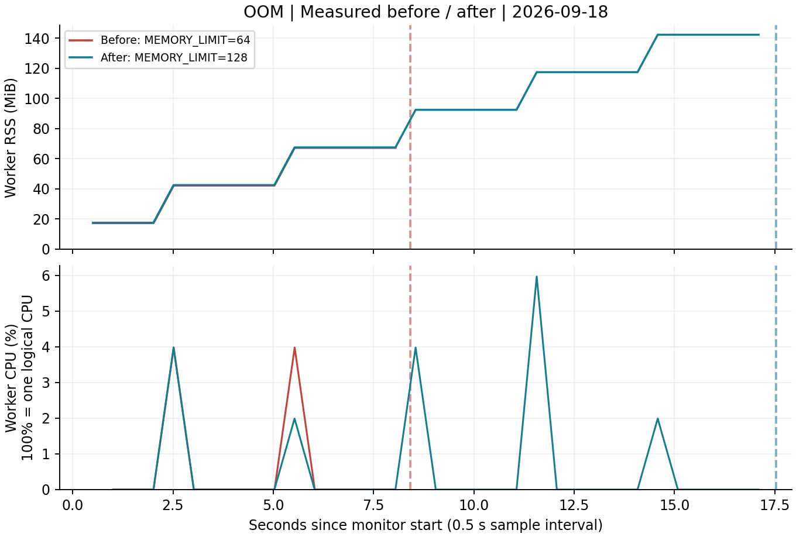

# [Bug] OOM Crash - 메모리 누적 후 MemoryGuard가 SIGKILL로 종료

실측 완료 · 2026-09-18 · 교육기관 제공 `agent-leak-app-x86`

## 1. Description (현상 설명)

WSL2 Linux x86_64에서 일반 계정 `kjw`(UID 1000)로 실행했다. 부팅 검사 6개와 `Agent READY`를 통과한 뒤 MemoryWorker의 메모리가 약 3초마다 25 MB씩 증가했다. `MEMORY_LIMIT=64`에서 실행 후 **8.418초**에 MemoryGuard가 강제 종료했다. 한도를 `128`로 높인 실행은 **17.536초**까지 생존했지만 같은 원인으로 종료했다.

두 실행에서 `CPU_MAX_OCCUPY=100`, `MULTI_THREAD_ENABLE=false`를 고정했다. 독립된 사용자·네트워크 네임스페이스에서 UID 1000으로 `0.0.0.0:15034`에 정상 바인딩했다. 바이너리는 수정하지 않았다. [실험 목록](../evidence/manifest.json), [원본 SHA256](../evidence/artifact.json).

## 2. Evidence & Logs (증거 자료)

### 재현 명령

관찰 상한은 90초, 모니터 간격은 0.5초다. 저장소 루트에서 일반 사용자로 실행한다.

```bash
unshare --user --map-current-user --net bash scripts/run-case.sh \
  --app vendor/agent-leak-app-x86 --case oom-before \
  --duration 90 --interval 0.5 --snapshot-interval 5
unshare --user --map-current-user --net bash scripts/run-case.sh \
  --app vendor/agent-leak-app-x86 --case oom-after \
  --duration 90 --interval 0.5 --snapshot-interval 5
```

소켓 소유 워커는 Before **2440463**, After **2440969**였다. 약 2 MiB인 패키징 실행기 PID와 구분했다.

| 실행 | 워커 RSS 첫 샘플 → 마지막/최대 | 앱 로그 Heap 진행 | 결과 |
| --- | --- | --- | --- |
| Before | 17.250 → 67.250 MiB | 25 → 50 → 75 MB | 75 ≥ 64, 보호 종료 |
| After | 17.484 → 142.359 MiB | 25 → 50 → … → 150 MB | 150 ≥ 128, 보호 종료 |



Before의 원문 발췌. 앱 시각은 KST(UTC+9)이며 관제 CSV와 수집기 시각은 UTC다.

```text
2026-09-18 18:06:16,803 [INFO] [MemoryWorker] Current Heap: 25MB
2026-09-18 18:06:19,834 [INFO] [MemoryWorker] Current Heap: 50MB
2026-09-18 18:06:22,866 [INFO] [MemoryWorker] Current Heap: 75MB
2026-09-18 18:06:22,867 [CRITICAL] [MemoryGuard] Memory limit exceeded (75MB >= 64MB) / (Recommend Over 256MB)
2026-09-18 18:06:22,868 [CRITICAL] [MemoryGuard] Self-terminating process 2440463 to prevent system instability.
```

After의 종료 직전 원문:

```text
2026-09-18 18:06:57,505 [INFO] [MemoryWorker] Current Heap: 125MB
2026-09-18 18:07:00,533 [INFO] [MemoryWorker] Current Heap: 150MB
2026-09-18 18:07:00,534 [CRITICAL] [MemoryGuard] Memory limit exceeded (150MB >= 128MB) / (Recommend Over 256MB)
2026-09-18 18:07:00,535 [CRITICAL] [MemoryGuard] Self-terminating process 2440969 to prevent system instability.
```

두 실행의 `result.json`은 `reason=app_exited`, `alive_before_cleanup=false`, `launcher_returncode=-9`, `runner_events=[]`다. 수집기가 종료 신호를 보내기 전에 앱 그룹이 종료됐고, 실행기는 SIGKILL 종료 상태를 반환했다. 종료 후 `monitor.log`에는 `EVENT:PROCESS_EXITED`가 기록됐다.

원문 자료:

- Before: [관제 로그](../evidence/runs/20260918T090614Z-oom-before-402105430/monitor.log), [CSV](../evidence/runs/20260918T090614Z-oom-before-402105430/metrics.csv), [실행 로그](../evidence/runs/20260918T090614Z-oom-before-402105430/console.log), [ps·top·ss](../evidence/runs/20260918T090614Z-oom-before-402105430/snapshots.txt), [종료 결과](../evidence/runs/20260918T090614Z-oom-before-402105430/result.json)
- After: [관제 로그](../evidence/runs/20260918T090643Z-oom-after-033262350/monitor.log), [CSV](../evidence/runs/20260918T090643Z-oom-after-033262350/metrics.csv), [실행 로그](../evidence/runs/20260918T090643Z-oom-after-033262350/console.log), [종료 결과](../evidence/runs/20260918T090643Z-oom-after-033262350/result.json)

## 3. Root Cause Analysis (원인 분석)

관측된 직접 원인은 **메모리 누적과 앱의 MemoryGuard 임계치 초과**다. Heap 출력과 RSS가 함께 증가하고, Guard가 초과를 기록한 직후 종료됐다. 할당한 데이터를 종료 전까지 충분히 회수하지 않는 누수성 패턴과 일치한다. 다만 제공 바이너리를 분석하지 않았으므로 어떤 객체·참조가 원인인지, 의도된 실습용 누적과 실제 결함을 내부 구현 수준에서 구분할 수는 없다.

이 결과는 **커널 OOM killer의 시스템 메모리 고갈 판정이 아니다**. 앱이 자체 보호 종료를 명시했고 수집기 개입도 없었다. 커널 OOM 로그나 시스템 전체 메모리 고갈은 입증하지 않았다.

Guard의 Heap MB와 OS의 RSS MiB는 같은 지표가 아니다. RSS에는 런타임과 공유 라이브러리도 포함된다. 0.5초 샘플 사이에 마지막 할당과 종료가 연속해서 발생하므로 마지막 RSS 샘플은 종료 순간을 놓칠 수 있다. 따라서 로그의 75/150 MB와 RSS 최대 67.250/142.359 MiB를 같은 값으로 취급하지 않는다.

## 4. Workaround & Verification (조치 및 검증)

| 항목 | Before | After |
| --- | --- | --- |
| MEMORY_LIMIT | 64 MB | 128 MB |
| 고정 변수 | CPU=100%, 멀티스레드=false | 동일 |
| 관찰 상한 | 90초 | 90초 |
| 실제 생존 시간 | 8.418초 | 17.536초 |
| 종료 상태 | MemoryGuard / -9 | MemoryGuard / -9 |
| 최대 RSS | 67.250 MiB | 142.359 MiB |

한도 상향으로 생존 시간이 **9.118초 증가, 약 2.08배**가 됐다. 메모리 증가 자체는 계속됐으므로 임시 완화다. 이후 `MEMORY_LIMIT=512`, `CPU_MAX_OCCUPY=40`, `MULTI_THREAD_ENABLE=false`의 정상 관측에서는 앱의 캐시 정리와 계속되는 작업 로그를 확인했다. 이 추가 관측은 다른 변수도 바뀌었으므로 위 단일 변수 비교와 분리해 해석한다.

근본 개선 제안은 불필요한 참조 제거, 캐시·큐 크기 제한, 주기적인 회수, 장시간 부하 검증이다. 바이너리의 소스 수정은 수행하지 않았다.
