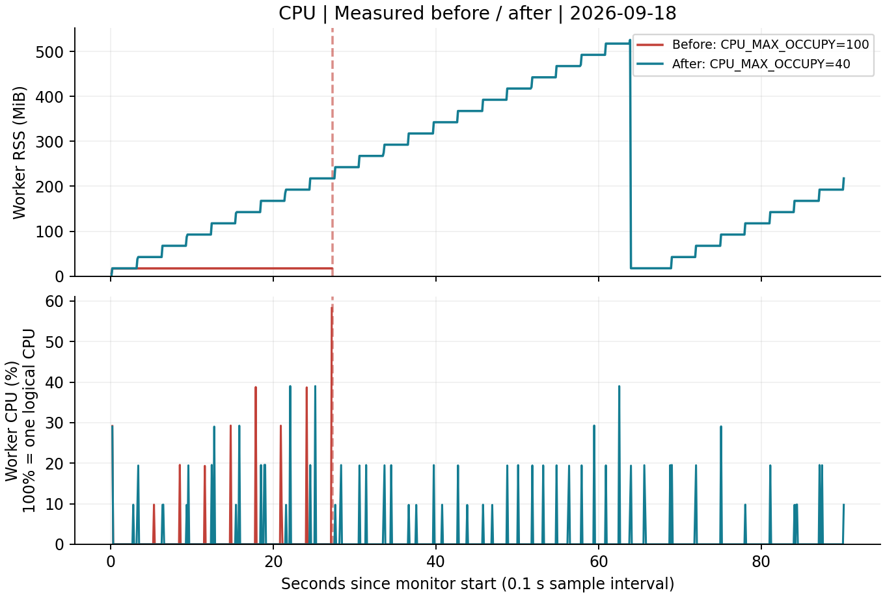

# [Bug] CPU Latency - CPU 급상승과 Watchdog의 SIGTERM 보호 종료

실측 완료 · 2026-09-18 · 교육기관 제공 `agent-leak-app-x86`

## 1. Description (현상 설명)

`MEMORY_LIMIT=512`, `MULTI_THREAD_ENABLE=false`를 고정하고 CPU 설정만 비교했다. `CPU_MAX_OCCUPY=100`에서 워커의 짧은 CPU 상승 구간을 관측했고, 앱 내부 부하 값이 52.69%가 되자 Watchdog가 종료했다. 실행부터 종료 관측까지 **27.302초**였다. `CPU_MAX_OCCUPY=40`으로 낮춘 실행은 **90초 이상 생존**하며 부하 증가·냉각과 작업 로그를 계속 남겼다.

공통 환경은 WSL2 Linux x86_64, 논리 CPU 12개, UID 1000이다. 독립 네트워크에서 앱이 `0.0.0.0:15034`에 정상 바인딩했다. 소켓 소유 워커 PID는 Before **2445628**, After **2447020**이다. HTTP 응답시간이나 실제 사용자 요청 지연은 측정하지 않았으므로 지연 감소를 실측 성과로 주장하지 않는다.

## 2. Evidence & Logs (증거 자료)

### 재현 명령

짧은 CPU 상승을 포착하기 위해 양쪽 모두 **0.1초** 간격으로 관측했다.

```bash
unshare --user --map-current-user --net bash scripts/run-case.sh \
  --app vendor/agent-leak-app-x86 --case cpu-before \
  --duration 90 --interval 0.1 --snapshot-interval 5
unshare --user --map-current-user --net bash scripts/run-case.sh \
  --app vendor/agent-leak-app-x86 --case cpu-after \
  --duration 90 --interval 0.1 --snapshot-interval 5
```

### CPU 상승과 종료 원문

Before의 `metrics.csv`에서 동일 워커의 CPU 구간 값이 다음과 같이 변했다. CPU 100%는 논리 CPU 한 개이며, 최초 샘플은 계산 구간이 없어 비워 둔다.

| UTC 시각 | 워커 PID | 구간 CPU | RSS KiB | 누적 CPU ticks |
| --- | --- | ---: | ---: | ---: |
| 09:11:48.850 | 2445628 | 0.00% | 17792 | 23 |
| 09:11:48.954 | 2445628 | 0.00% | 17792 | 23 |
| 09:11:49.057 | 2445628 | **58.26%** | 17792 | 29 |



앱 로그 원문은 KST(UTC+9)다. **앱의 Current Load는 OS 관제 CPU와 별도 지표**이며 동일 값으로 취급하지 않는다.

```text
2026-09-18 18:11:45,871 [INFO] [CpuWorker] Current Load: 44.69%
2026-09-18 18:11:48,987 [INFO] [CpuWorker] Current Load: 52.69%
2026-09-18 18:11:49,088 [CRITICAL] [CpuWorker] CPU Threshold Violated! (52.69%).

>>> [SYSTEM] WATCHDOG: INITIATING EMERGENCY ABORT (SIGTERM) <<<
```

Before 결과는 `app_exited`, `launcher_returncode=-15`, `runner_events=[]`다. 앱이 명시한 Watchdog 신호와 실제 SIGTERM 종료 상태가 일치하며, 수집기는 종료 신호를 보내지 않았다.

After에서는 다음과 같이 정상적인 냉각과 재증가가 이어졌다.

```text
2026-09-18 18:13:51,956 [INFO] [CpuWorker] Peak reached (40.00%). Starting cooldown...
2026-09-18 18:13:52,963 [INFO] [CpuWorker] Current Load: 40.00%
2026-09-18 18:14:07,533 [INFO] [CpuWorker] Cooldown complete (5.00%). Resuming load increase...
2026-09-18 18:14:08,539 [INFO] [CpuWorker] Current Load: 5.00%
2026-09-18 18:14:17,883 [INFO] [CpuWorker] Current Load: 19.12%
```

원문 자료:

- Before: [관제 로그](../evidence/runs/20260918T091121Z-cpu-before-748323350/monitor.log), [CSV](../evidence/runs/20260918T091121Z-cpu-before-748323350/metrics.csv), [실행 로그](../evidence/runs/20260918T091121Z-cpu-before-748323350/console.log), [ps·top·ss](../evidence/runs/20260918T091121Z-cpu-before-748323350/snapshots.txt), [종료 결과](../evidence/runs/20260918T091121Z-cpu-before-748323350/result.json)
- After: [관제 로그](../evidence/runs/20260918T091250Z-cpu-after-355471748/monitor.log), [CSV](../evidence/runs/20260918T091250Z-cpu-after-355471748/metrics.csv), [실행 로그](../evidence/runs/20260918T091250Z-cpu-after-355471748/console.log), [종료 결과](../evidence/runs/20260918T091250Z-cpu-after-355471748/result.json)

## 3. Root Cause Analysis (원인 분석)

직접 원인은 **앱 내부 부하 증가와 Watchdog 정책 위반**이다. 본 바이너리는 CPU 설정 100%에서 부하를 높이다가 내부 값 52.69%에서 보호 종료했고, 40%에서는 고점 도달 후 냉각했다. 따라서 CPU_MAX_OCCUPY를 보호 임계값 그 자체로 해석해 높이는 조치는 이 앱에 맞지 않는다. 로그상 최대 부하 설정을 낮추는 방향으로 회피했다. 정확한 내부 측정·분기 코드는 분석하지 않았다.

관측한 OS CPU 급상승은 **0.1초 구간의 58.26%**다. 시스템 전체가 장시간 100% 과부하였다는 뜻은 아니다. 초기 0.5초 관측에서는 짧은 부하가 평균에 희석됐으므로 더 짧은 동일 간격의 최종 비교를 사용했다. `ps %CPU`는 수명 평균이라 해당 순간의 고점을 대신할 수 없다.

CPU 연산이 길어지면 실행 대기 중인 다른 작업의 응답이 늦어질 수 있다. 이 실험은 특정 프로세스의 상승과 앱 보호 정책의 종료를 입증하며, 외부 서비스 지연이나 커널 장애는 입증하지 않는다. After에서 정상 시나리오로 전환되어 메모리 워커도 함께 동작했으므로 CPU 지표 차이를 동일 연산량의 성능 개선율로 계산하지 않았다.

## 4. Workaround & Verification (조치 및 검증)

| 항목 | Before | After |
| --- | --- | --- |
| CPU_MAX_OCCUPY | 100% | 40% |
| 고정 변수 | MEMORY_LIMIT=512, 멀티스레드=false | 동일 |
| 관찰 상한 / 샘플 간격 | 90초 / 0.1초 | 동일 |
| OS 최대 구간 CPU | 58.26% | 39.02% |
| 앱 Current Load | 52.69%에서 정책 위반 | 40.00% 고점 후 냉각 |
| 생존 | 27.302초 후 Watchdog 종료 | 90초 이상 생존 |
| 최종 -15의 주체 | 앱 Watchdog | 관찰 종료 후 수집기 정리 |

After의 `result.json`은 `observation_timeout`, `alive_before_cleanup=true`, `observed_s=90.020`이고 수집기 SIGTERM 시각이 별도로 기록됐다. 따라서 After의 -15를 Watchdog 재발로 오인하지 않는다.

실습용 임시 설정은 CPU_MAX_OCCUPY=40이다. 근본 개선은 불필요한 반복 연산·busy wait 점검, 작업 분할, 워커 수·요청량 제어 및 실제 응답시간 검증이다. 이 관측만으로 장기간 무장애를 보장하지 않는다.
