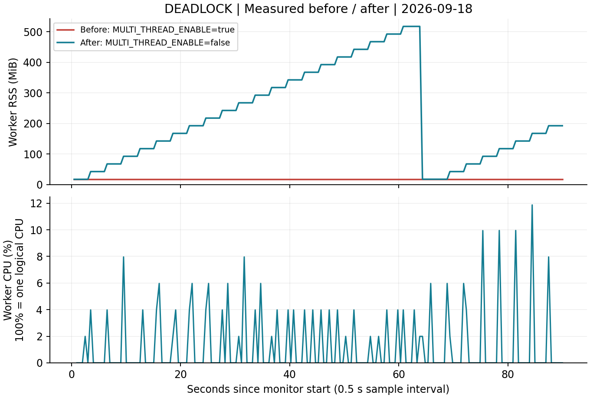

# [Bug] Deadlock - 두 워커의 순환 락 대기로 작업 진행 중단

실측 완료 · 2026-09-18 · 교육기관 제공 `agent-leak-app-x86`

## 1. Description (현상 설명)

`MEMORY_LIMIT=512`, `CPU_MAX_OCCUPY=40`을 고정하고 멀티스레드 설정만 비교했다. `true`에서 실행 약 9초 뒤 두 워커가 서로의 자원을 기다리는 로그를 남겼다. 이후 PID는 계속 존재했지만 CPU·RSS와 로그 크기가 정체됐다. `false`로 변경한 실행은 동일한 90초 동안 작업·메모리 회수·CPU 냉각 로그가 계속 진행됐다.

일반 계정 UID 1000, WSL2 x86_64, 독립 네트워크의 고정 포트 15034에서 관측했다. 워커 PID는 Before **2448740**, After **2451259**다. 종료 여부뿐 아니라 작업의 진행 여부를 함께 확인했다.

## 2. Evidence & Logs (증거 자료)

### 재현 명령

```bash
unshare --user --map-current-user --net bash scripts/run-case.sh \
  --app vendor/agent-leak-app-x86 --case deadlock-before \
  --duration 90 --interval 0.5 --snapshot-interval 5
unshare --user --map-current-user --net bash scripts/run-case.sh \
  --app vendor/agent-leak-app-x86 --case deadlock-after \
  --duration 90 --interval 0.5 --snapshot-interval 5
```

### 마지막 진행 로그와 순환 대기

Before의 실제 로그 발췌. 시각은 KST다.

```text
2026-09-18 18:14:40,866 [INFO] [AgentWorker][Worker-Thread-1] LOCK ACQUIRED: [Shared_Memory_A]. (Holding...)
2026-09-18 18:14:40,866 [INFO] [AgentWorker][Worker-Thread-2] LOCK ACQUIRED: [Socket_Pool_B]. (Holding...)
2026-09-18 18:14:42,870 [INFO] [AgentWorker][Worker-Thread-1] Need resource [Socket_Pool_B] to finish job.
2026-09-18 18:14:42,871 [INFO] [AgentWorker][Worker-Thread-1] WAITING for [Socket_Pool_B]... (Status: BLOCKED)
2026-09-18 18:14:42,879 [INFO] [AgentWorker][Worker-Thread-2] Need resource [Shared_Memory_A] to write logs.
2026-09-18 18:14:42,880 [INFO] [AgentWorker][Worker-Thread-2] WAITING for [Shared_Memory_A]... (Status: BLOCKED)
```

### PID·스레드·자원 정체

`09:16:03.609 UTC`의 `ps -L` 원문 발췌다. 동일 PID/TID들이 앞선 `09:14:44.299 UTC`에도 존재했다. 실행기 PID 2448732는 별도로 `do_wait` 상태였고, 실제 워커는 다음 세 스레드였다.

```text
    PID     TID STAT %CPU   RSS WCHAN                            COMMAND
2448740 2448740 SNl   0.0 17664 futex_wait_queue                 agent-leak-app-
2448740 2448841 SNl   0.0 17664 futex_wait_queue                 agent-leak-app-
2448740 2448842 SNl   0.0 17664 futex_wait_queue                 agent-leak-app-
```

전체 관제에서 워커 RSS는 **17664 KiB = 17.250 MiB**, 구간 CPU는 **0.00%**로 유지됐다. 프로세스는 `S` 상태였고 좀비 `Z`가 아니었다. 주 스레드의 워커 완료 대기와 두 워커의 락 대기를 로그·TID 상태가 함께 뒷받침한다. 로그 이름과 개별 TID의 일대일 매핑은 별도로 확인하지 않았다.

| UTC 관측 시각 | console.log | agent_app.log | PID 상태 |
| --- | ---: | ---: | --- |
| 09:14:44.539 | 2881 bytes | 1517 bytes | 생존 |
| 09:14:49.892 | 2881 bytes | 1517 bytes | 생존 |
| 09:15:59.424 | 2881 bytes | 1517 bytes | 생존 |
| 09:16:03.856 | 2881 bytes | 1517 bytes | 정리 직전 생존 |

로그 크기는 **79.317초** 동안 변하지 않았다. 마지막 앱 로그 시각 09:14:42.880부터 최종 기록까지는 약 80.976초다. `result.json`의 `alive_before_cleanup=true`와 종료 전 스냅샷이 지속 생존을 확인한다.



원문 자료:

- Before: [관제 로그](../evidence/runs/20260918T091433Z-deadlock-before-531338111/monitor.log), [CSV](../evidence/runs/20260918T091433Z-deadlock-before-531338111/metrics.csv), [실행 로그](../evidence/runs/20260918T091433Z-deadlock-before-531338111/console.log), [ps·ps -L·top -H](../evidence/runs/20260918T091433Z-deadlock-before-531338111/snapshots.txt), [로그 크기](../evidence/runs/20260918T091433Z-deadlock-before-531338111/log-sizes.jsonl), [종료 결과](../evidence/runs/20260918T091433Z-deadlock-before-531338111/result.json)
- After: [관제 로그](../evidence/runs/20260918T091713Z-deadlock-after-166295630/monitor.log), [CSV](../evidence/runs/20260918T091713Z-deadlock-after-166295630/metrics.csv), [실행 로그](../evidence/runs/20260918T091713Z-deadlock-after-166295630/console.log), [스레드 상태](../evidence/runs/20260918T091713Z-deadlock-after-166295630/snapshots.txt), [로그 크기](../evidence/runs/20260918T091713Z-deadlock-after-166295630/log-sizes.jsonl), [종료 결과](../evidence/runs/20260918T091713Z-deadlock-after-166295630/result.json)

## 3. Root Cause Analysis (원인 분석)

서로 반대 순서로 자원을 보유·요청한 것이 로그에서 확인된다.

```text
Worker-Thread-1: Shared_Memory_A 보유 → Socket_Pool_B 대기
Worker-Thread-2: Socket_Pool_B 보유 → Shared_Memory_A 대기
순환: Thread-1 → Pool-B → Thread-2 → Memory-A → Thread-1
```

| 교착상태 조건 | 증거와 해석 |
| --- | --- |
| 상호 배제 | Strict resource locking 안내와 LOCK ACQUIRED / BLOCKED 로그 |
| 점유 대기 | 한 자원을 Holding한 채 다른 자원을 요청 |
| 비선점 | 관측 구간에 상대 락을 빼앗거나 강제로 회수한 기록 없이 대기 지속 |
| 순환 대기 | 1은 2의 Pool-B, 2는 1의 Memory-A를 기다림 |

락 대기는 CPU를 소비하지 않고 스레드를 잠들게 할 수 있다. 그래서 PID와 RSS가 유지돼도 작업은 진행되지 않는다. `futex_wait_queue` 또는 낮은 CPU 하나만으로는 교착상태를 단정할 수 없지만, 이번에는 양방향 보유·대기 로그와 장시간의 정체가 함께 있어 순환 대기라는 설명을 뒷받침한다. 비선점 정책의 내부 구현과 락 객체 주소는 역공학하지 않았다.

TCP LISTEN은 유지되어도 작업 완료를 보장하지 않는다. 실제 네트워크 요청의 타임아웃은 별도로 측정하지 않았으므로 증상은 확인된 작업·로그 진행 중단으로 한정한다.

## 4. Workaround & Verification (조치 및 검증)

| 항목 | Before | After |
| --- | --- | --- |
| MULTI_THREAD_ENABLE | true | false |
| 고정 변수 | MEMORY_LIMIT=512, CPU=40% | 동일 |
| 관찰 시간 | 90.021초 | 90.044초 |
| 워커 PID | 2448740 | 2451259 |
| 최대 구간 CPU | 0.00% | 11.87% |
| RSS 추세 | 17.250 MiB로 정체 | 최대 517.676 MiB, 캐시 회수 후 재증가 |
| 마지막 로그 | 양쪽 WAITING / BLOCKED | MemoryWorker·CpuWorker 계속 진행 |
| 최종 콘솔 크기 | 2881 bytes | 7747 bytes |
| 관찰 후 정리 | 수집기 SIGTERM | 수집기 SIGTERM |

After에서는 `All tasks completed`, 부하 냉각, `18:18:17.146 Memory Cache Flushed`, `18:18:43.359 Current Heap: 200MB`까지 진행했다. `WAITING`/`BLOCKED` 로그는 없었다. PID 존재만이 아니라 실제 로그 진행과 메모리 회수로 **관찰한 90초 동안 교착상태를 회피했음**을 확인했다.

멀티스레드를 끄는 것은 동시성 감소를 감수하는 임시 회피다. 근본 개선은 일관된 락 획득 순서, 임계 구역 축소, 타임아웃 시 보유 락 해제, 자원 의존 구조 개선이다. 바이너리 수정은 수행하지 않았다.
